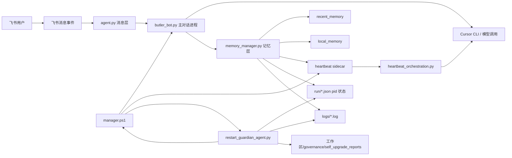
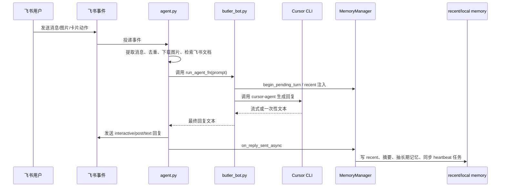
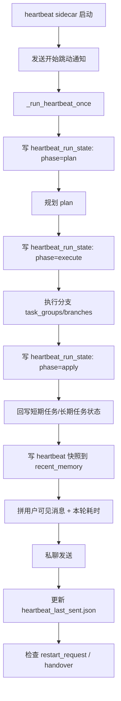
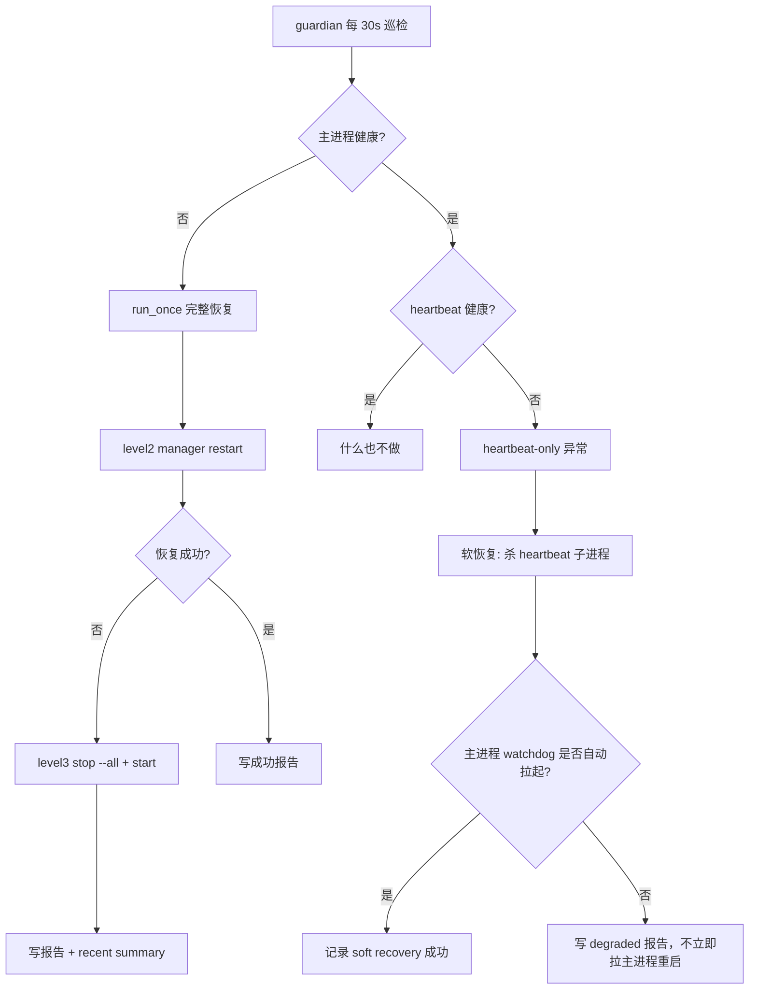

# Butler 项目全景说明与排障地图

> 目标：把 `butler_bot_code/` 从“能跑但难看懂”整理成一套可快速建立全局认知、定位问题、继续维护的说明。
>
> 适用对象：你自己、后续接手的人、以及以后需要快速理解代码的我。

---

## 1. 一句话先讲清它是什么

`butler_bot` 不是一个单脚本机器人，而是一套围绕“飞书对话 + 本地记忆 + 后台心跳 + 自动守护 + Cursor CLI 执行”搭起来的**多进程管家系统**。

它的核心目标不是只回复消息，而是：

- 接收飞书用户命令并调用 Cursor CLI 完成任务
- 在本地维护 recent / local memory，形成连续上下文
- 在后台按心跳推进短期任务、长期任务、主动探索任务
- 在进程异常时通过 guardian 做软恢复或重启抢救
- 把运行状态、日志、快照、任务真源都落盘，供排障和自我维护

理解它时，最重要的是先接受一个事实：

**这套系统的“真相”分散在 5 个层面里，而不是某一个 Python 文件里。**

1. 入口与启动方式：`manager.ps1`
2. 消息层：`butler_bot/agent.py`
3. 组合层：`butler_bot/butler_bot.py`
4. 记忆与心跳层：`butler_bot/memory_manager.py` + `butler_bot/heartbeat_orchestration.py`
5. 守护与恢复层：`butler_bot/restart_guardian_agent.py`

---

## 2. 推荐阅读顺序

如果以后要快速重新理解，建议固定按这个顺序读：

1. 先看本文档，建立整体脑图
2. 再看 `README.md`，确认管理命令和外层约定
3. 然后看 `manager.ps1`，理解真实启动形态
4. 再看 `butler_bot.py`，理解主进程如何把消息层和记忆层拼起来
5. 再看 `agent.py`，理解飞书消息收发与去重
6. 再看 `memory_manager.py`，理解 recent/local memory、心跳、状态文件
7. 最后看 `restart_guardian_agent.py`，理解为什么会“自动拉起 / 一直重启 / 写报告”

如果要改后台规划逻辑，优先看：

- `prompts/heart_beat.md`
- `heartbeat_orchestration.py`
- `memory_manager.py` 中 `_run_heartbeat_once` 附近

如果要排查“为什么现在状态怪怪的”，优先看：

- `run/`
- `logs/`
- `./butler_bot_agent/agents/recent_memory/`

---

## 3. 目录地图

下面是建议记住的最小目录集。

### 3.1 项目内目录

```text
butler_bot_code/
├── README.md
├── manager.ps1
├── registry.json
├── configs/
│   └── butler_bot.json
├── prompts/
│   └── heart_beat.md
├── butler_bot/
│   ├── agent.py
│   ├── butler_bot.py
│   ├── memory_manager.py
│   ├── heartbeat_orchestration.py
│   ├── heartbeat_service_runner.py
│   ├── restart_guardian_agent.py
│   └── memory_cli.py
├── tests/
├── logs/
├── run/
└── docs/
```

### 3.2 工作区级目录

```text
butler_bot_agent/agents/
├── recent_memory/
│   ├── recent_memory.json
│   ├── heart_beat_memory.json
│   ├── heartbeat_last_sent.json
│   └── recent_archive.md
└── local_memory/
    ├── 各类长期记忆文件.md
    └── heartbeat_long_tasks.json

工作区/
├── governance/
├── secretary/
├── literature/
└── heartbeat_upgrade_request.json
```

### 3.3 每个区域的职责

- `configs/`：运行配置，尤其是飞书凭据、模型、超时、心跳设置
- `prompts/`：心跳规划器提示词，不要把规划规则硬堆回 Python 里
- `butler_bot/`：核心实现
- `tests/`：回归保护，尤其覆盖心跳、守护、recent memory
- `run/`：PID 和运行时状态文件
- `logs/`：主进程、心跳、错误日志
- `./butler_bot_agent/agents/recent_memory/`：最近上下文、心跳快照、短期任务真源
- `./butler_bot_agent/agents/local_memory/`：长期偏好、约定、反思、长期任务真源
- `工作区/`：心跳和对话产出区，不是底层运行时目录

---

## 4. 核心架构

### 4.1 组件图



### 4.2 进程关系图

当前推荐启动方式不是“直接跑一个 Python 文件”，而是通过 `manager.ps1` 形成三件套：

1. `butler_bot` 主对话进程
2. `heartbeat` 独立 sidecar 子进程
3. `guardian` 常驻守护进程

这三者是协作关系，不是主从树形关系那么简单：

- `manager.ps1 start butler_bot` 启动主进程
- 同时显式启动 `heartbeat_service_runner.py` 作为 sidecar
- 再启动 `restart_guardian_agent.py --daemon`
- 主进程自身还会写运行心跳到 `run/butler_bot_main_state.json`
- guardian 巡检时会结合 `run/` 状态文件、`heartbeat_last_sent.json`、manager 状态和日志判断是否要恢复

### 4.3 一个容易误解但必须记住的点

**主进程并不总是自己内嵌拉起 heartbeat。**

在通过 `manager.ps1` 启动时，脚本会设置 `BUTLER_EXTERNAL_HEARTBEAT=1`，因此主对话进程会认为 heartbeat 由外部 sidecar 接管，不再内嵌拉起。

所以你看到：

- 主进程活着
- 心跳另有单独 PID
- guardian 也有单独 PID

这是当前设计的正常状态，不是“多启动了一份”。

---

## 5. 主链路一：飞书消息是怎么走完整一轮的

### 5.1 时序图



### 5.2 代码职责拆分

- `agent.py`
  - 飞书长连接
  - 解析消息与图片
  - 回复去重
  - interactive/post/text 发送
  - 卡片动作回调
  - 配置热加载入口 `get_config()`

- `butler_bot.py`
  - 解析“用某模型回答”“模型列表”“当前模型”等运行时控制
  - 构造给 Cursor CLI 的 prompt
  - 持有 `MemoryManager`
  - 启动 background services

- `memory_manager.py`
  - 在消息前注入 recent
  - 在消息后异步持久化 recent/local memory
  - 维护心跳任务真源

### 5.3 这一层最容易出的问题

- 同一条飞书消息重复回复：通常先看消息去重和 reply 去重
- 回答正常但 recent 没更新：看 `on_reply_sent_async` 和 recent fallback 是否写成功
- 明明是 JSON 配置却改了不生效：要区分“热加载参数”与“启动形态参数”

---

## 6. 主链路二：心跳单轮是怎么跑的

### 6.1 心跳单轮流程图



### 6.2 单轮内部阶段

`_run_heartbeat_once` 现在至少分为这些 phase：

1. `plan`
2. `execute`
3. `apply`
4. `snapshot`
5. `notify`
6. `restart-check`

每个阶段都会写运行时状态，所以排查“卡在哪”时，不必只看 log，也可以看 `run/heartbeat_run_state.json`。

### 6.3 心跳规划器实际在做什么

它不是简单发一句“我还活着”。它会综合：

- `heartbeat_tasks.md` / `task_ledger.json` 中的任务线索
- `recent_memory.json` 中最近上下文
- `agents/heartbeat-planner-context.md` 中的附加上下文
- `heartbeat.allow_autonomous_explore`
- `agents/heartbeat-planner-agent.md` 的角色约束
- `prompts/heart_beat.md` 的 JSON 模板

然后生成 plan，优先形式是：

- `task_groups`
- `branches`
- `execution_mode`
- `selected_task_ids`
- `deferred_task_ids`

如果规划器只返回旧式 `execute_prompt`，执行器也会兼容单分支旧路径。

### 6.4 并行执行如何理解

当前不是任意并发，而是**受控并行**：

- 配置上允许 `heartbeat.max_parallel_branches`
- 代码硬上限仍是 3
- 只有互不依赖、标记为可并行的 branch 才会组内并行
- 其余分支仍按组串行

这意味着心跳更像一个轻量的 agent team 编排器，而不是单 prompt 循环器。

### 6.5 默认运行模式：显式任务驱动，不默认进入心流

当前默认配置是 `heartbeat.allow_autonomous_explore=false`，含义是：

- 有明确短期任务、到期长期任务、用户专项指令时，心跳照常规划与执行
- 没有明确任务时，心跳默认发 `status`，不主动进入 explore / 自主探索 / 长时间连续工作
- 若以后需要恢复更强的自主探索，再显式打开该开关，而不是靠 prompt 自由发挥

这条边界是为了把心跳从“自己找事做”改成“以显式任务为中心的后台执行器”，避免它在没有授权时跑进开放式心流。

### 6.6 心跳相关的真实数据源

短期任务真源：

- `./butler_bot_agent/agents/recent_memory/heart_beat_memory.json`

长期任务真源：

- `./butler_bot_agent/agents/local_memory/heartbeat_long_tasks.json`

可见性快照：

- `recent_memory.json` 中 `topic=心跳执行快照`
- `./butler_bot_agent/agents/recent_memory/heartbeat_last_sent.json`
- `run/heartbeat_run_state.json`

---

## 7. 主链路三：guardian 为什么会“抢救 / 重启 / 误判”

### 7.1 guardian 判活逻辑

guardian 并不是只看某个 PID 存不存在，它会综合判断：

1. 主对话进程是否健康
2. heartbeat 是否健康
3. 当前是否处于 main watchdog 恢复窗口
4. 是否存在 restart request / handover 状态

主对话进程健康主要看：

- `run/butler_bot_main_state.json`
- PID 是否存活
- `updated_at` 是否足够新鲜
- 如果状态文件不可信，再回退到 `manager.ps1 status` / legacy 检测

heartbeat 健康主要看：

- `run/butler_bot_heartbeat.pid`
- `run/heartbeat_watchdog_state.json`
- `./butler_bot_agent/agents/recent_memory/heartbeat_last_sent.json`
- `last_activity_at` 是否超过 `heartbeat_stale_seconds`

### 7.2 guardian 恢复层级



### 7.3 为什么会出现“心跳一直重启”

这是当前系统最容易让人精神崩溃的观感问题之一。常见原因是：

1. heartbeat 单轮耗时太长，超过陈旧阈值
2. guardian 认为 heartbeat stale，于是做软恢复
3. 主进程的 heartbeat watchdog 又因为崩溃次数过多进入 cooldown
4. cooldown 期间不会立即拉回 heartbeat
5. guardian 下一轮巡检又继续看到“heartbeat 不健康”
6. 于是用户看到像是“一直重启 / 一直写报告”

所以这类问题不能只看某个 log，要同时看：

- `heartbeat_last_sent.json`
- `heartbeat_watchdog_state.json`
- `butler_bot_heartbeat.pid`
- 最新 heartbeat log

### 7.4 guardian 产物

guardian 在恢复或降级时会留下：

- 机器可读状态
- 人类可读报告
- recent_memory 摘要
- 日志尾部取证信息
- traceback 文件行号提示
- 最近 24h 代码改动清单

这意味着它不只是“重启器”，还是一套故障取证器。

---

## 8. 配置系统怎么理解

### 8.1 主配置文件

主配置入口是：

- `configs/butler_bot.json`

建议从字段层面理解，而不是死记某一份具体值。

### 8.2 配置大类

#### A. 飞书接入

- `app_id`
- `app_secret`

用于主对话进程的飞书长连接与消息回复。

#### B. 工作区与模型

- `workspace_root`
- `cursor_api_keys`
- `agent_model`
- `model_aliases`
- `agent_timeout`

控制 Cursor CLI 工作区、默认模型和超时。

#### C. 日志

- `logging.level`
- `logging.check_interval_seconds`
- `logging.timestamp`

控制运行时日志级别和时间戳开关。

#### D. 启动通知

- `startup_notify_open_id`
- `startup_notify_receive_id_type`

用于启动后的私聊通知。

#### E. 心跳

- `heartbeat.enabled`
- `heartbeat.every_seconds` / `every_minutes`
- `heartbeat.startup_delay_seconds`
- `heartbeat.receive_id`
- `heartbeat.receive_id_type`
- `heartbeat.planner_model`
- `heartbeat.executor_model`
- `heartbeat.planner_timeout`
- `heartbeat.branch_timeout`
- `heartbeat.max_short_tasks`
- `heartbeat.max_long_tasks_in_prompt`
- `heartbeat.heartbeat_stale_seconds`
- `heartbeat.proactive_talk.*`

这里决定后台节奏、规划与执行模型、消息投递目标，以及主动沟通节奏。当前优先级约束已迁到 `agents/heartbeat-planner-context.md`。

### 8.3 热加载边界

当前配置不是“任何改动都立刻无脑生效”，要分三类：

1. **运行期读取型**
   - 通过 `agent.py` 的 `get_config()` 周期性重读
   - 典型如模型、日志级别等
   - 一般约 5 秒粒度可感知

2. **子进程启动快照型**
   - sidecar/guardian 启动参数、启动时读取的配置快照
   - 改了后通常需要重启对应进程

3. **流程设计型**
   - 比如 manager 的启动策略、环境变量、是否 sidecar 化
   - 不是改 JSON 一处就能彻底改变的

结论：

**JSON 已支持一定程度热加载，但“是否需要重启”取决于该字段是在运行中反复读取，还是只在启动时拍快照。**

---

## 9. 运行时文件怎么用来排障

### 9.1 `run/` 目录

这是最应该优先看的目录之一。

常见文件：

- `butler_bot.pid`
- `butler_bot_heartbeat.pid`
- `restart_guardian.pid`
- `butler_bot_main_state.json`
- `heartbeat_watchdog_state.json`
- `heartbeat_run_state.json`

建议理解如下：

- `*.pid`：有没有那个进程
- `butler_bot_main_state.json`：主对话进程是否真的持续活着
- `heartbeat_watchdog_state.json`：heartbeat 当前是 running、crashed、restarting、cooldown 还是 restart-requested
- `heartbeat_run_state.json`：heartbeat 本轮跑到哪个 phase 了

### 9.2 `logs/` 目录

建议至少知道这几类：

- `butler_bot_YYYYMMDD_001.log`：主进程常规日志
- `butler_bot_heartbeat_YYYYMMDD_001.log`：心跳 sidecar 日志
- `*.err.log`：错误日志
- `butler_bot_startup-maintenance_*.log`：启动维护日志

特点：

- 按天切分
- 单文件最多 1000 行后自动递增分片
- 每行有时间戳，适合和状态文件对照

### 9.3 `./butler_bot_agent/agents/recent_memory/`

这个目录不是“辅助信息”，而是运行链路的一部分。

重点文件：

- `recent_memory.json`
- `heart_beat_memory.json`
- `heartbeat_last_sent.json`
- `recent_archive.md`

怎么看：

- `recent_memory.json`：最近对话摘要与统一对话近期流
- `heart_beat_memory.json`：兼容期短期心跳任务镜像，不再建议单独当作文档层“唯一任务真源”
- `heartbeat_last_sent.json`：最近一次心跳活动时间，是 guardian 判活的重要依据
- `recent_archive.md`：compact 后的归档摘要

### 9.4 `./butler_bot_agent/agents/local_memory/`

这里是长期记忆区，重点看：

- 用户偏好类文件
- 反思类文件
- `heartbeat_long_tasks.json`
- `L0_index.json`
- `L1_summaries/`
- `L2_details/`

如果问题是“为什么它总忘”“为什么规划器看不到老约定”，就不能只看 recent，还必须看 local_memory 是否真的有对应沉淀。

补充：`./工作区/local_memory/` 是工作区镜像、治理说明与草稿层；运行时长期记忆实现层仍以本目录为准。

---

## 10. 关键入口文件速查表

| 文件 | 角色 | 什么时候先看它 |
|------|------|----------------|
| `manager.ps1` | 统一启动、停止、状态查看 | 进程关系、启动行为、sidecar/guardian |
| `butler_bot/butler_bot.py` | 主进程组合层 | 想看一轮消息怎样连到 Cursor CLI |
| `butler_bot/agent.py` | 飞书消息层 | 回复异常、重复回复、卡片动作、配置热加载 |
| `butler_bot/memory_manager.py` | recent/local memory + 心跳主逻辑 | 记忆写入、心跳执行、状态文件 |
| `butler_bot/heartbeat_orchestration.py` | 心跳规划/并行编排 | 任务拆分、并行上限、planner backoff |
| `butler_bot/restart_guardian_agent.py` | 守护与恢复 | 重启循环、降级、报告、取证 |
| `butler_bot/heartbeat_service_runner.py` | heartbeat sidecar 入口 | sidecar 怎样独立启动 |
| `prompts/heart_beat.md` | 心跳规划提示词 | 想改规划思路而不是改死代码 |
| `configs/butler_bot.json` | 配置入口 | 模型、超时、飞书、心跳参数 |
| `tests/` | 回归保护 | 改心跳/守护/recent 后要先跑 |

---

## 11. 常见问题排障地图

下面按“现象 -> 优先检查 -> 常见根因”给出一张实用地图。

### 11.1 现象：飞书不回复，但 `status` 看起来还在运行

优先检查：

1. `logs/butler_bot_*.err.log`
2. `run/butler_bot_main_state.json`
3. 飞书配置是否正确
4. Cursor CLI / API key 是否可用

常见根因：

- 主进程存活，但上游模型调用已异常
- 飞书 token/权限问题
- 回复去重误判
- 主状态文件仍在，但业务链路已坏

### 11.2 现象：心跳一直重启或一直写“本次触发失败/跳过”

优先检查：

1. `./butler_bot_agent/agents/recent_memory/heartbeat_last_sent.json`
2. `run/heartbeat_watchdog_state.json`
3. `run/butler_bot_heartbeat.pid`
4. `logs/butler_bot_heartbeat_*.log`
5. guardian 最近报告

常见根因：

- heartbeat 单轮过长，被判 stale
- 软恢复后主进程 watchdog 处于 cooldown
- sidecar 启动即退出
- planner 失败后退回兜底逻辑，但依旧没有有效任务

### 11.3 现象：guardian 把主进程判死，但你看着明明还活着

优先检查：

1. `run/butler_bot_main_state.json` 的 `updated_at`
2. `manager.ps1 status` 输出
3. guardian 日志/报告里是否写了 stale / legacy-detect

常见根因：

- 主状态文件陈旧
- PID 活着但状态更新时间过期
- 进入 fallback 到 legacy 检测之前的判断窗口

### 11.4 现象：配置改了像没生效

优先检查：

1. 这是运行期参数还是启动期参数
2. 对应进程是否已经在运行
3. 是否是 sidecar / guardian 自己的启动参数

常见根因：

- 修改的是启动快照型参数
- 只改了主进程配置，但 heartbeat sidecar 没重启
- JSON 改了，但实际逻辑读取的是 prompt 文件或运行时状态文件

### 11.5 现象：它“没记住”之前交代过的事

优先检查：

1. `recent_memory.json` 是否有最近沉淀
2. `local_memory/` 是否有长期约定
3. `agents/state/task_ledger.json` 是否已有对应任务 / 状态
4. `heartbeat_tasks.md` 是否给 planner 提供了可读任务视图

常见根因：

- 信息只出现在某轮回答里，没有被沉淀成 recent/local memory
- recent 被大量同类快照淹没
- 任务只写进工作区说明文档或治理文档了，但没写入运行真源

---

## 12. 真正实用的排障顺序

以后再遇到问题，建议固定按这个顺序，不要东一锤西一棒：

1. 先执行 `manager.ps1 status`
2. 再看 `run/` 里的三个核心状态文件
3. 再看最近的 `*.err.log`
4. 再看 heartbeat log 与 `heartbeat_last_sent.json`
5. 再看 recent_memory 里的心跳快照或最近摘要
6. 最后才去翻具体实现代码

原因很简单：

这套系统很多问题不是“代码读不懂”，而是“你没先看运行时真相”。

---

## 13. 维护建议：以后改哪里最稳

### 13.1 想改心跳策略

优先改：

- `prompts/heart_beat.md`
- `heartbeat_orchestration.py`

尽量少直接在 `memory_manager.py` 里继续加条件分支。

### 13.2 想改消息回复行为

优先改：

- `agent.py`
- `butler_bot.py`

### 13.3 想改自动恢复/重启逻辑

优先改：

- `restart_guardian_agent.py`
- `manager.ps1`

### 13.4 想改“它为什么记不住 / 为什么老忘”

优先改：

- `memory_manager.py`
- `./butler_bot_agent/agents/local_memory/` 中约定文件
- recent compact 策略

---

## 14. 推荐最小命令集

```powershell
.
butler_bot_code\manager.ps1 status

.\scripts\butler_bot\manager.ps1 start butler_bot

.\scripts\butler_bot\manager.ps1 stop butler_bot

.\scripts\butler_bot\manager.ps1 restart butler_bot
```

如果只想查记忆：

```powershell
python scripts\butler_bot\butler_bot\memory_cli.py recent-list
python scripts\butler_bot\butler_bot\memory_cli.py local-query 关键词
```

如果要做回归验证，优先跑：

```powershell
python -m unittest scripts.butler_bot.tests.test_memory_manager_maintenance
python -m unittest scripts.butler_bot.tests.test_restart_guardian_agent
python -m unittest scripts.butler_bot.tests.test_heartbeat_orchestration
```

---

## 15. 一页结论

如果把整个 butler 项目压缩成一句维护心法，就是：

**把它当成一个“由 manager 管理的多进程系统”，而不是一个聊天脚本。**

进一步再压缩成三个判断：

1. 进程层：主进程、heartbeat、guardian 谁活着，谁在 cooldown
2. 状态层：`run/` 和 `recent_memory/` 记录了什么真相
3. 代码层：消息、记忆、心跳、守护分别在哪个文件负责

只要这三层分开看，项目就不会再是一团雾。

---

## 16. 后续建议

如果以后继续整理，最值得继续补的两份文档是：

1. `运行时状态文件字典.md`：把 `run/*.json` 每个字段逐个解释清楚
2. `记忆系统真源说明.md`：把 recent / local / heart_beat_memory / heartbeat_long_tasks 的关系画成一张图

这样未来排障和自我升级会更快。