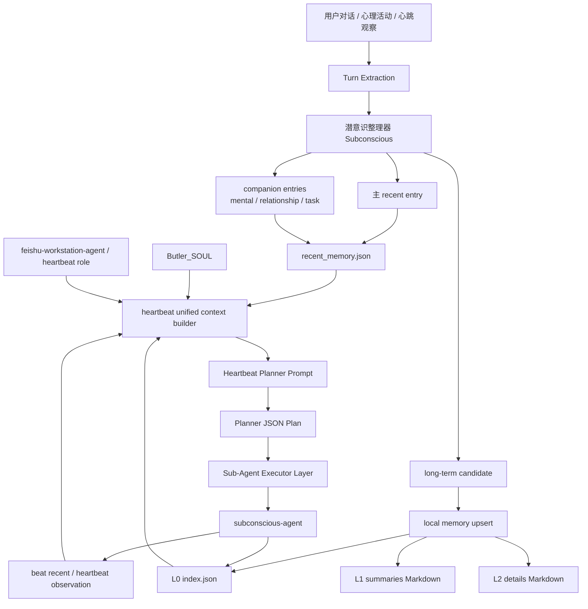

# 统一记忆机制技术设计

更新时间：2026-03-10

补充说明：本文主要描述统一记忆链路的工程机制。关于 `self_mind` 与 `local memory` 的认知分工、为什么前者更接近回忆层而后者更接近长期语义层，以及 Butler 作为整体如何形成“真正有记忆”的架构，请结合 `./self_mind与回忆机制_总体设计_20260311.md` 一起阅读。

## 目标

本轮改造把 Butler 的记忆链路从“对话摘要写 recent + 心跳各自读片段”升级为统一链路：

1. 每轮对话先经过【潜意识】整理，再写入统一短期记忆 schema。
2. 短期记忆不再只有 talk 摘要，还包含 mental、relationship_signal、task_signal、heartbeat_observation 等流。
3. heartbeat planning context 不再只读 `heartbeat_observation` 标记，而是显式读取统一 Soul、role、对话/心跳近期流、长期记忆索引。
4. local memory upsert 不再只是追加“摘要块”，而是落成带 `当前结论 / 历史演化 / 适用情景` 的 Markdown 模板，并同步进 L0 索引。

## 核心边界

### 0.5 跨对话与 heartbeat 共享的新陈代谢规则

这套规则属于统一记忆链路的长期制度，而不是某一轮 planner 的临时技巧：

1. 信息源优先级默认是：当前轮输入、当前运行事实、当前任务状态 > unified recent / beat recent > 当前有效长期记忆 > README / 说明文档 / 历史手册。
2. 同一来源内部，越新的信息权重越高；旧文档、旧索引、旧结论如果长期未验证，应被视为待复核对象。
3. 当文档与运行事实冲突时，优先承认冲突并回收旧认知，不得为了叙事完整继续沿用过时说明。
4. 统一记忆链路要支持小步新陈代谢：轻量复核、补充当前结论、收缩适用场景、标记冲突、提出退役建议，而不是只会追加。
5. 对长期记忆质量负责的是 `subconscious-agent` 所代表的记忆分层巩固层，而不是对外表达层或 planner 本身。

### 1. 决策器

- 负责决定本轮是否需要触发潜意识整理。
- 负责决定本轮是只写 short-term，还是同时推进 long-term。
- 在 heartbeat 中体现为 planner；在对话轮次中体现为 per-turn finalize。

### 0. 分层模型

- `feishu-workstation-agent` / `butler-continuation-agent`：对外表达层
- `heartbeat-planner-agent`：内在思维层
- `subconscious-agent`：记忆分层巩固 / 再巩固层（主责长期记忆质量与连续性）
- `sub-agents/*`：场景执行层

### 2. 潜意识

- 输入：当前 turn candidate、用户原始输入、回复、已有 recent。
- 输出：
  - 主 recent entry
  - companion entries
  - trigger level
  - 隐式 long-term candidate
- 不直接负责发消息，不直接执行任务。
- 对系统内部来说，它不只是“桥梁”，而是统一记忆的**分层巩固器**：负责把事件流整理成当前有效长期结论，并在命中旧结论时承担显式再巩固责任。
- 这层必须对长期记忆的新陈代谢负责：新事实进入时，不只是追加候选结论，还要判断旧结论是被支持、细化、冲突、还是应退役。

### 2.5 显式再巩固协议

当某条长期记忆在对话或 heartbeat 中被命中，并遇到新的相关证据时，`subconscious-agent` 应按下面的最小协议整理：

1. **retrieve**：识别当前轮命中的既有结论或 schema。
2. **compare**：比较新证据是 support、refine、contradict 还是 obsolete。
3. **decide**：决定增加证据、缩小/扩展适用场景、标记冲突、生成候选新版本，或提出旧结论退役建议。
4. **write back**：把结果回写到 recent、L0/L1/L2 或待复核项中，至少保留“当前结论为什么变化”的线索。

这个协议的目标不是复杂化，而是让长期记忆从“不断堆积”变成“可修订、可退役、可解释”。

### 3. Local Memory

- 作为跨轮、跨角色共享的长期语义层。
- 通过 L1 Markdown + L2 detail + L0 index 提供“人可读 + 机器可检索”的双面结构。

## 数据结构

### recent entry

统一字段包含：

- `memory_scope`
- `memory_stream`
- `event_type`
- `salience`
- `confidence`
- `derived_from`
- `context_tags`
- `mental_notes`
- `relationship_signals`
- `relation_signal`
- `active_window`
- `subconscious`

### local memory index entry

L0 索引条目升级后新增：

- `current_conclusion`
- `history_evolution`
- `applicable_scenarios`
- `current_effective`
- `source_type`
- `source_reason`
- `source_topic`

## 运行流

### 对话侧

1. `MemoryManager._summarize_turn_to_recent` 抽出 turn candidate。
2. `SubconsciousConsolidationService.consolidate_turn` 生成主 entry + companion entries。
3. 若显式 `long_term_candidate` 为空，潜意识会基于偏好词、关系/情绪线索、mental notes、recent companion pattern 做隐式提升。
4. `MemoryManager._upsert_local_memory` 以结构化模板写入 L1/L2，并更新 L0 index。

### heartbeat 侧

1. planner context 从以下四类源组装：
   - Butler SOUL 摘录
   - heartbeat 角色摘录
  - `heartbeat_tasks.md` 的任务文本视图（空时才退回 legacy JSON 渲染）
   - 对话侧 + 心跳侧 unified recent
   - local memory L0 index 的当前有效结论
2. planner prompt 模板中显式提供 `soul_text`、`role_text`、`recent_text`、`local_memory_text`。
3. planner 以“长期记忆索引”而不是散乱 Markdown 文件片段为恢复依据。
4. branch 执行前会自动加载对应 sub-agent role 摘录，默认执行者为 `heartbeat-executor-agent`。
5. 任务结构化状态以 `task_ledger.json` 为主，`heartbeat_tasks.md` 是给 planner 看的文本读口；`heart_beat_memory.json` 与 `heartbeat_long_tasks.json` 保留为兼容期 fallback。
6. planner 结果与 executor 结果在 heartbeat snapshot 阶段统一交给 `subconscious-agent` 整理，再写回 beat recent 和 long-term memory。
7. heartbeat 与对话侧共享同一套新陈代谢规则：优先参考当前运行事实和近期信号，再决定是否更新长期结论、修正文档认知或标记旧结论待复核。

## Markdown 模板

L1 summary 文件改为按更新块维护：

```md
## 更新于 2026-03-10 13:00

### 当前结论
- ...

### 历史演化
- ...

### 适用情景
- ...

### 关键词
- ...
```

L2 detail 文件保存长文本沉淀和详细上下文；L0 只保留 planner 真正需要恢复的“当前有效语义”。

## 架构图



## 关键文件

- `butler_bot/subconscious_service.py`
- `butler_bot/memory_manager.py`
- `butler_bot/heartbeat_orchestration.py`
- `butler_bot_agent/agents/heartbeat-planner-prompt.md`（heartbeat 规划提示词主入口）
- `prompts/heart_beat.md`（旧版规划模板的 JSON 契约镜像，保留兼容，不再作为决策原则真源）

## 当前已落地能力

1. unified recent schema 已生效。
2. 潜意识已能基于显式 + 隐式信号提升 long-term candidate。
3. heartbeat planner 已开始读取 Soul/role/unified recent/local index。
4. heartbeat planner 与 executor 的结果已通过潜意识回灌记忆，形成闭环。
5. local memory upsert 已落 Markdown 模板和 L0 结构化索引。
6. 新陈代谢原则已被明确为跨对话与 heartbeat 共享的长期规则，后续增强应围绕“轻量复核 + 显式再巩固 + 旧结论退役”展开，而不是只增加摘要量。

## 后续可继续增强

1. 把 local memory 的历史演化从启发式文本升级为版本链。
2. 让 heartbeat executor 的结果也通过潜意识回灌长期语义层。
3. 为不同 role 增加更细的 role excerpt 装配，而不只复用 feishu-workstation-agent。