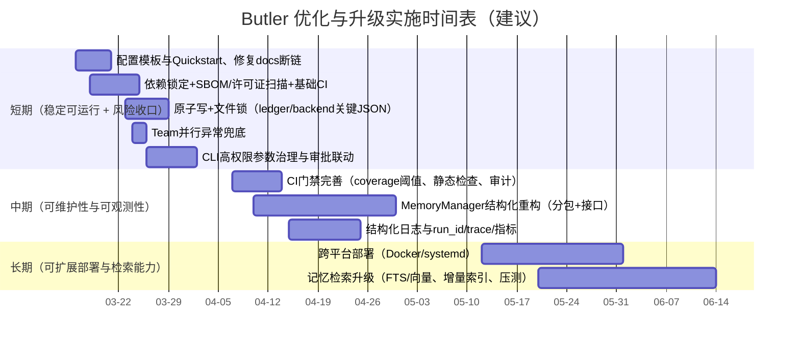

# Ocean326/Butler 仓库全量分析与评估报告

## 执行摘要

本仓库呈现出一个“以飞书对话为入口、以本地工作区为主场、以 CLI 形式驱动大模型执行、并引入心跳自治与记忆体系”的个人助理/管家型系统。其核心设计思想是把稳定的“身体能力”（消息接入、调度、记忆、治理闸门）固化在主代码中，把可复用的外部能力沉淀为 Skills/Sub-Agents/Teams，并通过心跳规划器把“显式任务→分支执行→回执→账本沉淀”串成可持续的闭环。该总体架构与关键路径在仓库内已有较系统化的概述文档（例如“当前系统架构_20260314”），并与代码实现（主进程、心跳编排、任务账本、运行时路由、治理闸门等）基本对齐。fileciteturn11file0L1-L1

从工程成熟度看：代码在“调度与治理”层面已经出现较强的产品化倾向（例如心跳并行编排、规划器退避、任务工作区落盘、写入闸门 Governor、运行时路由 RuntimeRouter、CLI 适配 Cursor/Codex），且仓库包含多组 `unittest` 测试来固化关键行为与回归点。fileciteturn42file0L1-L1 fileciteturn46file0L1-L1 fileciteturn44file0L1-L1 fileciteturn34file0L1-L1

主要风险集中在三类：  
一是“可复现性与依赖治理”薄弱：仓库注册表指向的核心配置文件 `configs/butler_bot.json` 在当前提交中缺失，导致外部使用者难以启动；同时缺少明确的依赖锁定文件（requirements/pyproject/lock），第三方依赖版本与许可证无法在仓库内被单点确认。fileciteturn58file0L1-L1 fileciteturn59file0L1-L1  
二是“并发与资源安全边界”：心跳分支与 team 成员支持并行执行，并会同时触发多个 CLI 子进程；当前实现对“线程安全、子进程资源上限、异常传播”的控制仍可强化（例如 team 并行 future 的异常未显式兜底、可观测性不足）。fileciteturn42file0L1-L1 fileciteturn52file0L1-L1  
三是“文档与入口一致性”：`docs/README.md` 出现指向本机绝对路径的链接，且仓库存在 `过时/guardian` 目录，说明经历过架构迁移但对外的导航仍需收敛与标注。fileciteturn10file0L1-L1 fileciteturn38file0L1-L1

本报告后续给出：功能清单与用户场景、体系架构图、模块依赖表、关键代码路径与核心对象说明、稳定性/安全/性能/可维护性评估、第三方依赖风险清单（基于仓库可得证据，并明确“待核验项”）、以及按短中长期拆分的可执行升级计划与甘特图、测试体系补强方案与示例用例。

## 功能清单与用户场景

### 功能清单与典型场景

| 功能域 | 具体能力 | 主要用户场景 | 代码/文档依据 |
|---|---|---|---|
| 飞书入口与对话处理 | 接入飞书消息/指令，将用户输入转为可执行 prompt，并把结果回写飞书 | 用户在飞书里发“帮我整理今天待办/查资料/写补丁”，系统自动组织上下文并执行 | `butler_bot/agent.py`（飞书接入与对话通道）fileciteturn19file0L1-L1 |
| 主进程编排 | 统一拉起对话主循环、与心跳 sidecar 协同、管理运行状态 | 长时间运行的个人助手，既能即时对话，又能后台心跳推进任务 | `butler_bot/butler_bot.py`、`heartbeat_service_runner.py`fileciteturn20file0L1-L1 fileciteturn43file0L1-L1 |
| 运行时执行引擎 | 通过 CLI（Cursor/Codex）执行 prompt，支持超时、输出解析、运行时配置 | 把“写代码/改文件/生成报告”交给本地 CLI 工具完成，并把结果回传 | `runtime/cli_runtime.py`、`runtime/runtime_router.py`fileciteturn40file0L1-L1 fileciteturn41file0L1-L1 |
| 心跳自治与并行分支 | 周期性规划（planner）→生成分支计划→并行/串行执行→汇总回执→落盘快照 | 用户不在线时，系统按任务队列与长期记忆“新陈代谢/低风险提升”推进事项 | `heartbeat_orchestration.py`、心跳测试fileciteturn42file0L1-L1 fileciteturn35file0L1-L1 |
| 任务账本与任务工作区 | 统一任务账本 JSON、自动同步任务工作区目录（未进行/进行中/已完成）、生成进展与最终报告 | 把计划/执行/验收的结果沉淀为可查可追踪的文件结构，便于回溯与二次加工 | `services/task_ledger_service.py`、相关测试fileciteturn46file0L1-L1 fileciteturn36file0L1-L1 |
| 治理闸门（变更审批） | 对“写入/改动/重启”等高风险动作默认要求人工批准 | 防止自动化对核心代码/配置做破坏性变更；将风险动作显式收口到审批流 | `governor.py`、路径规则 `butler_paths.py`fileciteturn44file0L1-L1 fileciteturn45file0L1-L1 |
| “脑子”资产体系 | Roles/Sub-Agents/Teams/Skills 的目录化登记与提示词渲染 | 将复杂能力按目录结构沉淀，心跳/对话时自动呈现可复用能力清单 | `registry/skill_registry.py`、`registry/agent_capability_registry.py`、路径常量fileciteturn50file0L1-L1 fileciteturn51file0L1-L1 fileciteturn45file0L1-L1 |
| 记忆体系 | 本地长期记忆索引（L0/L1/L2）、近期记忆池（talk/beat）、文件型 MemoryBackend | 对话时检索长期记忆命中；心跳时做“代谢式校验/提炼”并写入记忆 | `services/local_memory_index_service.py`、`services/prompt_assembly_service.py`、`services/memory_backend.py`fileciteturn49file0L1-L1 fileciteturn48file0L1-L1 fileciteturn62file0L1-L1 |
| 运维脚本 | Windows PowerShell 启停、日志分片、进程检测 | 在个人 Windows 环境中稳定常驻运行、快速启停排障 | `manager.ps1`、`registry.json`fileciteturn59file0L1-L1 fileciteturn58file0L1-L1 |

### 面向目标用户规模与部署约束的推断

仓库显示了强烈的“个人工作区/单机运行”倾向：路径常量直接使用中文目录“工作区”，运维入口以 PowerShell 为主，Cursor CLI 路径解析依赖 Windows 的 `LOCALAPPDATA`。因此在未额外改造前，系统更适合单用户或小规模工作站部署，而非多租户/云化服务形态。fileciteturn45file0L1-L1 fileciteturn59file0L1-L1 fileciteturn41file0L1-L1

## 架构与模块划分

### 系统架构图（建议与当前实现一致的抽象）

```mermaid
flowchart LR
  %% Entry
  U[用户] --> F[飞书对话/指令]
  F --> A[agent.py 飞书接入与消息编排]

  %% Main process
  A --> BB[butler_bot.py 主进程]
  BB --> MM[MemoryManager 核心编排器]

  %% Prompt + Runtime
  MM --> PA[PromptAssemblyService 提示词装配]
  MM --> RR[RuntimeRouter 分支运行时路由]
  RR --> CR[CLI Runtime 执行器\n(cursor/codex)]
  CR --> C1[Cursor CLI 子进程]
  CR --> C2[Codex CLI 子进程]
  C1 --> CR
  C2 --> CR
  CR --> MM
  MM --> A

  %% Heartbeat
  BB --> HSR[heartbeat_service_runner.py\n心跳 sidecar]
  HSR --> HO[HeartbeatOrchestrator\n计划/执行/汇总]
  HO --> TL[TaskLedgerService\n任务账本 + 工作区落盘]
  HO --> GOV[Governor\n写入/变更闸门]
  HO --> TEAM[AgentTeamExecutor\nSub-agent / Team 并行执行]

  %% Memory & State
  MM <--> LM[agents/local_memory\nL0/L1/L2 索引]
  MM <--> RM[agents/recent_memory\ntalk/beat 池]
  HO <--> STATE[agents/state\nledger/runner/router usage]
  MM <--> SM[butle_bot_space/self_mind\n自我认知资产]
```

该图与仓库自述的“身体（主代码）/脑子（agents+skills）/空间（self_mind）”分层一致：路径常量把 `butler_bot_code`（身体）、`butler_bot_agent/agents`（脑子/角色/记忆）、`butle_bot_space`（self_mind）分开定义，并被 Governor 用于风险分级。fileciteturn45file0L1-L1 fileciteturn44file0L1-L1 fileciteturn11file0L1-L1

### 模块划分与依赖关系表

| 模块层 | 子模块 | 关键职责 | 关键文件 | 主要依赖（内部） | 主要依赖（外部/系统） |
|---|---|---|---|---|---|
| 入口层 | 飞书接入 | 事件/指令接入、消息路由、触发对话与任务 | `butler_bot/agent.py`fileciteturn19file0L1-L1 | `butler_bot.py`、`MemoryManager` | 飞书 SDK/HTTP、网络与凭据（具体版本/依赖未在仓库锁定，需补） |
| 主进程层 | 主循环与协同 | 拉起对话主进程，整合心跳 sidecar 与状态 | `butler_bot/butler_bot.py`fileciteturn20file0L1-L1 | `MemoryManager`、`HeartbeatOrchestrator` | OS 进程与文件系统 |
| 编排层 | MemoryManager | 对话 prompt 装配、记忆读写、心跳规划/执行承载、运行时参数作用域 | `butler_bot/memory_manager.py`fileciteturn21file0L1-L1 | Prompt/Memory/Task/Governance 等服务 | CLI 子进程、文件 IO、锁 |
| 心跳层 | HeartbeatOrchestrator | planner 生成计划、并行/串行分支执行、退避、快照落盘、账本 apply | `heartbeat_orchestration.py`fileciteturn42file0L1-L1 | `TaskLedgerService`、`RuntimeRouter`、`AgentTeamExecutor` | 线程池、计时与调度 |
| 运行时层 | CLI Runtime + Router | 根据分支类型决定 cursor/codex；封装子进程调用、超时、输出提取 | `runtime/cli_runtime.py`、`runtime/runtime_router.py`fileciteturn40file0L1-L1 fileciteturn41file0L1-L1 | MemoryManager（提供 env/路径） | `subprocess`、CLI 工具安装与权限 |
| 治理层 | Governor | 风险分级、写入/重启/核心代码变更默认需批准 | `governor.py`fileciteturn44file0L1-L1 | 路径规则 `butler_paths.py` | 人工审批流程（仓库内以约定与文件入口体现） |
| 任务层 | TaskLedgerService + Acceptance | 账本 schema、任务状态迁移、工作区同步、验收回执 | `services/task_ledger_service.py`、`services/acceptance_service.py`fileciteturn46file0L1-L1 fileciteturn47file0L1-L1 | Heartbeat apply_plan | 文件系统、JSON 抗损坏策略（可增强） |
| 能力登记层 | Skills/SubAgents/Teams | 解析 SKILL.md/frontmatter、团队定义 JSON、提示词渲染 | `registry/skill_registry.py`、`registry/agent_capability_registry.py`fileciteturn50file0L1-L1 fileciteturn51file0L1-L1 | Heartbeat prompt 构建与 team 执行 | 目录结构一致性 |
| 记忆层 | LocalMemoryIndex / MemoryBackend | markdown 索引与检索、文件型语义/情景/自我模型/意图存储 | `services/local_memory_index_service.py`、`services/memory_backend.py`fileciteturn49file0L1-L1 fileciteturn62file0L1-L1 | PromptAssemblyService、MemoryManager | 文件 IO、索引重建成本 |

## 关键代码路径与核心对象说明

### 关键执行路径总览

| 路径 | 入口/核心对象 | 主要输入 | 主要输出 | 关键风险点（工程视角） |
|---|---|---|---|---|
| 启动与运维 | `manager.ps1` + `registry.json` | bot 名称、脚本路径、配置路径 | 进程启动、日志分片、PID 文件 | 强依赖 Windows/Powershell；配置缺失会阻断启动；建议补跨平台入口与配置模板fileciteturn59file0L1-L1 fileciteturn58file0L1-L1 |
| 飞书消息→对话 | `agent.py` → `butler_bot.py` → `MemoryManager` | 飞书事件、用户输入、工作区 | 组装 prompt → CLI 执行 → 回复 | 外部 API 错误码/ID 类型错配；需加强可观测性与重试策略（代码中已有“错误码要解释”的执行协议思想，但需要系统化落地）fileciteturn19file0L1-L1 fileciteturn42file0L1-L1 |
| 心跳规划 | `HeartbeatOrchestrator.plan_action` | heartbeat 配置、任务上下文、recent/local memory、skills/teams 列表 | JSON 计划（分支组） | planner 超时/无效 JSON：已有退避+本地兜底策略，但仍需加强结构化验证与指标上报fileciteturn42file0L1-L1 |
| 分支执行 | `HeartbeatOrchestrator.execute_plan` / `run_branch` | 分支 prompt、角色/skill/team、timeout、model | 分支结果列表 + 面向用户的汇总 | 并行线程池 + 多 CLI 子进程的资源上限；team 并行 future 异常传播风险；需要全链路限流与隔离fileciteturn42file0L1-L1 fileciteturn52file0L1-L1 |
| 运行时路由与执行 | `RuntimeRouter` + `cli_runtime.run_prompt` | 分支类型（acceptance/test/team）、运行时配置 | 选择 cursor/codex 与 model；返回文本输出和 ok | codex 选择次数有窗口配额守卫；但 CLI 默认参数包含 `--trust`/`--full-auto` 等高权限选项，需强化治理闸门联动fileciteturn41file0L1-L1 fileciteturn40file0L1-L1 |
| 结果落盘与“可追踪化” | `TaskLedgerService.apply_heartbeat_result` | plan、execution_result、branch_results | `task_ledger.json`、任务工作区、final_report/progress | JSON 直接写入，缺少原子写/损坏恢复；并发写冲突风险；需引入原子写与文件锁/SQLitefileciteturn46file0L1-L1 |

### 核心类/函数简析（面向代码阅读者）

**HeartbeatOrchestrator** 体现了系统“自治闭环”的操作化：  
- 内置规划器失败退避（记录 failure_count/backoff_until）、规划器输出无效时自动切换本地兜底任务（短任务优先，其次到期长期任务），并可固定注入“新陈代谢分支”和“后台低风险成长分支”。fileciteturn42file0L1-L1  
- 分支执行支持并行线程池，执行前会注入执行协议、维护协议（update-agent）、以及 skill 强制阅读块；执行后可抽取 `【heartbeat_tell_user_markdown】...` 形成用户可读汇总。fileciteturn42file0L1-L1

**TaskLedgerService** 把“任务状态机+工作区落盘”做成了系统事实源：  
- 账本 schema 版本化、runs 追踪、短/长期任务统一；  
- 任务工作区按“未进行/进行中/已完成”形成目录，并自动生成 `task_detail.md / progress.md / final_report.md`；  
- 与 AcceptanceService 联动，将 acceptance 分支结果写回任务的 acceptance_status、runtime_profile、process_roles 等字段。fileciteturn46file0L1-L1 fileciteturn47file0L1-L1

**RuntimeRouter + cli_runtime** 体现“把不同阶段交给不同执行器”的工程化策略：  
- RuntimeRouter 会基于 process_role / execution_kind 等字段选择是否偏好 codex，并在窗口内限制 codex 选择次数，避免成本/配额被心跳并行耗尽。fileciteturn41file0L1-L1  
- cli_runtime 同时封装 Cursor CLI 与 Codex CLI 的调用、超时、输出提取，并做了多编码策略解码与 ANSI 清理。fileciteturn40file0L1-L1

**Governor** 是高价值的安全“闸门”雏形：  
- 对涉及重启、核心代码（`.py/.ps1/.json`）与身体层文件，默认拒绝并要求人工批准；  
- 对 state（任务账本/代理状态）与 agents（脑子层 md/json）等低风险写入允许自动执行。fileciteturn44file0L1-L1 fileciteturn45file0L1-L1

## 代码质量、稳定性、性能与安全评估

### 功能性与稳定性结论

整体功能链路在“编排→执行→落盘”层面完整，且测试用例覆盖了若干关键行为：  
- 包结构与可导入性校验（防止模块漂移）fileciteturn34file0L1-L1  
- 心跳规划关键策略（planner 兜底、探索模式开关、skill 注入、team 执行、planner 退避跨重启保持等）fileciteturn35file0L1-L1  
- 任务账本 bootstrap 与 apply 行为、任务工作区文件生成与回执记录fileciteturn36file0L1-L1  

但稳定性仍存在可预期的“工程短板集中区”，主要来源于：  
- **配置与依赖不可复现**：注册表声明 `configs/butler_bot.json`，而 `manager.ps1` 也要求该配置存在，否则直接报错；当前提交中该配置文件缺失，意味着仓库无法“开箱即跑”。fileciteturn58file0L1-L1 fileciteturn59file0L1-L1  
- **文件写入的原子性与损坏恢复不足**：任务账本、memory backend 等均采用“直接 write_text 覆盖 JSON”模式；在多线程/多进程或异常终止时，存在写入半截导致 JSON 损坏的风险，且目前多为“读失败则回默认值”的弱恢复策略，会造成状态丢失或静默回退。fileciteturn46file0L1-L1 fileciteturn62file0L1-L1  
- **并行执行异常边界**：心跳分支并行的异常有兜底，但 team 并行成员的 future 直接 `future.result()`，若 sub-agent 执行过程中抛异常可能导致整个 team 执行中断，需要补 try/except 与降级策略。fileciteturn42file0L1-L1 fileciteturn52file0L1-L1  

### 异常处理、并发与资源管理

**异常处理现状（优点）**：  
- CLI runtime 对超时场景有两段式处理（TimeoutExpired 后再给 grace 时间，最终 kill），并统一输出提取与解码。fileciteturn40file0L1-L1  
- 心跳规划对“规划器超时/无效 JSON/失败”已实现退避与本地兜底，并且退避状态可跨 manager 重启维持（见测试）。fileciteturn35file0L1-L1 fileciteturn42file0L1-L1  

**异常处理现状（缺口）**：  
- team 并行执行缺少对 future 异常的单点吞吐与“成员失败不拖垮全队”的策略，需要补齐（尤其在心跳并行场景下）。fileciteturn52file0L1-L1  
- 日志与状态多散落在 run/logs/state，且缺少统一结构化日志字段（run_id、branch_id、team_id、runtime_profile 等可观测性关键字段虽在数据结构里存在，但未系统化写入 logs）。fileciteturn46file0L1-L1 fileciteturn59file0L1-L1  

**并发与资源管理重点风险**：  
- Heartbeat 分支默认最大并行 8 路，同时每路可能触发一个 CLI 子进程；在资源紧张的工作站环境，可能造成 CPU/IO 饱和、CLI 工具锁竞争、以及响应时间抖动。fileciteturn42file0L1-L1  
- RuntimeRouter 的 codex 选择配额守卫能缓解成本耗尽，但对 Cursor CLI 并行量、子进程数量上限、以及“并行时每个子进程的 IO/日志隔离”尚未形成硬约束。fileciteturn41file0L1-L1 fileciteturn42file0L1-L1  

### 测试覆盖率与测试结构评估

仓库已具备“围绕关键机制写行为测试”的良好倾向（心跳、账本、模块布局、markdown 安全、模型控制等测试文件在 tests 目录中可见）。fileciteturn34file0L1-L1 fileciteturn35file0L1-L1 fileciteturn36file0L1-L1  
同时从测试文件索引可见还存在更多围绕 MemoryManager 与消息流的测试（例如 `test_agent_message_flow.py`、`test_memory_manager_recent.py`、`test_memory_manager_maintenance.py` 等），说明作者有持续固化回归点的习惯。fileciteturn38file8L1-L1 fileciteturn38file9L1-L1 fileciteturn38file10L1-L1

但“覆盖率”在本报告中只能做定性评估：仓库未体现 CI/coverage 配置与覆盖率阈值，无法确认语句覆盖、分支覆盖与关键异常路径覆盖是否达标；且缺少对飞书真实接入、CLI 真执行、文件损坏恢复、并行压力的系统级测试。上述缺口应在升级计划中以“自动化测试体系扩建 + CI 门禁”补齐。fileciteturn59file0L1-L1 fileciteturn46file0L1-L1

### 第三方依赖、版本与许可证风险

由于仓库当前未提供明确的依赖锁定文件（如 requirements.txt/poetry.lock/pyproject.toml），导致**无法仅凭仓库文件**确认完整依赖集合与精确版本；本节给出“从代码与脚本可直接观察到的依赖线索”，并将“版本/许可证核验”作为短期必做的工程收敛项纳入实施计划。该判断依据：运行注册表与运维脚本依赖虚拟环境与配置，但仓库缺失对应可复现清单。fileciteturn58file0L1-L1 fileciteturn59file0L1-L1

| 依赖/组件 | 类型 | 用途（在本仓库中的角色） | 版本（仓库内证据） | 许可证风险与建议 |
|---|---|---|---|---|
| 飞书/Lark Python SDK（代码中出现 `lark_oapi` 线索） | 第三方 Python 包 | 飞书事件与 API 调用（消息接入层） | 未锁定；需在依赖清单生成阶段确认 | 必须生成 SBOM 与许可证报告；若许可证不兼容目标分发方式，需考虑改为 HTTP 直连 API 或替代 SDK（以官方许可为准）fileciteturn39file2L1-L1 |
| Cursor CLI | 外部可执行程序 | “执行引擎”之一，用于运行 prompt 与产生 JSON 输出 | 由本机安装决定，代码只做路径解析 | 属于工具链依赖，需把版本检测与兼容矩阵写入 docs；建议引入“最低支持版本”与自动探测提示fileciteturn40file0L1-L1 fileciteturn41file0L1-L1 |
| Codex CLI（由 `codex` 命令推断） | 外部可执行程序 | “执行引擎”之一，适合 acceptance/test/team 等分支（可配置） | 由本机安装决定，仓库内有 provider path 配置接口 | 需建立配额/审批与安全沙箱策略；对 `--full-auto` 类参数应默认关闭并纳入治理闸门fileciteturn40file0L1-L1 fileciteturn41file0L1-L1 |
| PowerShell 5.1 + Windows 进程模型 | 系统环境 | 启停、日志、PID 管理 | 已在脚本头部写明 | 若要跨平台，需补 Linux/macOS 入口（systemd/launchd/Docker）fileciteturn59file0L1-L1 |

> 结论：依赖治理与许可证风险可以通过“生成依赖锁 + SBOM + license scan + CI 门禁”在短期内收敛为可控状态，这是优先级最高的工程化补齐项之一。fileciteturn58file0L1-L1 fileciteturn59file0L1-L1

### 安全评估要点

**已有安全设计亮点**：Governor 的风险分层明确区分了身体层代码/核心配置、脑子层文档、state 目录等，默认对高风险动作要求人工批准，这为“AI 自动化修改本地文件/代码”提供了必要的安全收口机制。fileciteturn44file0L1-L1

**需要加强的关键点**：  
- CLI 执行默认参数中出现 `--trust`、`--full-auto`、`--approve-mcps` 等“高权限/高自动化”特征，若没有与 Governor/审批流形成强绑定，会放大误操作与供应链风险；应把“执行器能力”视为高风险资源，并引入默认拒绝+显式 allowlist 的配置。fileciteturn40file0L1-L1 fileciteturn44file0L1-L1  
- 机密信息管理：仓库缺少配置模板与 secrets 管理说明；建议把 `app_id/app_secret/token` 等敏感项迁移到环境变量或本机密钥链，配置文件只保留非敏感结构，并提供 `.example`。fileciteturn58file0L1-L1 fileciteturn59file0L1-L1  
- 供应链与依赖扫描：缺少 lock 文件与自动审计，无法对依赖 CVE、许可证合规做门禁。fileciteturn58file0L1-L1  

### 性能评估要点

本系统的性能瓶颈主要不在纯 Python 计算，而在“外部 IO 与子进程执行”：  
- 心跳并行执行会启动多个 CLI 子进程，整体耗时与资源消耗取决于 CLI 工具的执行效率与工作区规模；当前最大并行上限为 8，且 group 内串行也有上限，属于“可控但粗粒度”的限流。fileciteturn42file0L1-L1  
- LocalMemoryIndexService 的检索是基于 JSON index 的线性扫描与 token 匹配，规模增大时（entries 上限 800、relations 上限 1200）仍可工作，但缺少增量更新与更高效的倒排/向量检索；若长期记忆文件显著增长，需要引入更强的索引结构（SQLite FTS / embeddings）。fileciteturn49file0L1-L1

### 可维护性与可扩展性评估

- **可维护性强项**：模块边界在最近迭代中趋于清晰（services/registry/runtime/execution/utils），并存在测试约束“根目录仅保留核心 runtime 模块”，能抑制无序扩张。fileciteturn34file0L1-L1  
- **可维护性短板**：外部入口（docs/README）存在本机路径与断链风险，配置缺失，导致“新人接手成本”上升。fileciteturn10file0L1-L1 fileciteturn58file0L1-L1  
- **可扩展性瓶颈**：状态主要依赖文件系统 JSON，面对多用户/多 workspace 或高并发会遇到一致性与锁竞争问题；后续若要扩展到多实例，需要升级为 SQLite/轻量服务化存储，并定义更严格的 workspace 隔离边界。fileciteturn46file0L1-L1 fileciteturn62file0L1-L1

## 优化建议与实施计划

### 改进项总表（优先级、估时、风险与验收）

> 说明：工时以“人时（hours）”估算，默认 1 人日≈8h；风险等级为对稳定性/安全/回归成本的综合判断。

| 改进项 | 优先级 | 估时 | 需要技能 | 风险等级 | 回归测试要点 | 验收标准 |
|---|---|---:|---|---|---|---|
| 补齐可运行配置与 Quickstart（提供 `configs/butler_bot.json.example`、secrets 说明、修复 docs 断链） | 短期 | 16–24h | Python 配置规范、文档工程 | 中 | 启动脚本 smoke test；无 secrets 也能跑“dry-run 模式” | 新用户按 README 在 30 分钟内完成启动；docs 链接无本机绝对路径；缺配置时提示清晰fileciteturn10file0L1-L1 fileciteturn59file0L1-L1 |
| 引入依赖锁定与 SBOM/许可证扫描（requirements/pyproject + lock；CI 输出 license report） | 短期 | 24–40h | Python 依赖治理、CI | 中 | 单元测试全跑；`pip install -r` 可复现；license 扫描有门禁 | 生成 lock 文件；CI 固化依赖；输出 SBOM 与 license 清单；不通过则阻断合并fileciteturn58file0L1-L1 |
| 任务账本与关键 JSON 写入改为原子写 + 文件锁（避免半写损坏） | 短期 | 24–32h | 文件系统一致性、跨平台锁 | 中 | 构造中断/并发写用例；损坏 JSON 恢复测试 | `task_ledger.json` 与 backend JSON 在 kill/并发下不损坏；出现损坏可自动回滚到最近有效副本fileciteturn46file0L1-L1 fileciteturn62file0L1-L1 |
| 修复 team 并行异常边界（future 异常兜底、成员级失败不拖垮全队） | 短期 | 8–12h | 并发编程、健壮性设计 | 低 | 注入抛异常的 sub-agent；确保输出仍为结构化 team report | 任一成员异常时 team 仍返回完整报告；错误被记录且不影响其他成员结果fileciteturn52file0L1-L1 |
| 将 CLI 高权限参数纳入治理与配置（默认更安全；与 Governor 联动审批） | 短期 | 24–40h | 安全工程、威胁建模、CLI | 高 | 针对 `--trust/--full-auto` 的策略测试；审批流测试 | 默认配置下不会无审批执行高风险 CLI 模式；审批后可执行且留痕（run_id/branch_id）fileciteturn40file0L1-L1 fileciteturn44file0L1-L1 |
| 建立 CI 门禁（lint/format/test/coverage 基线） | 中期 | 24–40h | GitHub Actions、Python 工具链 | 中 | PR 自动运行；覆盖率阈值回归 | main 分支每次提交都有绿灯；关键模块覆盖率达到阈值（建议 ≥70% 起步）fileciteturn34file0L1-L1 |
| MemoryManager 的结构化重构（拆分 orchestration/storage/prompt/governance；补类型与接口） | 中期 | 80–120h | 架构重构、类型系统、测试 | 高 | 现有心跳/账本/消息流测试全回归；新增金丝雀 E2E | 代码职责更单一；核心路径可读性提升；无功能回退；关键行为由测试锁定fileciteturn21file0L1-L1 |
| 引入可观测性（结构化日志、run_id/trace、心跳指标、错误分类） | 中期 | 40–80h | 观测体系、日志设计 | 中 | 日志字段完整性；异常分类测试 | 每次 run 可追溯：planner→branches→apply；错误码与异常归类可检索fileciteturn46file0L1-L1 |
| 跨平台部署与隔离（Docker/systemd、Linux path、工作区隔离） | 长期 | 80–160h | DevOps、容器化、跨平台 IO | 高 | Linux 上集成测试；文件路径兼容 | Windows/Linux 都可一键启动；CI 运行跨平台用例；工作区隔离清晰fileciteturn45file0L1-L1 fileciteturn59file0L1-L1 |
| 记忆检索升级（SQLite FTS/向量检索、增量索引、规模压测） | 长期 | 80–160h | 信息检索、数据工程 | 中 | 大规模 markdown 压测；检索正确性回归 | 在 10x 记忆规模下检索延迟可控；命中质量可评估；索引重建/增量更新稳定fileciteturn49file0L1-L1 |

### 实施时间表（甘特图）与里程碑交付物



**建议里程碑与交付物**：  
- **M1：可复现运行（2026-03 下旬）**：README/Quickstart + 配置模板 + 能跑的最小闭环（对话/心跳/账本）。交付物：`.example` 配置、无断链文档、启动 smoke test。fileciteturn58file0L1-L1 fileciteturn59file0L1-L1  
- **M2：安全与稳定基线（2026-04 上旬）**：依赖锁定与审计、关键状态原子写、CLI 高权限参数治理、回归测试绿灯。交付物：CI 门禁、SBOM、稳定写入机制。fileciteturn40file0L1-L1 fileciteturn46file0L1-L1  
- **M3：可维护性跃迁（2026-04 下旬）**：MemoryManager 重构完成、结构化日志与可追踪 run_id 落地。交付物：模块边界清晰、观测可用、关键行为由测试锁死。fileciteturn21file0L1-L1  
- **M4：跨平台与规模化（2026-05~06）**：Docker/systemd 上线、记忆检索升级与压测体系。交付物：跨平台部署包、检索性能报告与基准。fileciteturn49file0L1-L1

### 自动化测试补强清单（单元/集成/E2E/性能/安全）

#### 需要新增或增强的测试类型

| 测试类型 | 目标 | 建议覆盖点 | 说明 |
|---|---|---|---|
| 单元测试 | 锁定关键规则与边界 | team 并行异常、原子写与恢复、RuntimeRouter 路由策略、Governor 风险判定 | 与现有 unittest 风格保持一致，快速落地fileciteturn52file0L1-L1 fileciteturn44file0L1-L1 |
| 集成测试 | 验证模块组合 | 心跳：planner→execute→apply；任务工作区同步；local_memory 索引重建 | 通过临时目录 + fake_model 注入实现可重复集成测试fileciteturn35file0L1-L1 fileciteturn36file0L1-L1 |
| 端到端（E2E） | 验证“飞书消息→回复”闭环 | 模拟飞书事件输入（mock SDK/HTTP），输出检查 | 需要把接入层抽象成接口，或提供本地模拟器入口fileciteturn19file0L1-L1 |
| 性能测试 | 确认并行与检索规模 | 心跳并行分支数、CLI 子进程上限、local_memory 检索/重建耗时 | 建议引入基准测试（pytest-benchmark 或自研脚本）fileciteturn42file0L1-L1 fileciteturn49file0L1-L1 |
| 安全测试 | 供应链与高权限执行风险 | 依赖漏洞（pip-audit）、许可证（pip-licenses）、secret 扫描（gitleaks）、静态扫描（bandit） | 与 CI 绑定，作为合并门禁fileciteturn40file0L1-L1 |

#### 示例测试用例/伪代码（保持与现有 unittest 风格一致）

**示例一：team 并行 future 异常不应导致整体崩溃（单元/集成）**

```python
import unittest
import tempfile
from pathlib import Path

from execution.agent_team_executor import AgentTeamExecutor

class TeamParallelResilienceTests(unittest.TestCase):
    def test_parallel_member_exception_is_captured(self):
        # 伪造 run_model_fn：某个角色抛异常
        def run_model_fn(prompt, workspace, timeout, model):
            if "role=bad-agent" in prompt:
                raise RuntimeError("boom")
            return "result\nok", True

        with tempfile.TemporaryDirectory() as tmp:
            workspace = str(Path(tmp))
            executor = AgentTeamExecutor(run_model_fn)

            # 需要配合一个最小 team 定义（建议用临时文件写入 teams/*.json）
            # 断言：execute_team 返回 ok=False 或部分 ok，但必须返回结构化 output，
            # 且 member_results 中包含失败原因，而不是抛出异常终止。
```

该测试关注点来自 team 并行路径对 `future.result()` 缺少显式异常兜底的现状。fileciteturn52file0L1-L1

**示例二：task_ledger.json 原子写与损坏恢复（集成）**

```python
import unittest
import tempfile
from pathlib import Path
import json

from services.task_ledger_service import TaskLedgerService

class TaskLedgerAtomicWriteTests(unittest.TestCase):
    def test_corrupted_json_is_recovered_from_backup(self):
        with tempfile.TemporaryDirectory() as tmp:
            ws = Path(tmp)

            service = TaskLedgerService(str(ws))
            payload = service.ensure_bootstrapped(short_tasks=[{
                "task_id": "t1", "title": "demo", "detail": "demo", "status": "pending"
            }])

            # 人为写入损坏 JSON（模拟半写）
            service.path.write_text("{bad json", encoding="utf-8")

            recovered = service.load()
            # 期望：load 不应静默丢失所有数据；应从 *.bak / journal 恢复到最近一次有效数据
            self.assertTrue(isinstance(recovered, dict))
```

该测试对应“关键 JSON 直接覆盖写入”的可靠性风险。fileciteturn46file0L1-L1

**示例三：CLI 高权限参数默认禁止（安全回归）**

```python
import unittest
from runtime.cli_runtime import resolve_runtime_request

class CliSafetyDefaultsTests(unittest.TestCase):
    def test_default_should_not_enable_trustful_flags(self):
        cfg = {
            "cli_runtime": {
                "providers": {
                    "cursor": {"enabled": True},
                    "codex": {"enabled": True, "extra_args": ["--full-auto"]},
                }
            },
            # 未来应新增例如：security_policy/allow_full_auto/allow_trust 等开关
        }
        req = resolve_runtime_request(cfg, {"cli": "codex"})
        # 断言：若未显式允许，extra_args 中的高权限参数会被过滤或触发审批
```

该测试针对 “CLI 调用参数需要与 Governor/审批联动”的改造目标。fileciteturn40file0L1-L1 fileciteturn44file0L1-L1

### 需要标注的隐含假设与缺失项

| 类别 | 发现 | 风险 | 建议补齐方式 |
|---|---|---|---|
| 配置与凭据 | 运行注册表声明 `configs/butler_bot.json`，但仓库缺失该文件；运维脚本要求它存在 | 无法复现运行；敏感配置可能散落本机 | 提供 `.example` + 环境变量注入；给出 secrets 管理说明与“dry-run”模式fileciteturn58file0L1-L1 fileciteturn59file0L1-L1 |
| 文档导航 | docs/README 存在指向本机绝对路径的链接 | 外部读者无法导航；知识沉淀失效 | 全部改为仓库相对路径；增加“从这里开始”的 README 索引页fileciteturn10file0L1-L1 |
| 平台假设 | 运维以 PowerShell 5.1 + Windows 进程模型为中心；路径解析也偏 Windows | Linux/macOS 无法直接运行；CI 难以覆盖 | 长期引入 Docker/systemd；短期至少抽象“启动器接口”并提供跨平台说明fileciteturn59file0L1-L1 fileciteturn41file0L1-L1 |
| 依赖与许可证 | 缺少依赖锁定文件，第三方依赖版本与许可证不透明 | 供应链与合规风险不可控 | 短期生成 lock + SBOM + license report 并纳入 CI 门禁fileciteturn58file0L1-L1 |
| 迁移痕迹 | 存在 `过时/guardian` 目录，说明架构迭代而未完全收敛 | 外部贡献者误用旧路径；维护成本上升 | 明确标注 legacy 状态、冻结/归档策略；在主 README 指出“当前唯一入口”fileciteturn38file0L1-L1 |

---

**结语式结论（用于决策者）**：Ocean326/Butler 已具备“可持续自治助手”的关键骨架：心跳编排、任务账本、记忆索引、能力登记、治理闸门、运行时路由与 CLI 执行器均已成体系，并有测试固化部分关键行为。下一阶段最大收益来自“工程化收敛”：补齐配置与依赖可复现、把高权限执行纳入安全治理、增强原子写与并发异常边界、建立 CI 门禁与覆盖率基线，并在此基础上推进 MemoryManager 的结构化重构与跨平台部署能力。fileciteturn11file0L1-L1 fileciteturn42file0L1-L1 fileciteturn46file0L1-L1