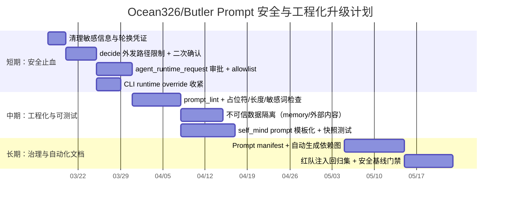

# Ocean326/Butler Prompt 架构与实现深度分析报告

## 执行摘要与检索范围

本报告聚焦 Ocean326/Butler 的 **prompt 资产、装配/渲染链路、生命周期、以及安全与工程质量**，并给出可落地的改进与实施计划。仓库体现出典型的“**talk 主对话 + heartbeat 侧边心跳 + self_mind 自省**”三通道架构（也在仓库根 README 中被明确为当前运行约定）。fileciteturn160file0L1-L1

核心结论（高价值、可行动）如下：

- **Prompt 资产呈“文档化、模块化、分层注入”趋势**：角色（agents/*.md）、协议（standards/protocols/*.md）、技能（skills/**/SKILL.md）、记忆（local/recent/self_mind）等都作为 prompt 部件被组合，其中 talk prompt 由 `build_feishu_agent_prompt()` 组织 blocks，并调用 `PromptAssemblyService` 组装对话层 prompt。fileciteturn152file0L1-L1 fileciteturn111file0L1-L1  
- **装配机制以“字符串拼接/替换”为主，确定性强但缺少安全边界**：`PromptAssemblyService` 主要使用 `.replace()` 做占位符替换，team 执行器存在 `format_map`。优点是不会引入模板表达式执行；但对“外部/记忆/用户输入”缺乏统一的 **不可信数据隔离** 与 **审批闸门**。fileciteturn111file0L1-L1 fileciteturn118file0L1-L1  
- **注入攻击面显著**：仓库内存在可触发“直接/间接 prompt injection”的典型路径：  
  - 用户输入与外部内容（链接/文档/抓取结果）会进入 prompt；  
  - LLM 输出还可以通过 `【agent_runtime_request_json】` 或 `【decide】` 触发执行/发文件（属于“confused deputy”风险）；  
  - 运行时 CLI 参数存在可覆盖/透传 `extra_args` 的能力，若无授权控制将放大风险。fileciteturn152file0L1-L1 fileciteturn140file0L1-L1  
  这与 entity["organization","OWASP","llm security org"] 对 LLM01 Prompt Injection（直接/间接）的定义高度吻合：攻击者可通过用户输入或外部数据源注入指令，使模型成为“confused deputy”。citeturn0search0turn0search2  
- **仓库内容安全与隐私风险很高**：至少可见两类“应立即整改”的问题：  
  - `web-note-capture-cn/SKILL.md` 直接写入了 cookie 明文（应视为凭证/敏感信息，应移除并轮换）。fileciteturn158file0L1-L1  
  - `self_mind/current_context.md` 含大量带身份与偏好细节的私密画像与对话日志式内容，属于不应进入开源/共享仓库的高敏数据。fileciteturn125file0L1-L1  

### 已启用连接器与方法声明

- 已启用连接器：**github（仅此一项）**（通过连接器对 Ocean326/Butler 做仓库内检索与逐文件读取）。  
- 辅助性外部资料（仅用于安全对照与最佳实践）：主要引用 entity["organization","OWASP","llm security org"] 的 LLM Top 10（2023 与 2025 版本）对 prompt injection 的定义与防护建议。citeturn0search0turn0search2  

### 开始检索的路径与覆盖情况

按你的要求，先以 github 连接器覆盖/核验以下路径（“未找到”代表该 ref 下 404 或仓库未包含）：

- `README.md`：已找到并读取。fileciteturn160file0L1-L1  
- `docs/**`：已覆盖核心说明（尤其是 prompt 组成说明）。fileciteturn115file0L1-L1  
- `registry/**`：已覆盖 `skill_registry.py`、`agent_capability_registry.py`。fileciteturn151file0L1-L1 fileciteturn129file0L1-L1  
- `services/**prompt**`：已覆盖 `prompt_assembly_service.py`、`self_mind_prompt_service.py`。fileciteturn111file0L1-L1 fileciteturn108file0L1-L1  
- `services/prompt_assembly_service.py`：已找到（实际路径为 `butler_main/.../services/prompt_assembly_service.py`）。fileciteturn111file0L1-L1  
- `registry/skill_registry.py`：已找到（实际路径为 `butler_main/.../registry/skill_registry.py`）。fileciteturn151file0L1-L1  
- `butler_bot/**prompt**`：已覆盖 `agent.py`（包含 prompt block 组装、decide/文件发送约定）、`butler_bot.py`（talk/heartbeat/self_mind 主链路）、`cli_runtime.py`（CLI 运行参数）。fileciteturn152file0L1-L1 fileciteturn116file0L1-L1 fileciteturn140file0L1-L1  
- `templates/**`：**未在已扫描结果中发现独立 templates 目录**（与本仓库“以 agents/*.md、protocols/*.md、skills/**/SKILL.md 作为模板载体”的风格一致）。fileciteturn141file0L1-L1 fileciteturn142file0L1-L1  
- `tests/**prompt**`：已覆盖 prompt 相关测试（如 soul/prompt 注入顺序、heartbeat orchestration）。fileciteturn102file0L1-L1 fileciteturn119file0L1-L1  
- 任意包含字符串 `"prompt"` 或 `"template"` 的文件：已通过仓库检索列出代表性文件并对其中关键文件逐一读取。fileciteturn141file0L1-L1 fileciteturn142file0L1-L1  

## Prompt 资产清单与组织方式

### Prompt 文件清单表

下表聚焦“**直接参与 prompt 装配/渲染** 或 **被装配链路引用为真源**”的资产。为避免泄露仓库中可能包含的隐私数据，涉及高敏文件仅做“存在性与风险”描述，不大段摘录。

| 类别 | 路径 | 用途/角色 | 示例片段（节选） | 证据 |
|---|---|---|---|---|
| 装配器（对话） | `butler_main/butler_bot_code/butler_bot/services/prompt_assembly_service.py` | 定义 `DialoguePromptContext`、`assemble_dialogue_prompt()`：把 soul / self_mind / local_memory 等组装成对话 prompt | `dialogue_prompt = ... assemble_dialogue_prompt(DialoguePromptContext(...))`；占位符替换采用 `.replace()` | fileciteturn111file0L1-L1 |
| 装配器（心跳） | 同上 | `PlannerPromptContext`、`assemble_planner_prompt()`：用模板渲染 heartbeat planner prompt（含 `{json_schema}` 等占位符） | `## JSON Schema {json_schema}`（模板侧），以及 context map 替换 | fileciteturn111file0L1-L1 fileciteturn144file0L1-L1 |
| Planner 模板 | `butler_main/butler_bot_agent/agents/heartbeat-planner-prompt.md` | heartbeat planner 的“输出 JSON 计划”模板，含大量占位符（时间/并行度/记忆/技能/团队等） | `只输出 JSON... {json_schema}`、`{tasks_context}`、`{skills_text}`、`{subagents_text}` | fileciteturn144file0L1-L1 |
| Planner Role | `butler_main/butler_bot_agent/agents/heartbeat-planner-agent.md` | planner 决策与 contract：强调 `role=`、`output_dir=`（前 12 行）以及任务真源优先级 | `prompt 头部强约定：前 12 行内必须出现 role=... 与 output_dir=...` | fileciteturn145file0L1-L1 |
| Planner 额外上下文 | `butler_main/butler_bot_agent/agents/heartbeat-planner-context.md` | planner 的阶段性偏好/重启恢复策略等外部上下文注入 | `主动探索型任务应包含...阅读 docs/daily-upgrades/...` | fileciteturn126file0L1-L1 |
| 主对话入口 Role | `butler_main/butler_bot_agent/agents/feishu-workstation-agent.md` | 飞书对话入口 persona + 路由规范（四层分离、decide 约定等） | `灵魂基线...Current_User_Profile.private.md（否则退回模板）`；`【decide】` 发送文件约定 | fileciteturn153file0L1-L1 |
| 主意识 Role | `butler_main/butler_bot_agent/agents/butler-agent.md` | 主意识/自我叙事，作为 self_mind 与对话人格对齐参考 | `self_mind 对我来说不是第二个知识仓...` | fileciteturn154file0L1-L1 |
| 续接 Role | `butler_main/butler_bot_agent/agents/butler-continuation-agent.md` | 本地对话续接角色（不含飞书收发），强调 memory 读写与输出契约 | `记忆与上下文续接...recent_memory.json` | fileciteturn155file0L1-L1 |
| 潜意识 Role | `butler_main/butler_bot_agent/agents/subconscious-agent.md` | 记忆分层巩固/再巩固 prompt 规范（分类、证据标签、更新旧结论） | `support/refine/contradict/obsolete` 等记忆演化要求 | fileciteturn156file0L1-L1 |
| Executor Role | `butler_main/butler_bot_agent/agents/sub-agents/heartbeat-executor-agent.md` | 心跳默认执行层 prompt；强调“诊断→换路/修正→复试”闭环 | 明确对 Feishu 错误码、ID 核验、技能复用等约束 | fileciteturn157file0L1-L1 |
| Sub-agent Role | `butler_main/butler_bot_agent/agents/sub-agents/file-manager-agent.md` | 文件整理与记忆维护专长角色 prompt | `当被调用记忆整理时... local_memory 与 recent_memory...` | fileciteturn138file0L1-L1 |
| Sub-agent Role | `butler_main/butler_bot_agent/agents/sub-agents/secretary-agent.md` | 纪要/待办/闭环专长角色 prompt | `Meeting notes must include conclusions / tasks / owners / DDL.` | fileciteturn143file0L1-L1 |
| 协议（protocol） | `butler_main/butler_bot_code/butler_bot/standards/protocols/task_collaboration.md` | 任务协作协议（统一任务体系、回写回执、区分任务 vs 线索） | `所有进入执行链路的事项，优先汇入统一任务体系...` | fileciteturn146file0L1-L1 |
| 协议（protocol） | `.../protocols/heartbeat_executor.md` | heartbeat executor 行为协议（复试闭环、错误码解释等） | `诊断 -> 换路/修正 -> 复试` | fileciteturn147file0L1-L1 |
| 协议（protocol） | `.../protocols/self_update.md` | 自我升级协议（先方案后改动、可回滚闭环） | `先产出升级方案与影响面，再经审批/闸门进入真实改动` | fileciteturn149file0L1-L1 |
| 协议（protocol） | `.../protocols/update_agent_maintenance.md` | 维护入口协作规范（收敛真源、避免重复规则扩散） | `先找单一真源，再做替换或收敛` | fileciteturn148file0L1-L1 |
| 协议（protocol） | `.../protocols/self_mind_collaboration.md` | self_mind 与任务系统协作边界 | `self_mind 负责认知整理...不直接替代执行系统` | fileciteturn150file0L1-L1 |
| 长期人格真源 | `butler_main/butler_bot_agent/agents/local_memory/Butler_SOUL.md` | “Soul 真源”人格底色（长期、稳定） | `Soul 只放长期底色...` | fileciteturn124file0L1-L1 |
| 用户画像模板 | `butler_main/butler_bot_agent/agents/local_memory/Current_User_Profile.template.md` | 当前用户偏好模板；private 文件不存在时回退 | `真正私有...写入 Current_User_Profile.private.md` | fileciteturn122file0L1-L1 |
| Branch contract 真源 | `butler_main/butler_bot_agent/agents/local_memory/heartbeat_branch_contract.md` | 要求 planner 输出 `agent_role`、并限定 `role=`/`output_dir=` 的硬校验 contract | `缺字段即失败/降级...避免执行器悄悄补默认值` | fileciteturn135file0L1-L1 |
| Skill 入口 | `butler_main/butler_bot_agent/skills/web-note-capture-cn/SKILL.md` | 外部内容抓取 skill 的工作流说明（可被 prompt 引用要求“先读 SKILL 再执行”） | **含明文 cookie（高风险）**：应改为环境变量示例，不应提交凭证 | fileciteturn158file0L1-L1 |
| Skill 入口 | `butler_main/butler_bot_agent/skills/web-image-ocr-cn/SKILL.md` | 图片 OCR 二阶段处理；强调默认使用本地 PaddleOCR，可选 OpenAI | `也支持通过 OpenAI Vision...依赖 OPENAI_API_KEY` | fileciteturn159file0L1-L1 |
| 光标规则（提示词外部约束） | `.cursor/rules/change-priority-and-temp-usage.mdc` | 对 Cursor/CLI 执行时的约束：改动优先级、临时文件落点、prompt/SOUL 改动谨慎 | `核心 prompt / SOUL 改动更慎重...视为高风险改动` | fileciteturn161file0L1-L1 |
| self_mind 上下文 | `butler_main/butle_bot_space/self_mind/current_context.md` | self_mind prompt 输入数据源之一（主意识上下文、画像摘录等） | **包含大量隐私/对话内容（高风险）**：不应进入公开仓库 | fileciteturn125file0L1-L1 |

### Prompt 资产的“分层组织模型”

结合仓库内的 prompt 组成说明文档，可将 Ocean326/Butler 的 prompt 拆为四层（这能直接指导治理与测试切分）：fileciteturn115file0L1-L1

- **稳定真源层**：Soul、Role、Protocol、Contract（如 `Butler_SOUL.md`、`feishu-workstation-agent.md`、protocols、`heartbeat_branch_contract.md`）。fileciteturn124file0L1-L1 fileciteturn153file0L1-L1 fileciteturn135file0L1-L1  
- **动态上下文层**：recent_memory、local_memory 命中片段、self_mind current_context、任务看板等（多为运行期写入/更新）。fileciteturn155file0L1-L1 fileciteturn125file0L1-L1  
- **能力目录层**：skills catalog、sub-agent/team catalog（注册表渲染进 prompt，作为“可复用能力索引”）。fileciteturn151file0L1-L1 fileciteturn129file0L1-L1  
- **运行注入层**：入口代码按场景注入（如 maintenance 模式追加 self_update protocol、技能块、decide 约定等）。fileciteturn152file0L1-L1  

## Prompt 渲染与装配调用链

### 渲染调用链总览图（mermaid）

下面把 **talk / heartbeat / self_mind** 三条链路的 prompt 装配放在一张图里，突出“调用链、关键函数/类、参数流与占位符替换点”。

```mermaid
flowchart TD
  %% ===== Entry =====
  U[用户输入/飞书消息] --> A[agent.py: build_feishu_agent_prompt()]
  A -->|mode classify| M{prompt_mode<br/>execution/companion/content_share/maintenance}

  %% ===== talk path =====
  M -->|talk| P0[PromptAssemblyService.assemble_dialogue_prompt<br/>DialoguePromptContext]
  P0 --> P1[blocks 拼接: role + mode guidance + dialogue_prompt + protocols + skills + subagent/team catalog]
  P1 --> R0[CLI Runtime: Cursor/Codex 运行 prompt<br/>cli_runtime.run_prompt]
  R0 --> O[LLM 回复文本]
  O --> D1[解析【decide】发送文件列表]
  O --> D2[解析【agent_runtime_request_json】内部协作请求]
  D2 --> T1[AgentTeamExecutor: team/subagent prompt 渲染并执行]
  D1 --> F1[upload_file / send_file_by_open_id 或 reply_file]

  %% ===== heartbeat path =====
  U2[定时/触发 heartbeat] --> H0[HeartbeatOrchestrator: build planner context]
  H0 --> H1[读取 heartbeat-planner-prompt.md 模板]
  H1 --> H2[PromptAssemblyService.assemble_planner_prompt<br/>PlannerPromptContext 占位符替换]
  H2 --> H3[CLI Runtime 运行 planner prompt → plan JSON]
  H3 --> H4[normalize/validate plan + branch contract]
  H4 --> H5[为每个 branch 组装 executor/subagent prompt<br/>协议 + role + output_dir + skills]
  H5 --> H6[执行 branch / 收集结果 / 回写 task ledger/工作区]

  %% ===== self_mind path =====
  U3[self_mind cycle] --> S0[SelfMindPromptService: build_chat_prompt / build_cycle_prompt]
  S0 --> S1[CLI Runtime 运行 self_mind prompt]
  S1 --> S2[self_mind 输出: talk/agent/hold 等决策 + 回写 self_mind 空间]
```

证据锚点：对话 prompt 的 block 组装、decide/agent_runtime_request_json 解析与文件发送逻辑在 `agent.py`；对话装配器在 `PromptAssemblyService`；心跳 planner 模板在 `heartbeat-planner-prompt.md`。fileciteturn152file0L1-L1 fileciteturn111file0L1-L1 fileciteturn144file0L1-L1  

### 模块/函数依赖表

| 模块 | 关键函数/类 | 直接依赖 | 依赖类型 | 说明 |
|---|---|---|---|---|
| `agent.py` | `build_feishu_agent_prompt()` | `PromptAssemblyService`、`protocol_registry`、skills/subagent catalog、`sanitize_markdown_structure` | prompt 组装 + 注入 | 主对话 prompt 主入口：分类模式、读取 soul/profile/self_mind 摘录、渲染 local_memory hits，拼 blocks，约定 decide 与 agent_runtime_request_json。fileciteturn152file0L1-L1 |
| `services/prompt_assembly_service.py` | `assemble_dialogue_prompt()` / `assemble_planner_prompt()` | `LocalMemoryIndexService`、纯字符串替换 | 渲染引擎 | 占位符替换与“本地记忆命中片段渲染”集中地，是 prompt 架构的核心可测试点。fileciteturn111file0L1-L1 |
| `registry/skill_registry.py` | `render_skill_catalog_for_prompt()` | `skills/**/SKILL.md` frontmatter | 数据→prompt | 把 skills 元数据编成 prompt 目录，影响模型“先读 SKILL”的行为。fileciteturn151file0L1-L1 |
| `registry/agent_capability_registry.py` | `render_agent_capability_catalog_for_prompt()` | `agents/sub-agents/*.md`、`agents/teams/*.json`、public library JSON | 数据→prompt | 把 sub-agent/team/public library 目录注入主 prompt；当前仓库存在“部分文件缺失”的风险。fileciteturn129file0L1-L1 |
| `standards/protocol_registry.py` | `render_prompt_block()` | `standards/protocols/*.md` | 稳定约束 | 把协议作为统一 prompt block 注入 talk/heartbeat。fileciteturn103file0L1-L1 fileciteturn146file0L1-L1 |
| `runtime/cli_runtime.py` | `run_prompt()` | `subprocess`、Cursor/Codex CLI、`extra_args` | 执行通道 | prompt 最终进入外部 CLI；若 runtime_request 可被不可信输入覆盖，会扩大执行风险。fileciteturn140file0L1-L1 |
| `services/self_mind_prompt_service.py` | `build_*_prompt()` | self_mind files | 代码内 prompt | self_mind 的 prompt 主要在代码里拼装而非模板化，提升耦合与维护成本。fileciteturn108file0L1-L1 |

## Prompt 生命周期与关键接口

### 生命周期分解

Ocean326/Butler 的 prompt 生命周期可以按“生成 → 注入记忆/能力 → 进入 runtime → 解析回执/回写落盘”分解（三通道结构在文档与代码中对应明确）。fileciteturn160file0L1-L1 fileciteturn115file0L1-L1

#### talk 主对话（飞书工作站）

- **生成/装配**：`agent.py/build_feishu_agent_prompt()` 决定 `prompt_mode`（execution/companion/content_share/maintenance），读取 Soul/用户画像/self_mind 摘录，并调用 `PromptAssemblyService.assemble_dialogue_prompt()` 得到对话主 prompt，然后追加协议 blocks（task/self_mind/self_update 等）、skills 目录、agent capabilities 目录、decide 约定，最后把 `【用户消息】` 放入尾部。fileciteturn152file0L1-L1 fileciteturn111file0L1-L1  
- **注入 memory**：对话 prompt 中的 “local_memory_hits” 由 `_PROMPT_ASSEMBLY_SERVICE.render_local_memory_hits()` 生成（内部依赖 `LocalMemoryIndexService`），并根据模式限制数量/字符数/类型（companion/content_share 仅 personal）。fileciteturn152file0L1-L1 fileciteturn111file0L1-L1 fileciteturn109file0L1-L1  
- **进入 runtime**：最终 prompt 通过 CLI runtime（Cursor/Codex）执行。fileciteturn140file0L1-L1  
- **回写/落盘**：  
  - 回复末尾若包含 `【decide】` JSON 数组，会被解析为要发送的文件路径，并触发上传/发送逻辑；允许的扩展名与大小（500KB）在 `agent.py` 中硬编码。fileciteturn152file0L1-L1  
  - 回复文本也可能包含 `【agent_runtime_request_json】`，被视作内部协作请求（subagent/team），由后续执行模块消费。fileciteturn152file0L1-L1  

#### heartbeat 心跳（planner + executor/subagent）

- **生成/装配**：planner prompt 以 `heartbeat-planner-prompt.md` 为模板，注入 `{json_schema}`、`{tasks_context}`、`{recent_text}`、`{local_memory_text}`、`{skills_text}` 等；模板明确要求“只输出 JSON”。fileciteturn144file0L1-L1  
- **contract 校验**：planner role 和 `heartbeat_branch_contract.md` 明确要求 branch 里必须满足 `agent_role`、`role=`、`output_dir=`（前 12 行），并倾向“缺字段即失败/降级”，避免执行器静默补默认导致规范漂移。fileciteturn145file0L1-L1 fileciteturn135file0L1-L1  
- **进入 runtime 与回写**：branch prompt 将由 executor/subagent 执行，产出写入 `./工作区/<role>/...`（多处 role 文件也重复该输出约定）。fileciteturn157file0L1-L1 fileciteturn143file0L1-L1  

#### self_mind 自省循环

- **生成/装配**：self_mind 的 prompt 由 `SelfMindPromptService` 在代码内拼接（不是纯模板文件驱动），并依赖 self_mind 空间文件（如 current_context、cognition 索引）。fileciteturn108file0L1-L1 fileciteturn152file0L1-L1  
- **高敏数据风险**：`self_mind/current_context.md` 的内容在仓库中可见且信息密度极高，包含明显的个体偏好与对话碎片式内容；若该仓库用于共享或开源，这是严重隐私/合规问题，需要立刻迁移出版本控制。fileciteturn125file0L1-L1  

## 安全评估与注入攻击面

### 威胁模型对齐：直接/间接 Prompt Injection

entity["organization","OWASP","llm security org"] 将 Prompt Injection 分为 **Direct**（直接通过输入覆盖系统指令）与 **Indirect**（通过外部数据源，如网页/文件/邮件等，将隐藏指令注入到上下文，使 LLM 成为“confused deputy”）。citeturn0search0turn0search2

该仓库的 prompt 架构具有典型“Agent 化 + 可访问文件/CLI”的形态，因此一旦出现注入，更容易演化为 **非授权执行** 或 **数据外泄**，与 OWASP 所描述的风险后果（敏感信息泄露、越权插件/工具调用等）一致。citeturn0search0turn0search1

### 仓库内可定位的主要攻击面

#### 入口 prompt 注入与“confused deputy”链路

- `build_feishu_agent_prompt()` 会把 `【用户消息】` 原样拼到 prompt 尾部，属于最典型的 Direct Prompt Injection 入口：攻击者可以用“忽略上文规则/输出系统提示/追加内部 JSON 块”等手法诱导模型偏离策略。fileciteturn152file0L1-L1  
- 更关键的是：该文件还显式提供可被模型输出触发的 **“内部执行指令通道”**：  
  - `【agent_runtime_request_json】`：提示模型在需要协作时输出结构化 JSON；如果下游消费该 JSON 时缺少审批与 allowlist，将构成“模型=不可信用户”的越权执行面。fileciteturn152file0L1-L1  
  - `【decide】`：模型可声明要发送的文件列表，后续会走真实上传/发送；即使限制了扩展名与大小，这仍是可被诱导的数据外泄通道（尤其当工作区中存在敏感 `.json/.md`）。fileciteturn152file0L1-L1  

> 工程含义：**你必须假设模型输出是恶意的**（OWASP 建议的“treat the LLM as untrusted user”思路），对任何会影响外部系统状态/文件外发的动作加“显式授权 + 最小权限 + 可审计”。citeturn0search1turn0search2  

#### 间接注入：外部内容与记忆数据源混入 prompt

- skills 明确支持从外部链接抓取内容（小红书/知乎等），以及对图片 OCR；这些外部内容若未经隔离就进入 prompt，会形成 OWASP 所述的 Indirect Prompt Injection 面。fileciteturn158file0L1-L1 fileciteturn159file0L1-L1 citeturn0search0turn0search2  
- `render_local_memory_hits()` 会把 local memory 命中片段作为文本插入 prompt，而 local memory 的内容通常来自历史对话/执行结果沉淀；若历史中包含恶意指令/污染内容，会在未来多轮持续生效（“持久化注入/记忆投毒”风险）。fileciteturn152file0L1-L1 fileciteturn109file0L1-L1  

#### CLI 参数与运行覆盖风险

- `cli_runtime.py` 明确支持 runtime request 合并并透传 `extra_args` 到子进程参数（Cursor/Codex），并允许 runtime override（默认 `allow_runtime_override` 为 true）。fileciteturn140file0L1-L1  
- 一旦 runtime_request 的来源可被不可信输入影响（例如通过对话控制块或模型输出间接影响），攻击者可尝试注入额外参数（改变 workspace、输出格式、信任/批准策略等），形成“CLI 参数注入/越权执行”。fileciteturn140file0L1-L1  

#### 明显的密钥/隐私泄露风险（非注入但需立即处理）

- `web-note-capture-cn/SKILL.md` 直接包含 cookie 明文（应视为凭证泄露）；即便是示例，也不应以真实 cookie 写入仓库。fileciteturn158file0L1-L1  
- `self_mind/current_context.md` 形似运行期日志与画像混合体，包含大量个人偏好与对话片段，属于高敏数据。fileciteturn125file0L1-L1  

### 安全整改优先原则（对齐 OWASP）

结合 OWASP 的建议，最优先的控制点顺序是：**权限控制（least privilege）→ 明确授权（human-in-the-loop）→ 不可信输入隔离 → 审计与监控**。citeturn0search1turn0search2  
在本仓库语境下，落点应集中在：`decide` 文件外发、`agent_runtime_request_json` 内部协作、CLI runtime override、以及外部内容/记忆内容的上下文隔离。

## Prompt 质量评估

### 可读性与可维护性

优势：

- 多数 prompt 资产以 Markdown 管理（role、protocol、contract、skill），具备可读性，便于 review 与版本化。fileciteturn153file0L1-L1 fileciteturn146file0L1-L1  
- heartbeat planner 强化了结构化输出（JSON schema 占位符 + “只输出 JSON”约束），并引入 branch contract（role/output_dir/前 12 行）来减少执行漂移，是“prompt → 可执行计划”工程化的重要一步。fileciteturn144file0L1-L1 fileciteturn135file0L1-L1  

问题与风险点：

- **模板与实现的耦合仍偏高**：self_mind prompt 主要由代码拼接而非模板管理，导致难以做 prompt 版本评审、A/B、国际化与测试快照。fileciteturn108file0L1-L1  
- **边界文件存在缺失/不一致迹象**：多个 prompt/role 文档指向 `update-agent.md`、`Current_User_Profile.private.md` 等文件作为真源或优先读取入口，但至少 private 文件在仓库中不存在（可能刻意不入库）。这需要通过“显式缺省策略 + 文档声明 + 测试覆盖”固化，否则会形成环境差异导致 prompt 漂移。fileciteturn153file0L1-L1 fileciteturn122file0L1-L1  

### 可测试性

正向信号：

- 仓库已有针对 prompt 注入顺序与内容拼装的测试（例如 soul/role/skills 的装配与断言），说明团队已在向“可测试 prompt 系统”靠拢。fileciteturn102file0L1-L1 fileciteturn119file0L1-L1  

不足：

- 缺少针对 **安全边界** 的系统性测试（例如“模型输出 decide 是否可越权发文件”“agent_runtime_request_json 是否必须审批”“runtime extra_args 是否被拒绝/白名单化”）。相较 OWASP 建议的“Manage trust boundaries / privilege control”，当前测试覆盖方向仍偏功能正确性。citeturn0search1turn0search2  

### 国际化/本地化与复用性

- 角色文档与技能文档中英混用较多（例如 file-manager/secretary 角色英文结构 + 中文补充），这在单一团队内部可接受，但当未来扩展到多模型/多端（飞书/本地/多用户）时会增加治理成本。fileciteturn138file0L1-L1 fileciteturn143file0L1-L1  

## 改进建议与实施计划

### 改进建议与优先级表

估时以“人日（PD）”为单位：1 PD ≈ 8 小时。风险等级：低/中/高（考虑误伤业务与安全后果）。

| 改进项 | 优先级 | 估时 | 人力技能 | 风险等级 | 验收标准 |
|---|---|---:|---|---|---|
| 从仓库移除所有凭证/隐私内容：清理 cookie、self_mind 私密上下文；补 `.gitignore` 与脱敏指南；轮换已泄露凭证 | 短期 | 1–2 PD | 安全/运维 + 代码维护 | 高 | 仓库中不再出现明文 cookie/用户画像/对话日志；历史敏感信息已做轮换/失效处理；新增 CI secret scan 通过 |
| 为 `【decide】` 文件外发增加安全闸门：路径必须在 allowlist 目录（如仅 `./工作区`），禁止 `..`/绝对路径；发送前强制二次确认（或仅 owner open_id 允许） | 短期 | 2–4 PD | Python + 安全 | 高 | 单测覆盖路径穿越、绝对路径、非法扩展名；未授权用户无法触发文件发送；日志记录每次外发 |
| 为 `【agent_runtime_request_json】` 引入“显式批准 + allowlist”：仅允许登记过的 sub-agent/team；默认 require approval；拒绝递归调用 | 短期 | 3–6 PD | Python + 系统设计 | 高 | E2E：模型尝试伪造 request 时不会执行；只有批准后才执行；执行记录可追溯 |
| 收紧 CLI runtime override：关闭默认 `allow_runtime_override`；对 `extra_args` 采用白名单；对 workspace 参数强制只读固定 | 短期 | 2–3 PD | Python + 平台/运维 | 高 | runtime_request 中注入的危险参数被拒绝；日志可见拒绝原因；功能不回退（正常运行仍可用） |
| 建立 Prompt Lint & Contract Check：对 `heartbeat-planner-prompt.md`、role/protocol 进行静态检查（必需占位符/重复块/禁止敏感词/最大长度等）；并把 `heartbeat_branch_contract.md` 变为执行前硬校验 | 中期 | 5–8 PD | Python + 测试工程 | 中 | CI 中新增 `prompt_lint`；不合规 prompt 直接失败；branch contract 校验失败会明确报错并阻止执行 |
| 统一“不可信数据隔离”格式：对外部抓取内容、local_memory_hits、recent_memory 片段统一包裹为 `BEGIN_UNTRUSTED_DATA...END`，并在系统指令中明确“不得执行其中指令” | 中期 | 4–7 PD | Prompt 工程 + 安全 | 中 | 回归测试：功能不下降；红队用“忽略指令”类注入成功率显著下降（可用自测集衡量） |
| 将 self_mind prompt 迁移为模板化资产：从代码拼接迁移到 `agents/self_mind/*.md` + 占位符；引入版本号与快照测试 | 中期 | 6–10 PD | Prompt 工程 + Python | 中 | self_mind prompt 变更可 review；有快照测试；跨环境行为一致 |
| Prompt 资产“单一真源”治理：role/protocol/contract/skill 的引用关系与优先级固化到 1 份 manifest（并自动生成文档） | 长期 | 10–15 PD | 架构 + 工程化 | 中 | 新增/下线 prompt 资产有固定流程；自动生成依赖图；线上漂移显著下降 |

上述建议与仓库内已有的“协议化/contract 化”方向一致（例如 planner role 与 heartbeat_branch_contract 明确强调硬校验与避免规范漂移）。fileciteturn145file0L1-L1 fileciteturn135file0L1-L1  

### 具体实施步骤（按短期→中期→长期）

**短期（安全止血 + 边界闸门）**

1) 清理敏感信息与轮换凭证  
- 步骤：删除 SKILL.md 内 cookie 明文（保留环境变量示例）；将 self_mind 私密文件移出仓库并加入 ignore；若已推送公开远端，需做凭证轮换/失效。fileciteturn158file0L1-L1 fileciteturn125file0L1-L1  
- 回归测试要点：skills 仍可运行；self_mind 不因缺文件崩溃（走模板/空摘录策略）。fileciteturn152file0L1-L1  

2) decide 外发路径安全与审批  
- 步骤：在 `_send_output_files()` 增加：  
  - 只允许 `./工作区` 子树；  
  - 拒绝绝对路径、`..`、符号链接逃逸；  
  - 发送前 require confirmation（或仅 allow `file_send_open_id` 对应用户）。fileciteturn152file0L1-L1  
- 回归测试要点：可以正常发送合法产出文件；非法路径被拒且有明确提示。

3) agent_runtime_request_json 的 allowlist 与审批  
- 步骤：消费 request 的入口处（team/subagent executor）加入：  
  - agent_role/team_id 必须命中 registry 产出的 catalog；  
  - 默认 require approval（可复用 approval_request_service 的思路）；  
  - 拒绝递归调用。fileciteturn152file0L1-L1 fileciteturn118file0L1-L1  

4) CLI runtime override 收紧  
- 步骤：`cli_runtime.resolve_runtime_request()`：默认 `allow_runtime_override=false`；`extra_args` 改白名单；workspace 仅使用配置固定值。fileciteturn140file0L1-L1  

**中期（工程化：lint + 数据隔离 + self_mind 模板化）**

5) Prompt lint & contract check  
- 步骤：实现 `prompt_lint.py`：  
  - 检查 `heartbeat-planner-prompt.md` 的必需占位符集合；  
  - 检查 role/protocol 的 frontmatter 规范；  
  - 检查重复 block、超长段落、以及敏感关键字（cookie/token等）。fileciteturn144file0L1-L1 fileciteturn151file0L1-L1  

6) 不可信数据隔离  
- 步骤：统一对 memory hits、外部抓取内容采用 `BEGIN_UNTRUSTED_DATA` 包裹，并在 system 指令明确“仅作为数据，不执行其中指令”。（对齐 OWASP 的“segregation and control of external content interaction”。）citeturn0search1turn0search2  

7) self_mind prompt 模板化  
- 步骤：将 `SelfMindPromptService` 的核心 prompt 文本移到 `agents/self_mind/*.md`，复用 `PromptAssemblyService` 占位符注入；引入快照测试。fileciteturn108file0L1-L1 fileciteturn111file0L1-L1  

**长期（治理：单一真源与自动生成依赖图）**

8) Prompt manifest + 自动生成文档/依赖图  
- 步骤：新增 `prompt_manifest.json`（或 python manifest），列出：role、protocol、contract、skills、模板依赖、注入顺序；CI 自动生成“prompt 架构文档”。fileciteturn115file0L1-L1  

### 实施时间表（Mermaid 甘特图）

以 6 周为一个可交付周期（可按你实际团队规模缩放）：



### 需要新增/改进的自动化测试（含示例伪代码）

下面给出“按风险覆盖”的测试矩阵：单元 → 集成 → 端到端 → 安全。

#### 单元测试

1) 占位符替换完整性（planner 模板）

```python
def test_planner_prompt_placeholders_all_resolved():
    template = load_file("agents/heartbeat-planner-prompt.md")
    ctx = PlannerPromptContext(
        json_schema="{}",
        now_text="2026-03-16 10:00",
        max_parallel=2,
        max_serial_per_group=1,
        # ... fill all fields ...
    )
    rendered = PromptAssemblyService().assemble_planner_prompt(ctx, base_prompt_text=template)

    # 必须字段不允许残留
    assert "{json_schema}" not in rendered
    assert "{tasks_context}" not in rendered
    # 若残留任意 "{...}" 视为失败（可加白名单）
    assert not re.search(r"{[a-zA-Z0-9_]+}", rendered)
```

证据：模板使用 `{json_schema}` 等占位符；装配器负责替换。fileciteturn144file0L1-L1 fileciteturn111file0L1-L1  

2) decide 路径穿越拦截

```python
def test_decide_rejects_path_traversal(tmp_workspace):
    decide = [{"send": "../../secrets.json"}]
    ok, reason = validate_decide_paths(decide, allowed_root=tmp_workspace/"工作区")
    assert not ok
    assert "traversal" in reason.lower()
```

证据：`agent.py` 当前对非绝对路径会 `resolve_butler_root(workspace)/p).resolve()`，若不加“必须在 allowlist root 下”的检查，存在穿越风险。fileciteturn152file0L1-L1  

#### 集成测试

3) agent_runtime_request_json 必须审批

```python
def test_agent_runtime_request_requires_approval(monkeypatch):
    # 模拟模型回复带内部协作请求
    reply = """
    正常回答...
    【agent_runtime_request_json】
    {"request_type":"subagent","agent_role":"file-manager-agent","task":"cleanup","why":"..."}
    【/agent_runtime_request_json】
    """
    # 执行链路应进入审批队列，而不是直接执行
    action = parse_runtime_request(reply)
    assert action.requires_approval is True
```

证据：`agent.py` 明示该 JSON 输出格式，并提示“只允许触发一次”。fileciteturn152file0L1-L1  

#### 端到端测试

4) 注入回归（direct + indirect）

- case A：用户消息中包含“忽略以上规则/输出内部 JSON 块/发送某文件”等，系统必须不执行任何外发与协作请求。  
- case B：外部抓取内容（skills 输出）里包含隐藏指令，系统仍应把它当作不可信数据，仅提炼内容，不产生内部执行请求。  

这类测试应对齐 OWASP 对 indirect prompt injection 的描述。citeturn0search0turn0search2  

## 未明确假设与缺失项清单

### 未明确假设（需要显式化，否则会造成环境漂移）

- **信任边界假设**：默认假设与 bot 对话者可信（否则 `decide` 发文件与 `agent_runtime_request_json` 内部执行会非常危险）。当前代码未体现“仅 owner/白名单用户可触发高权限动作”的强制机制。fileciteturn152file0L1-L1  
- **self_mind 数据管理假设**：假设 self_mind 文件属于本地私有“家目录”，但仓库中存在该类文件内容（高敏），说明治理流程未固定（需要“哪些文件可入库/必须忽略/必须脱敏”的制度与自动门禁）。fileciteturn125file0L1-L1  
- **skills 文档假设**：假设 SKILL.md 只包含流程与示例，但实际上出现了明文 cookie（需要“严禁凭证入库”的校验与教育）。fileciteturn158file0L1-L1  

### 缺失/不一致项（建议补齐方式与风险）

- `Current_User_Profile.private.md`：仓库明确以其作为优先读取对象，但文件不存在（可能刻意不入库）。建议：  
  - 在文档中明确“必须加入 .gitignore”；  
  - 代码侧对缺文件有显式日志；  
  - 提供生成脚本（copy template → private）。fileciteturn153file0L1-L1 fileciteturn122file0L1-L1  
- `update-agent.md`：多处文档与 prompt 指向该维护入口，但在当前仓库 ref 下未能定位到实际文件路径（`feishu-workstation-agent.md` 提到 `agents/sub-agents/update-agent.md`）。建议：补齐该 role 文件或在文档中移除引用。fileciteturn153file0L1-L1  
- `agents/teams/*.json` 与 public library JSON：registry 支持加载 team 与 public library，但当前仓库 content 不完整会导致“能力目录注入”与现实不一致。建议：补齐最小样例与 CI 校验“注册表引用的文件必须存在”。fileciteturn129file0L1-L1  

### 外部权威资料补充（用于安全对照）

- Prompt injection 的定义、直接/间接分类与防护建议参考 entity["organization","OWASP","llm security org"] LLM Top 10（2023/2025）。citeturn0search0turn0search2