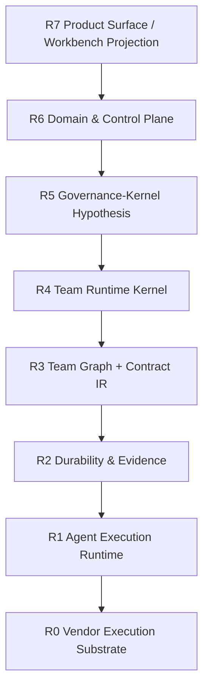

# 0407 Canonical Team Runtime 最终收口：任务产物真源、治理真源与升级门槛

日期：2026-04-07  
状态：最终收口 / 当前真源  
所属层级：跨层理论收口 / docs-only  
定位：统一收口 `0407` 两份脑暴稿与多轮交叉质询结论，给出当前现役命名、远景边界、proof slice 与升级门槛

关联：

- [0407 当日总纲](./00_当日总纲.md)
- [CLI Agent Substrate -> Canonical Team Runtime -> Team OS 脑暴收口](../../每日头脑风暴/0407/01_CLI_Agent_Substrate到Canonical_Team_Runtime再到Team_OS_脑暴收口.md)
- [以 `Task + Artifact` 为真源的 Full-Stack Team OS 草稿](../../每日头脑风暴/0407/02_以Task_Artifact为真源的Full_Stack_Team_OS草稿.md)
- [当前系统基线](../../project-map/00_current_baseline.md)
- [真源矩阵](../../project-map/03_truth_matrix.md)
- [系统分层与事件契约](../../runtime/System_Layering_and_Event_Contracts.md)
- [0401 Claude / Codex CLI 单 Session 能力报告](../0401/20260401_claude_codex_cli_session_report.md)
- [0403 Butler Flow Codex 执行根隔离与 `repo_bound` 裁决](../0403/01_butler-flow_Codex执行根隔离与repo_bound裁决.md)
- [0403 Butler Flow supervisor 控制画像与 agents-flow 治理升级](../0403/02_butler-flow_supervisor控制画像与agents-flow治理升级.md)

## 一句话裁决

Butler 当前不应直接命名为 `Team OS`。  
更准确的现役口径是：

> **Butler 当前是运行在 vendor CLI agent substrate 之上的 `canonical team runtime`；以 `Task / Artifact` 为交付真源，以 `Ownership / Authority / Policy / Receipt` 为治理真源；`session / thread` 只作为 runtime / recovery 容器，`group chat / @ / 1:1` 只作为 projection。只有当 `organizational kernel` 被正式对象化并稳定成立后，才升级命名为 `Team OS`。**

## 1. 本轮最终定位

### 1.1 当前现役命名

当前正式命名固定为：

- `canonical team runtime over vendor substrate`

当前明确不再使用的现役命名：

- `已经是 Team OS`
- `完整可移植的 vendor-neutral Team OS`
- `general knowledge work 平台`

### 1.2 三个时间尺度必须拆开

本轮最大收口之一，是不再把三个时间尺度揉成一层：

1. `现役 v1`
   - 单 primary substrate
   - 单 operator
   - 单 repo-bound engineering-task archetype
2. `中期 canonical runtime`
   - 继续把 `Task / Artifact / Ownership / Authority / Policy / Receipt` 做硬
   - 把 session 从业务真源中降级
3. `远景 Team OS`
   - 只有在 `organizational kernel`、治理账本、升级/撤销/追认、资源调度和可恢复投影都成立后才进入

## 2. 两份 0407 脑暴稿的正式分工

### 2.1 `0407/01` 的职责

`0407/01` 继续保留，但降级为：

- 前置讨论稿
- 现役定位与升级门槛的论证材料

它继续有效的结论：

- CLI agent 只是 `L1 execution substrate`
- `team runtime != team OS`
- `group chat` 只是 projection
- `caller != authority`
- 至少存在 `ownership / authority / communication / task / runtime` 五张图

它不再负责：

- full-stack 远景总图
- 最终命名裁决
- v1 实施边界的最终口径

### 2.2 `0407/02` 的职责

`0407/02` 继续保留，但降级为：

- full-stack 远景草稿
- 未来 `Team OS` 结构化想象的补充材料

它继续有效的结论：

- `Task + Artifact` 适合作为第一真源
- `Team Graph + Runtime Kernel + Governance + Workbench Projection` 是有效远景
- `external peer != MCP/tool`

它不再直接作为：

- 当前现役命名真源
- v1 范围裁决
- 当前分层替换令

## 3. 当前正式骨架与远景映射

### 3.1 现役骨架不推翻

Butler 当前现役骨架仍是：

`Product Surface -> Domain & Control Plane -> L4 Session Runtime -> L3 Protocol -> L2 Durability -> L1 Agent Execution Runtime`

本轮不推翻这条骨架。

### 3.2 远景映射只作为辅图

为了避免双分层，下面这张图只作为远景映射，不直接替换现役 `P/C/L4/L3/L2/L1`：

其中当前最重要的结论只有一句：

> **Butler 现在最该补的不是再造一层 workflow，而是把 `Ownership / Authority / Policy / Receipt` 从现有 control plane 中显式抽出，形成最小治理子集。**

## 4. 现役对象与新对象的裁决

### 4.1 现役控制链路继续有效

在完成正式迁移前，现役控制链路继续是：

- `campaign ledger -> workflow_session -> turn receipt`

这条链路仍是：

- 当前对外稳定链路
- 当前恢复与查询的正式入口

### 4.2 新对象的进入方式

新对象不允许与现役真源并列成第二套账本。  
本轮裁决是：

- `Task`
  - 允许作为规范化主对象推进
  - 但在没有正式映射表前，不得与 `campaign` 并列写真源
- `Artifact`
  - 允许继续强化为正式交付对象
  - 但必须映射到现役 artifact / delivery / bundle 口径
- `Ownership / Authority / Policy / Receipt`
  - 当前先作为最小治理子集推进
  - 不得只停留在 prompt 修辞

### 4.3 `session/thread` 的最终口径

本轮正式写死：

- `session/thread` 不是业务真源
- 但它们仍然是 runtime / recovery 一级真源

因此任何恢复设计都不得绕开：

- `workflow_session`
- `canonical_session_id`
- `RecoveryCursor`

## 5. 当前最值得做的 proof slice

本轮多席位交叉质询后，最像真的切口只有一个：

### `Receipt-backed Repo-Bound Task Contract Runtime`

限定条件：

- 单 repo
- 单 operator
- 单 engineering task
- 单 primary substrate

进入系统的正式对象不是 session，而是 typed `Task Contract`：

- `goal`
- `repo_scope`
- `acceptance`
- `owner`
- `authority`
- `policy`

运行中真正增长的真源只有：

- `Artifact`
- `Artifact Receipt`

当 session 挂掉、resume 失效或 turn 跑偏时，系统不依赖“继续聊天猜状态”，而是依赖：

- 最后一个被接受的 `Artifact Receipt`
- 当前 `Recovery Cursor`
- operator 的 typed action

## 6. 这条线比现有产品真正多出来的东西

不是：

- 更像群聊
- 更多面板
- 更会调用 vendor subagent

真正形成代差的点只有三个：

1. `Task Contract Runtime`
   - 任务先成为带范围、权限、验收的合同，再进入执行
2. `Artifact Receipt Ledger`
   - 代码、文档、测试、验收都产出 receipt，形成可追责账本
3. `Operator Recovery Lane`
   - 恢复、分叉、回滚基于 receipt，而不是基于 transcript 猜测

其中当前最值得先押注的是：

- `Task Contract Runtime`

因为另外两者都能挂在它之上。

## 7. 升级为 Team OS 的门槛

只有满足下面条件，Butler 才有资格从 `canonical team runtime` 升级命名为 `Team OS`：

1. 团队与子团队成为第一类对象，而不是 prompt 幻觉
2. `Ownership / Authority / Policy / Receipt` 形成正式账本
3. 组织状态真源不再依赖单一 vendor session
4. operator 的暂停、审批、接管、回滚都有 typed receipt
5. 任务、产物、治理、恢复、投影能够跨 session 家族连续成立
6. 至少存在一个明确的 `organizational kernel` 最小对象集，而不只是长 prompt 或经验约束

在这之前，最诚实的说法仍然是：

- `canonical team runtime`
- 不是 `Team OS`

## 8. 最终设计铁律

1. 一类事实只能有一个主真源。
2. 迁移期必须写出旧真源到新真源的单向映射。
3. `Projection` 永不写真源。
4. `Authority` 必须产出 typed receipt，不能只做注释字段。
5. `execution_context`、资源绑定、治理权限三者必须分开。
6. compile-time 协议、runtime 状态、governance 账本不得混成 mega-IR。
7. v1 只证明一个 primary substrate、一个 operator、一个 repo-bound engineering-task archetype。
8. 新对象进入真源前，必须先回答：`ID`、`谁能写`、`状态机`、`恢复依据`、`查询面`。

## 9. 对后续文档回写的直接要求

后续若继续推进本主题，优先补三张硬表，而不是继续写大段叙事：

1. `canonical-now vs provisional`
2. `Team Runtime -> Team OS upgrade conditions`
3. `现役对象 -> 新对象映射表`

在这三张表补齐前，不再继续扩大：

- `portable semantics`
- `general knowledge work`
- `完整 recursive team`
- `多 vendor parity`

## 10. 当前正式产品主张

> **Butler 是构建在 vendor substrate 之上的 canonical team runtime，用 `task / artifact` 真源与 `ownership / authority / policy / receipt` 治理 repo-bound engineering tasks，让执行可恢复、可审计、可追责。**
