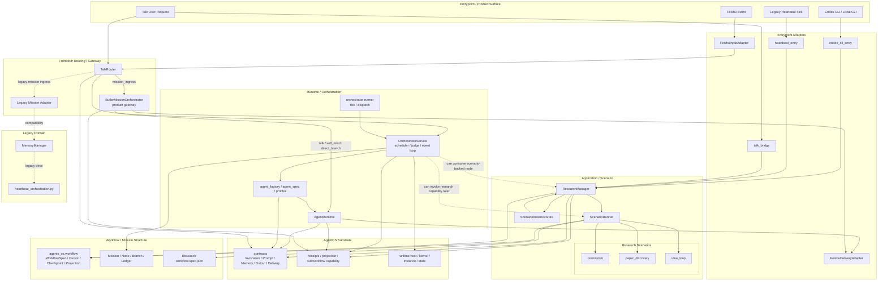

# Orchestrator / AgentOS / Research 总图（可转 iodraw）

日期：2026-03-21
时间标签：0321_2312

## 一、定位结论

这张图对应当前较稳定的工程口径：

- `orchestrator` 是后台编排运行时，不是某一个 workflow 本身
- `workflow` 是被 orchestrator 推进、或被 application/scenario 消费的结构层
- `adapter / entrypoint` 是接入面，不是 runtime core
- `agent_os` 是中性 substrate
- `research` 是 application/scenario 层，当前已具备 `brainstorm / paper_discovery / idea_loop` 三类场景 workflow

一句话：

> 入口把请求送进系统，adapter 负责映射，router/gateway 决定去向，orchestrator 负责推进后台 mission，agent_os 提供底座，research scenario 提供具体业务 workflow。

---

## 二、总图（Mermaid）

---

## 三、分层解释

### 1. Entrypoint / Adapter

这一层只负责把不同入口送进系统：

- `Feishu Event -> FeishuInputAdapter -> Invocation`
- `talk_bridge / heartbeat_entry / codex_cli_entry -> ResearchManager`
- `Legacy Heartbeat Tick -> legacy runtime`

这一层不拥有 mission 真源，也不拥有 workflow 真源。

### 2. Router / Gateway

这一层分成两个不同角色：

- `TalkRouter`
  - 前台路由器
  - 识别 `talk / self_mind / direct_branch / mission_ingress`
- `ButlerMissionOrchestrator`
  - 产品层 mission gateway
  - 把 `RuntimeRequest` 翻译成 mission create/status/control/feedback 等操作

注意：

- `TalkRouter` 不是 `MissionOrchestrator`
- `ButlerMissionOrchestrator` 也不是 core runtime，只是 gateway

### 3. Workflow / Mission Structure

这里有两类“workflow”，要分开理解：

- `agents_os.workflow`
  - 通用控制流层
  - 提供 `WorkflowSpec / Cursor / Checkpoint / Projection`
  - 更适合作为通用 workflow 表达和投影层

- `research scenarios/*/workflow.spec.json`
  - 应用层场景 workflow
  - 表达 `brainstorm / paper_discovery / idea_loop` 的 step 语义

而 `Mission / Node / Branch / Ledger` 是 orchestrator 自己的后台 mission 真源模型，不等于上面任一类 workflow。

### 4. Orchestrator Runtime

`OrchestratorService` 的准确定位是：

- 持有 mission 真源
- 推进 ready node
- dispatch branch
- collect result
- trigger judge
- 写 ledger

所以它和 workflow 的关系是：

- orchestrator 会消费 workflow/projection/template
- orchestrator 会推进 mission graph
- orchestrator 不是一个普通 workflow 节点
- orchestrator 也不是某个 application scenario

### 5. AgentRuntime / AgentFactory

这一层回答“具体怎么执行”：

- `agent_factory` 负责把 profile/spec 解析成可执行 worker 形态
- `AgentRuntime` 负责 prompt/memory/output 的执行层
- orchestrator 在 dispatch node 时调用它

所以顺序更准确是：

`Entrypoint -> Adapter -> Router/Gateway -> Orchestrator or AgentRuntime`

而不是：

`agent_factory -> workflow -> adapter -> 入口 -> orchestrator`

### 6. Research Application / Scenario

`research` 当前更适合被放在 application/scenario 层：

- `ResearchManager`
- `ScenarioRunner`
- `ScenarioInstanceStore`
- `brainstorm / paper_discovery / idea_loop`

它们当前已经有：

- workflow spec
- runner
- instance/state store
- multi-entry shared scenario thread

所以 research 的定位是：

> 一组可被多入口复用的场景 workflow 应用，而不是 orchestrator 本体。

未来它和 orchestrator 的关系可以有两种：

- 直接入口调用：`talk_bridge / heartbeat_entry / codex_cli_entry -> ResearchManager`
- 被 orchestrator 当成某类 capability 或 scenario-backed node 调用

---

## 四、你刚才那个问题的正式答案

如果按这张图，最稳的口径是：

- `orchestrator` 不是入口本身
- `orchestrator` 通过 `ButlerMissionOrchestrator` 暴露一个产品入口面
- `orchestrator` 也不是一种普通 workflow
- `orchestrator` 是拥有并推进 mission/workflow 的后台运行时

所以可以说：

> `orchestrator` 有入口面，但它的本体是 runtime；它管理 workflow，但它本身不等于 workflow。

---

## 五、iodraw 摆放建议

如果你要在 iodraw 里正式画，建议按 5 层横向泳道摆：

1. 第一排：`Entrypoint / Adapter`
   - Feishu Event
   - Talk Request
   - Codex CLI
   - Legacy Heartbeat Tick
   - FeishuInputAdapter / talk_bridge / heartbeat_entry / codex_cli_entry / FeishuDeliveryAdapter

2. 第二排：`Router / Gateway`
   - TalkRouter
   - ButlerMissionOrchestrator
   - Legacy Mission Adapter

3. 第三排：`Application / Scenario`
   - ResearchManager
   - ScenarioRunner
   - ScenarioInstanceStore
   - brainstorm / paper_discovery / idea_loop

4. 第四排：`Workflow / Mission Structure`
   - agents_os.workflow
   - Research workflow.spec.json
   - Mission / Node / Branch / Ledger

5. 第五排：`Runtime / Substrate`
   - OrchestratorService
   - orchestrator runner
   - AgentRuntime
   - agent_factory
   - agents_os contracts / receipts / runtime host

颜色建议：

- 产品入口层：浅蓝
- gateway/router：浅青
- research/application：浅绿
- workflow/mission：浅黄
- runtime/substrate：浅灰
- legacy：浅红虚线框

线型建议：

- 实线：当前主链
- 点线：未来能力接入或兼容关系
- 红色虚线：legacy compatibility

---

## 六、一个更简短的关系式

最后压成一行就是：

`Entrypoint -> Adapter -> Router/Gateway -> (AgentRuntime | MissionOrchestrator)`

其中：

- `MissionOrchestrator -> MissionGraph`
- `AgentRuntime <- agent_factory`
- `ResearchManager -> ScenarioRunner -> Scenario workflow`
- `agent_os` 在底下提供 contracts / receipts / runtime / workflow substrate

这版图的核心价值，就是把：

- `orchestrator`
- `workflow`
- `application/scenario`
- `entrypoint/adapter`

这四个层级彻底分开。
