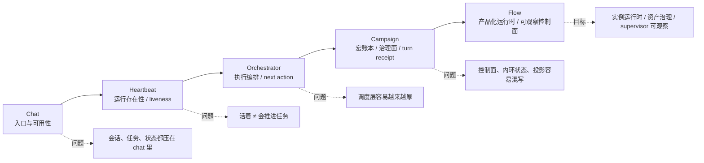
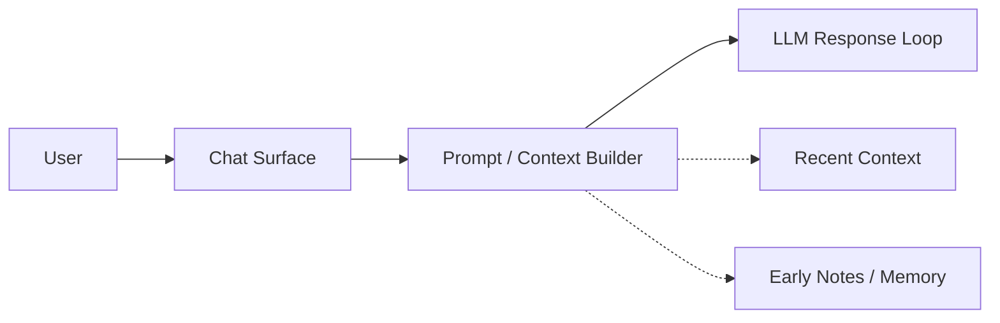
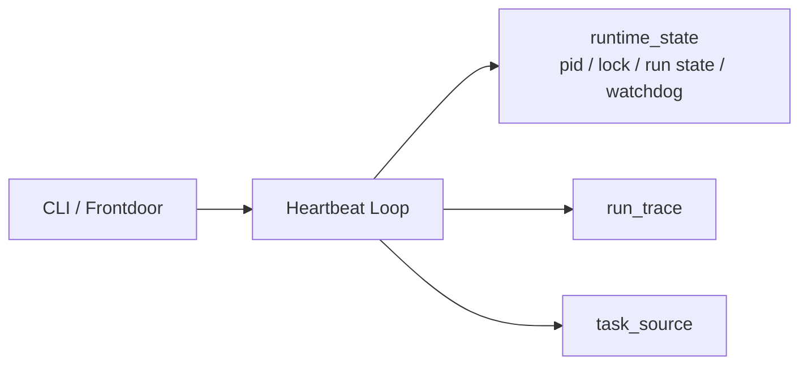
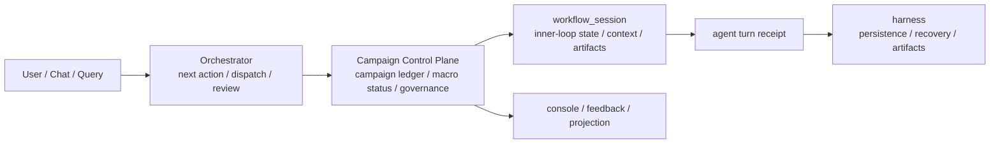
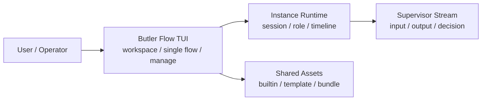

# Butler 开发者视角复盘稿（图文版）：从 Chat 到 Flow，我到底在学什么

日期：2026-04-02  
用途：个人复盘 / 组会分享 / 后续继续开发时对照  
口径：在上一版复盘稿基础上，补入关键技术文档锚点、架构图与演变史

---

## 先说结论：这不是一个“功能不断变多”的故事

如果只看表面，Butler 像是在一路加模块：

`chat → heartbeat → orchestrator → campaign → flow`

但站在开发者角度看，这条线真正重要的不是模块名，而是：**我在被项目逼着，一层层把 agent 系统里原本混在一起的东西拆开。**

拆到最后，我慢慢看清楚了四件事：

1. 系统是不是还活着  
2. 它到底怎么推进任务  
3. 长任务怎么被治理、恢复、审计  
4. 这些能力怎么变成一个人真的能用的工作台  

> 我一开始以为自己在做一个更聪明的 chat。后来才发现，我其实是在一步步学习怎么做一个长期可运行、可恢复、可治理、可观察的 agent 系统。

---

## 演变总图：不是模块叠加，而是 Harness 能力分层

### 这一页图想表达什么

- `Chat` 阶段解决的是**入口与可用性**
- `Heartbeat` 阶段解决的是**运行存在性与最低限度的 runtime discipline**
- `Orchestrator / Campaign` 阶段解决的是**任务推进与宏观治理**
- `Flow` 阶段解决的是**把控制面做成一个可使用、可观察、可恢复的产品化运行时**

如果要用一句话概括整条线：

> 这不是“功能更多了”，而是我对 Harness Engineer 的理解，从 prompt/对话层一路往 runtime / control plane / product runtime 往下扎。

---

## 一、Chat 阶段：先把入口做出来，但很快就撞上边界

最开始的 Butler，本质上还是一个“更贴近我自己使用”的 chat。

这一阶段的价值，不在技术有多复杂，而在于它立住了一个最重要的现实约束：

> 后面的所有 agent 能力，最后都得回到一个我自己愿不愿意天天用的入口。

但这个阶段的问题也暴露得很快：

- chat 适合单轮问答、轻上下文延续、局部辅助
- chat 不适合长任务推进、后台持续运行、多轮状态治理、多步骤执行与验收

说白了，chat 很快就让我撞到一个事实：

> “能聊”不等于“能长期做事”。

### 从开发者角度，这一层真正的问题是什么

不是模型答得差，而是所有语义都压在同一个对话壳里：

- 会话语义和任务语义没分开
- 运行状态和聊天状态没分开
- 记忆像是在“补丁式增强 chat”，不是一个真正的任务系统
- 一旦时间拉长，对话历史就会同时承担产品入口、任务记录、状态容器三种职责

这一步其实已经埋下了后面所有层的起点：  
**我需要的不是“更厚的 chat”，而是“把 chat 从系统总壳里解放出来”。**

---

## 二、Heartbeat 阶段：第一次真正把 agent 当成“运行体”而不是“对话体”

heartbeat 这一层把问题一下子拉回了工程现实：

- 进程还在不在
- 当前 run 到底有没有卡住
- stale 怎么判
- watchdog 什么时候接管
- run_id、phase、trace 有没有留
- 前台断开后，后台到底发生了什么

如果用更直白的话说：

> heartbeat 解决的不是“任务怎么推进”，而是“系统是不是还活着、还能不能被管”。

### Heartbeat 阶段暴露出的工程问题

- 运行噪声和业务状态混在一起
- 前后台感知不一致
- 一个模块开始承担太多职责

### 这一层在 Harness Engineer 上让我明白了什么

> 你给模型搭的，不只是一个提示词环境，而是一个能持续运行、能判断是否异常、能恢复状态的执行环境吗？

所以 heartbeat 不是附属物。它是我从“做一个聊天产品”转向“做一个 agent runtime”的起点。

---

## 三、Orchestrator 到 Campaign：我第一次认真做“任务推进”和“治理面”

heartbeat 解决的是“活着”。但一个系统活着，不代表它会做事。

真正把我推向 orchestrator 的，是下面这些问题终于绕不过去了：

- 一件事不再是一轮对话能做完
- 一个任务需要拆成多步
- 有的步骤负责探索，有的负责执行，有的负责验收
- 长任务不可能靠单个 chat loop 稳定推进
- 状态不能只挂在对话历史上

所以 orchestrator 长出来，核心不是“加一个调度器”，而是：

> 我已经不能再用“用户说一句，模型回一句”的范式来理解系统了。我必须开始处理“目标如何被组织成一串动作”。

### Campaign 阶段：从“推进”转向“治理”

到了 `0331`，项目已经明确在把后台主线收成这样一条链：

`campaign 宏账本 -> workflow_session 内环状态 -> agent turn receipt -> harness 持久化/恢复/设施`

也就是说：

- `campaign` 负责宏账本和宏观身份
- `workflow_session` 负责细粒度运行态
- `turn receipt` 负责每一轮 agent 的结构化产物
- `harness` 负责持久化、恢复、artifact 与设施层

这个方向其实非常值钱，因为它第一次比较系统地把下面几层拆开了：

1. 宏观任务身份  
2. 细粒度会话内环  
3. 单轮执行证据  
4. 基础设施层  

### 技术文档锚点 1：双状态口径，其实已经说明控制面开始过载

到了 `0329`，后台任务已经因为“一个状态同时表示正在推进和是否最终完成”而开始做双状态收口：

- `execution_state`
- `closure_state`

这说明单一状态已经不够表达系统真实情况了：

- 任务仍在推进
- 当前阶段已经有产物
- 为什么还没有最终闭环

### 技术文档锚点 2：Campaign 变厚，暴露的是控制面问题，不是功能问题

到了 `0331`，文档里把复杂性来源点得很明白：

- 派生状态回写进真源
- 同一任务存在多层状态
- 控制面承担运行同步桥职责
- operator 写口过强

#### 1）派生状态写回真源：控制面开始发胖的典型信号

这些东西里，有不少其实更适合在 query / feedback / console 读时计算，而不是长久写进 metadata 当真源。

> 控制面最怕把“解释”误存成“事实”。

#### 2）状态层级过多：系统开始失去“到底哪一层说了算”的直觉

同一条后台任务一度同时涉及：

- `campaign.status`
- `mission.status`
- `node.status`
- `branch.status`
- `workflow_session.status`
- `execution_state / closure_state`
- `approval_state`

这类问题不会像语法错误那样直接炸，但会慢性退化：

- 功能还能跑
- 文档还能写
- operator 还能 patch
- 但架构已经开始变糊

#### 3）operator patch 太强，本质上说明平时结构约束还不够

如果系统经常需要：

- 强行改 phase
- 强行改 status
- 手工 patch metadata
- 跳步骤
- 人工补状态

那通常不说明系统很灵活，而说明：

> 正常路径不够稳，所以才不得不靠大量手工外科手术兜底。

所以后来 campaign 逐步把 operator 主动作收成：

- `pause`
- `resume`
- `abort`
- `annotate_governance`
- `force_recover_from_snapshot`
- `append_feedback`

---

## 四、Flow 阶段：我不再只是在做后台控制面，而是在做“产品化运行时”

如果说：

- heartbeat 解决的是“它活不活着”
- orchestrator 解决的是“任务怎么推进”
- campaign 解决的是“长任务怎么治理”

那 flow 解决的就是：

> 这些能力怎样从后台机制，变成一个人可以使用、可以观察、可以恢复、可以管理的运行平台。

这一步和前面最大的不同在于：

**它不是单纯的后台升级，而是控制面开始产品化。**

### Flow 阶段到底和 orchestrator/campaign 有什么本质区别

#### orchestrator / campaign 更像什么
- 后台控制面
- 调度与治理层
- 宏账本、session、receipt 的组织方式

#### flow 更像什么
- 前台主产品
- instance runtime workbench
- shared assets 管理中心
- supervisor 可观察界面
- session / role / runtime / timeline 的产品外显

也就是说：

> orchestrator / campaign 更像“系统怎么工作”；flow 更像“系统怎么被使用、被观察、被恢复”。

### Flow 阶段最重要的两个成熟点

#### 1）它把 shared assets 和 instance runtime 硬拆开了

到了 flow 阶段，系统开始明确区分：

- `/manage`：管理 shared assets
- `workspace + single flow`：管理 instance runtime

这意味着 Butler 不再把：

- 静态定义
- 运行态
- operator 动作
- 历史身份
- prompt 资产

都混在一个控制面里。

> 资产治理和实例运行不是一回事。

#### 2）它把 supervisor 从“黑盒调度器”变成“可观察运行体”

到了 `0402`，flow 已经明确要求 supervisor stream 不再只给 decision，而要显式展示：

- `input`
- `output`
- `decision`

连 heuristic supervisor 也要补齐合成的 input/output 记录，不能只剩一个 decision 结果。

这说明了一个非常关键的转变：

> 我不再满足于“系统内部已经知道下一步要干嘛”。我开始要求：这个决定是怎么来的，能不能被人看到、被人审、被人复盘。

因为真正成熟的 agent 系统，不能只有“智能行为”，还要有：

- observability
- auditability
- replayability
- inspectability

否则它永远是黑盒。

---

## 五、如果站在 Harness Engineer 的层级上，这条线到底体现了什么

### 1. Heartbeat 体现的是：运行存在性开始被工程化
关键词：

- liveness
- watchdog
- stale detection
- run state
- lifecycle
- trace

这一步说明：我第一次不再把系统当作“对话体”，而开始把它当作“运行体”。

### 2. Orchestrator / Campaign 体现的是：任务推进与长任务治理开始被控制面化
关键词：

- task loop
- next action
- execution semantics
- macro ledger
- workflow session
- turn receipt
- governance

这一步说明：我不再只是在做会话，而是在做 control plane。但也正是在这一步，我第一次被“厚控制面”反噬，学会了控制面该薄、内环该强、派生态不要回写真源。

### 3. Flow 体现的是：控制面开始被产品化、实例化、可观察化
关键词：

- workbench
- instance runtime
- shared assets
- supervisor observability
- manage center
- runtime product surface

这一步说明：我不再只是做后台 agent 内核，而是在做一个人和 agent 都能共同工作的运行平台。

---

## 六、如果从“文档的问题 / 升级改造的 bug / 现状不足”来讲，我会重点讲这几个

### 1. 文档很容易先于代码一步
长期项目里，文档常常先把理想边界讲清楚，但代码仍处在迁移期。

> 文档能不能持续回写，成为迁移控制面的一部分，而不是只讲理想结构。

### 2. 升级改造里最危险的 bug，不是报错，而是“边界回流”

- 本来拆出去的职责又悄悄塞回来
- 本来应该是读时投影的语义又重新写回 metadata
- 本来分开的资产面和运行时面又开始互相写对方的东西

这类 bug 很隐蔽，但对长期维护最伤。

### 3. 现状不足不是“还没做完”，而是系统仍然处在几个张力之间

#### 张力一：历史控制面 vs 新产品主线
campaign 在历史上很重要，但 flow 正在变成新的主产品中心。

#### 张力二：治理面 vs 运行时面
控制面总想知道更多，运行时又不该把所有细状态都升格成真源。

#### 张力三：智能自主性 vs 可审计性
supervisor 越强，越需要更强的可观察与恢复。

#### 张力四：工作区自由度 vs 程序主体整洁度
个人长期工作区是真需求，但程序真源不能被它侵入。

---

## 七、最后一句最短总结

我原来以为自己在做一个更复杂的 chat。后来发现，我真正做的是三件事：

1. 给 agent 建一个能活着的运行环境  
2. 给长任务建一个能推进、能治理的控制面  
3. 再把这些东西做成一个可观察、可操作、可恢复的产品运行时  

所以 `heartbeat → orchestrator/campaign → flow` 并不是简单的模块升级，而是三个不同层级的 Harness 能力：

- heartbeat 是 **运行存在性**
- orchestrator/campaign 是 **任务控制与治理**
- flow 是 **产品化运行时与可观察控制面**

如果非要用一句话总结这段开发经历，我现在会说：

> 我一开始以为自己在做一个更聪明的 chat，后来才明白，我真正学会的是：如何给一个 agent 建立可持续工作的系统环境。

---

## 技术文档锚点（建议组会时备用）

- `docs/runtime/System_Layering_and_Event_Contracts.md`
- `docs/daily-upgrade/0329/03_后台任务双状态与前门弱化重构.md`
- `docs/daily-upgrade/0331/03_后台主线控制面瘦身与Agent内环提权草稿计划.md`
- `docs/daily-upgrade/0402/02_butler-flow_manage-center资产中心升级与会话式交互落地.md`
- `docs/daily-upgrade/0402/11_butler-flow_长流治理与supervisor可观测性升级.md`
