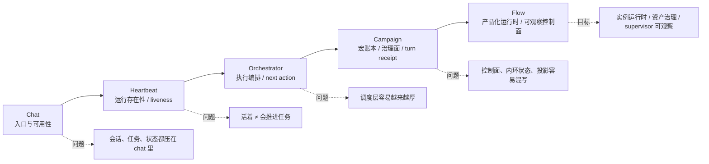
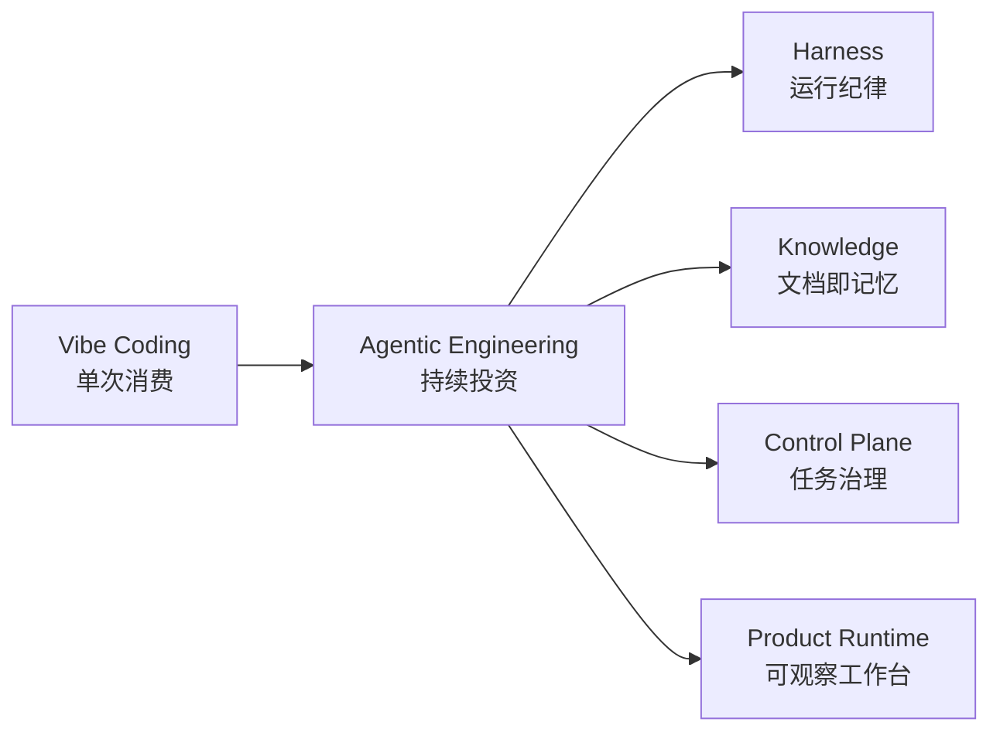
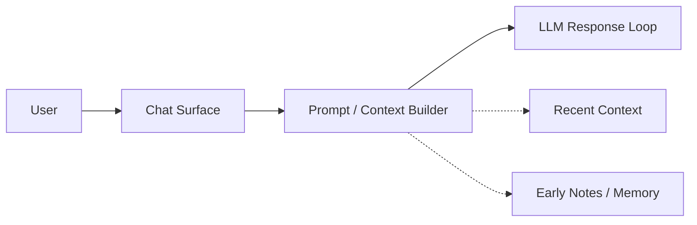
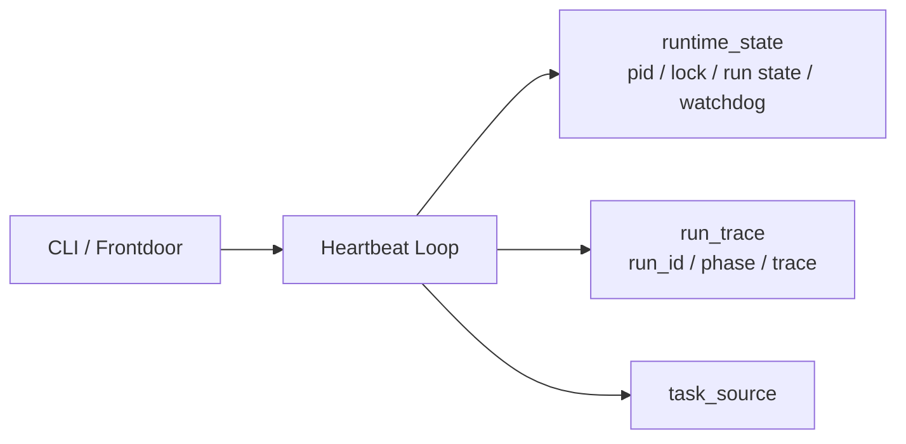
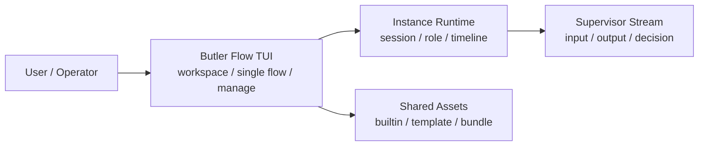
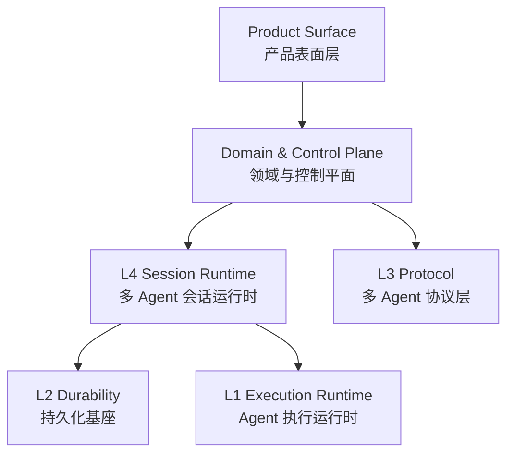

# Butler 开发者视角复盘稿 V2.1：从 Chat 到 Flow，我到底在学什么

日期：2026-04-03  
用途：个人复盘 / 组会分享 / 后续继续开发时对照  
口径：在 V2 基础上，补入 Agentic Engineering / Harness 学习材料、演变图、方法论对照与下一步实验议题

---

## 先说结论：这不是一个“功能不断变多”的故事，而是一条控制面不断外移的线

如果只看表面，Butler 像是在一路加模块：

`chat → heartbeat → orchestrator → campaign → flow`

但站在开发者角度看，这条线真正重要的不是模块名，而是：**我在被项目逼着，一层层把 agent 系统里原本混在一起的东西拆开。**

拆到最后，我慢慢看清楚了四件事：

1. 系统是不是还活着
2. 它到底怎么推进任务
3. 长任务怎么被治理、恢复、审计
4. 这些能力怎么变成一个人真的能用的工作台

> 我一开始以为自己在做一个更聪明的 chat。后来才发现，我其实是在一步步学习怎么做一个长期可运行、可恢复、可治理、可观察的 agent 系统。

---

## 一页总览：这条线其实对应三层 Harness 能力

- `Chat` 阶段解决的是**入口与可用性**
- `Heartbeat` 阶段解决的是**运行存在性与最低限度的 runtime discipline**
- `Orchestrator / Campaign` 阶段解决的是**任务推进与宏观治理**
- `Flow` 阶段解决的是**把控制面做成一个可使用、可观察、可恢复的产品化运行时**

---

## 再补一个外部视角：为什么我现在更愿意把这条线叫做 Agentic Engineering

最近补读 Agentic Engineering / Harness 的材料之后，我越来越觉得 Butler 这条线不是孤立经验，而是和更大的工程趋势在对齐。

我现在最认同的四个方法论锚点：

1. **Vibe Coding 和 Agentic Engineering 不是一回事**  
   前者更像单次消费，后者更像复利投资。你不是这次让模型写对就结束了，而是每次使用都要让体系更可复用。

2. **上下文窗口就是认知带宽**  
   你每多加一条规则、一个中间层、一个路由器，都在占用带宽。机制不是免费的。

3. **文档即记忆**  
   Markdown + Git 不只是说明书，而是人和 agent 共享的冷记忆真源。

4. **Command / Skill / Subagent 的分层，不该按复杂度切，而该按对上下文的影响来切**  
   这个视角特别适合用来反思 Butler 里的路由、skills、长任务隔离和控制面设计。

---

## Chat：入口是对的，但任务语义全被压在 chat 里

Chat 阶段最大的价值，是它立住了一个现实约束：后面的所有 agent 能力，最后都得回到一个我自己愿不愿意天天用的入口。

但它的问题也暴露得很快：

- chat 适合单轮问答、轻上下文延续、局部辅助
- chat 不适合长任务推进、后台持续运行、多轮状态治理、多步骤执行与验收

从开发者视角看，这一层最大的问题不是“弱”，而是“太容易承担一切”：会话、任务、状态、恢复都压在同一个壳里。

---

## Heartbeat：第一次真正把 agent 当成“运行体”

heartbeat 解决的不是“它会不会做事”，而是“它是不是还活着、还能不能被管”。

这一层让我第一次认真面对：

- liveness
- lifecycle
- watchdog
- stale detection
- run state
- trace

也就是从这时起，我才真正明白：agent 首先是一个要被监管、被恢复、被判断是否存活的运行体。

---

## Orchestrator：从“会话思维”切到“执行编排思维”

真正把我推向 orchestrator 的，不是“我想做复杂”，而是长任务已经绕不过去了：

- 一件事不再是一轮对话能做完
- 一个任务需要拆成多步
- 有的步骤负责探索，有的负责执行，有的负责验收
- 长任务不可能靠单个 chat loop 稳定推进

这一层的关键不是模块名，而是：**我开始承认系统需要一个执行编排层。**

但 orchestrator 也很容易进入一个典型陷阱：什么都想往调度层塞，最后变成超级控制器。

---

## Campaign：从“会推进”到“会治理”，也第一次被厚控制面反噬

到了 `0331`，后台主线已经明确在收成：

`campaign 宏账本 -> workflow_session 内环状态 -> agent turn receipt -> harness 持久化/恢复/设施`

这一步真正值钱的，不是“多了个 campaign”，而是开始明确区分：

1. 宏观任务身份
2. 细粒度会话内环
3. 单轮执行证据
4. 基础设施层

但它也暴露了非常典型的控制面问题：

- 派生状态回写进真源
- 同一任务存在多层状态
- 控制面承担运行同步桥职责
- operator 写口过强

也就是从这里开始，我第一次真正被“厚控制面”反噬。

---

## Flow：我不再只是在做后台控制面，而是在做“产品化运行时”

如果说：

- heartbeat 解决的是“它活不活着”
- orchestrator 解决的是“任务怎么推进”
- campaign 解决的是“长任务怎么治理”

那 flow 解决的就是：这些能力怎样从后台机制，变成一个人可以使用、可以观察、可以恢复、可以管理的运行平台。

Flow 阶段最关键的两条边界：

1. **shared assets 和 instance runtime 被硬拆开**
2. **supervisor 不再只是黑盒调度器，而开始变成可观察、可审计的运行体**

尤其是 `0402` 的 supervisor `input / output / decision` 三段式外显，说明我已经不再满足于“系统内部知道下一步要干嘛”，而开始要求“这个决定能不能被人看到、被人审、被人复盘”。

---

## 补一层总视角：Butler 后来为什么越来越像一个真正的 agent 系统

这一层特别重要，因为它说明：我后面越来越不是在“加功能”，而是在给系统找稳定落点。

一旦这些层混说，系统就会重新变糊：

- 产品面会去碰真源
- 控制面会去吞运行细节
- 运行态会反向污染静态协议
- 可观测面会被当成状态真源

---

## 如果把这次补读真正转成行动，接下来最值得做的不是“再加一个模块”，而是做三个实验

1. **实验 A：把一类高频规范从“推送注入”改成“按需拉取”**  
   验证某些 router / 规范注入是不是已经在交“带宽税”。

2. **实验 B：强制长结论带锚点**  
   例如必须引用 `docs/`、测试或 artifact，减少“看起来合理但没有来源”的输出。

3. **实验 C：并行 checker 小规模试跑**  
   低风险任务先试固定检查项 + 综合裁决，别一上来把系统复杂度拉满。

---

## 最后一句

我原来以为自己在做一个更复杂的 chat。后来发现，我真正做的是三件事：

1. 给 agent 建一个能活着的运行环境
2. 给长任务建一个能推进、能治理的控制面
3. 再把这些东西做成一个可观察、可操作、可恢复的产品运行时

所以 `heartbeat → orchestrator/campaign → flow` 不是简单的模块升级，而是三个不同层级的 Harness 能力：

- heartbeat 是 **运行存在性**
- orchestrator/campaign 是 **任务控制与治理**
- flow 是 **产品化运行时与可观察控制面**

如果非要用一句话总结这段开发经历，我现在会说：

> 我一开始以为自己在做一个更聪明的 chat，后来才明白，我真正学会的是：如何给一个 agent 建立可持续工作的系统环境。

---

## 建议一起看的一组文档

### Butler 内部文档
- `docs/runtime/System_Layering_and_Event_Contracts.md`
- `docs/daily-upgrade/0329/03_后台任务双状态与前门弱化重构.md`
- `docs/daily-upgrade/0331/03_后台主线控制面瘦身与Agent内环提权草稿计划.md`
- `docs/daily-upgrade/0402/02_butler-flow_manage-center资产中心升级与会话式交互落地.md`
- `docs/daily-upgrade/0402/11_butler-flow_长流治理与supervisor可观测性升级.md`

### 外部学习锚点（V2.1 新增）
- OpenAI：Harness engineering / Codex harness / agent loop
- Anthropic：effective agents / writing tools / subagents / skills
- 社区样板：everything-claude-code
- Agentic Engineering 导读材料：Vibe vs Agentic、上下文带宽、文档即记忆、Command / Skill / Subagent、错误 2 分钟记录
