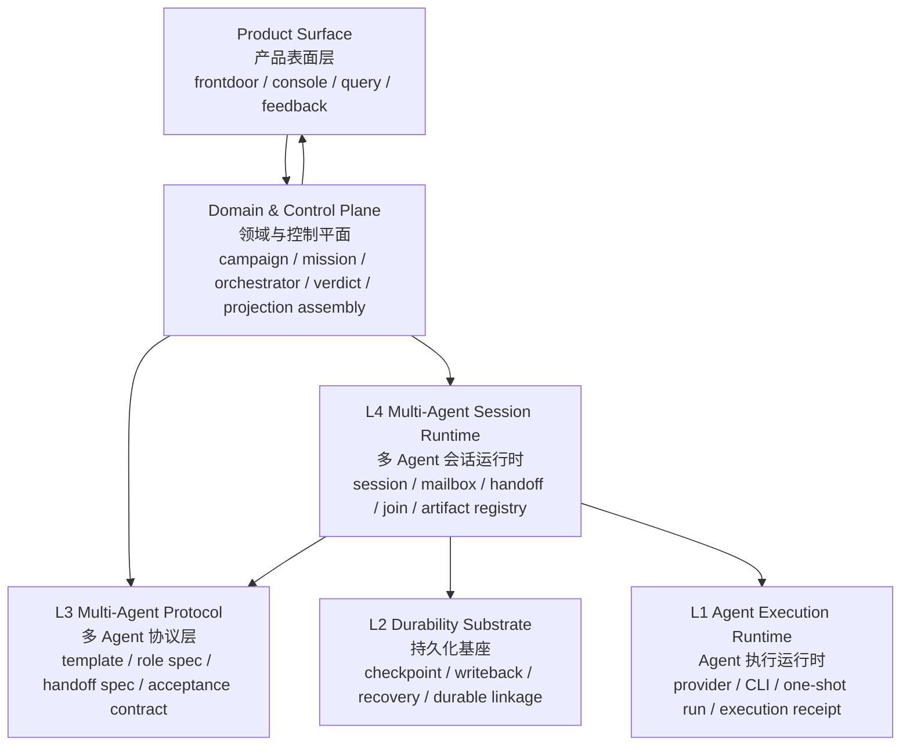
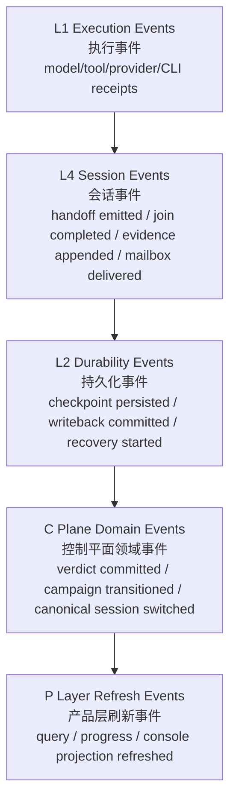

# Butler System Layering And Event Contracts

更新时间：2026-03-27  
状态：现役 / V1  
用途：冻结 Butler 当前系统分层、真源边界、事件契约和兼容命名

## 一句话裁决

当前 Butler 统一按下面口径理解：

`Product Surface（产品表面层） -> Domain & Control Plane（领域与控制平面） -> L4 Multi-Agent Session Runtime（多 Agent 会话运行时） -> L3 Multi-Agent Protocol（多 Agent 协议层） -> L2 Durability Substrate（持久化基座） -> L1 Agent Execution Runtime（Agent 执行运行时）`

其中：

1. `multi-agent` 从今天起默认只指 `L3 + L4`，不再指代整个 Butler。
2. `Observe（观察）` 不再作为 `Phase（阶段）`、`Role（角色）` 或 `Verdict Authority（裁决权）` 使用。
3. `Observe（观察）` 的正式定义是 `Observability（可观测性） + Projection（投影读模型）` 的控制面能力集合。

## 总图

## 术语冻结

| 英文名 | 中文名 | 当前定义 | 禁止再混用 |
|---|---|---|---|
| Butler System | Butler 全系统 | 包含产品表面、领域控制、运行栈和兼容层的总称 | 不要再让 `multi-agent system` 代指它 |
| Product Surface | 产品表面层 | 人和外部入口可见面，负责输入、展示和受控动作 | 不拥有底层真源 |
| Domain & Control Plane | 领域与控制平面 | 拥有 campaign/mission/verdict/canonical session pointer 真源 | 不等于“外围壳” |
| Multi-Agent Session Runtime | 多 Agent 会话运行时 | Session 级协作运行态，承载 handoff/join/mailbox/artifact/session event | 不等于 compile-time protocol |
| Multi-Agent Protocol | 多 Agent 协议层 | Template、RoleSpec、ContractSpec、HandoffSpec、AcceptanceContract 等 compile-time 真源 | 不等于某次 session 里的实例 |
| Durability Substrate | 持久化基座 | Checkpoint、writeback、recovery、durable linkage | 不要再用 `process` 造成 OS process / workflow process 歧义 |
| Agent Execution Runtime | Agent 执行运行时 | 单次 provider/CLI 执行与 execution receipt | 不拥有长任务主存 |
| Observability | 可观测性 | trace/log/metrics/receipt/event lineage，面向诊断与审计 | 不是产品态 summary |
| Projection | 投影读模型 | 给 Product Surface 和上层模块消费的统一读模型 | 不是真源对象 |

## 真源边界

| 层级 | 拥有的真源 | 明确不拥有 |
|---|---|---|
| Product Surface（产品表面层） | 无 | campaign truth、session truth、protocol truth |
| Domain & Control Plane（领域与控制平面） | `campaign truth`、`mission truth`、`canonical session pointer`、`verdict ledger`、`product-facing status truth` | 单 agent 执行细节、session 内部协作状态 |
| L4 Multi-Agent Session Runtime（多 Agent 会话运行时） | `WorkflowSession`、`RoleBinding`、`RoleInstance` 的运行态、`Mailbox`、`RoleHandoffReceipt`、`JoinState`、`SessionEventLog`、session-level evidence append state | compile-time schema、product-facing status truth |
| L3 Multi-Agent Protocol（多 Agent 协议层） | `WorkflowTemplate`、`RoleSpec`、`ContractSpec`、`HandoffSpec`、`AcceptanceContract`、framework/profile mapping | 运行中的 session state |
| L2 Durability Substrate（持久化基座） | `CheckpointRecord`、`PersistedEventRecord`、`WritebackRecord`、`RecoveryCursor`、bundle/output linkage | 多 Agent 协作语义 |
| L1 Agent Execution Runtime（Agent 执行运行时） | `ExecutionFact`、`ExecutionReceipt`、provider/CLI invocation result | campaign/session/protocol truth |

## RoleSpec 与 RoleBinding

`RoleSpec（角色规格）` 与 `RoleBinding（角色绑定）` 从今天起必须硬切开：

1. `RoleSpec（角色规格）` 属于 `L3 Multi-Agent Protocol（多 Agent 协议层）`。
2. `RoleBinding（角色绑定）`、`RoleInstance（角色实例）`、`SessionRoleState（会话角色状态）` 属于 `L4 Multi-Agent Session Runtime（多 Agent 会话运行时）`。
3. 当前仓库第一版实现里，`WorkflowTemplate.roles[*]` 仍然是 `RoleSpec（角色规格）` 的载体；`RoleBinding` 已通过 `runtime_os.multi_agent_runtime` 独立导出。

## Observability 与 Projection

固定区分如下：

1. `Projection（投影读模型）` 面向产品态展示和上层读模型消费。
2. `Observability（可观测性）` 面向调试、诊断、审计和事件追溯。
3. 二者可以复用同一底层事实，但不能互相替代。
4. `Projection Refresh Event（投影刷新事件）` 只能刷新读模型，不能反向写真源。

## 事件契约分层

### 最小 Event Envelope（事件封套）

跨层事件至少统一包含：

- `event_id`
- `event_type`
- `layer`
- `subject_ref`
- `causation_ref`
- `created_at`
- `payload`

当前第一版已经把这组字段落到 `WorkflowSessionEvent`，作为 `L4 Multi-Agent Session Runtime（多 Agent 会话运行时）` 的统一种子事件封套。

### 分层事件图

### 固定规则

1. 上层只能通过 `public API（公开接口）` 或 `public event（公开事件）` 驱动下层。
2. 任意层禁止跨层偷写真源对象。
3. `Projection（投影读模型）` 永远不是恢复依据。
4. `Observability（可观测性）` 事件可以用于诊断与审计，但不能直接当产品态状态真源。

## 当前公开导出面

第一版代码实现已经固定下面四个公开面：

1. `runtime_os.agent_runtime`
2. `runtime_os.durability_substrate`
3. `runtime_os.multi_agent_protocols`
4. `runtime_os.multi_agent_runtime`

兼容期保留：

5. `runtime_os.process_runtime`

兼容策略固定为：

1. 新代码优先从四个分层公开面导入。
2. `runtime_os.process_runtime` 只作为兼容聚合别名，不再作为长期命名目标。
3. `agents_os/`、`multi_agents_os/` 继续保留兼容壳，物理重命名留到 import 面收敛后再做。

## 当前代码映射

| 逻辑层 | 当前公开命名空间 | 当前主要兼容代码目录 |
|---|---|---|
| L4 Multi-Agent Session Runtime（多 Agent 会话运行时） | `runtime_os.multi_agent_runtime` | `butler_main/runtime_os/process_runtime/session/`、`butler_main/multi_agents_os/session/` |
| L3 Multi-Agent Protocol（多 Agent 协议层） | `runtime_os.multi_agent_protocols` | `butler_main/runtime_os/process_runtime/templates/`、`butler_main/runtime_os/process_runtime/contracts.py`、`butler_main/multi_agents_os/templates/` |
| L2 Durability Substrate（持久化基座） | `runtime_os.durability_substrate` | `butler_main/runtime_os/process_runtime/engine/`、`butler_main/runtime_os/process_runtime/governance/recovery.py` |
| L1 Agent Execution Runtime（Agent 执行运行时） | `runtime_os.agent_runtime` | `butler_main/runtime_os/agent_runtime/`、`butler_main/agents_os/` |

## 与 Workflow IR 的关系

`Workflow IR（工作流中间表示）` 当前固定按下面方式归属：

1. compile-time schema 与 template linkage 归 `L3 Multi-Agent Protocol（多 Agent 协议层）`
2. session/runtime linkage 与 role binding 归 `L4 Multi-Agent Session Runtime（多 Agent 会话运行时）`
3. writeback/recovery/checkpoint linkage 归 `L2 Durability Substrate（持久化基座）`
4. `Observability（可观测性）` 只承载诊断与 lineage
5. `Projection（投影读模型）` 由 `Domain & Control Plane（领域与控制平面）` 组装，不直接落在 `Workflow IR` 里

## 当前不做的事

这份 V1 不做三件事：

1. 不做 destructive rename。
2. 不把全部 `process_runtime` 物理拆空。
3. 不强制把现有 campaign family 立刻替换成 triad family。

当前目标只有一个：先把概念边界、公开命名空间、事件契约和文档真源钉住，避免继续混说。
