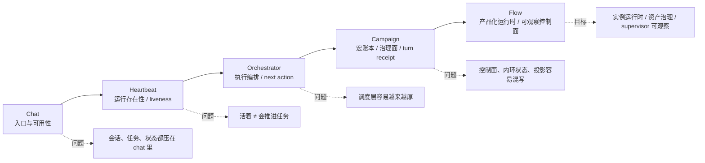
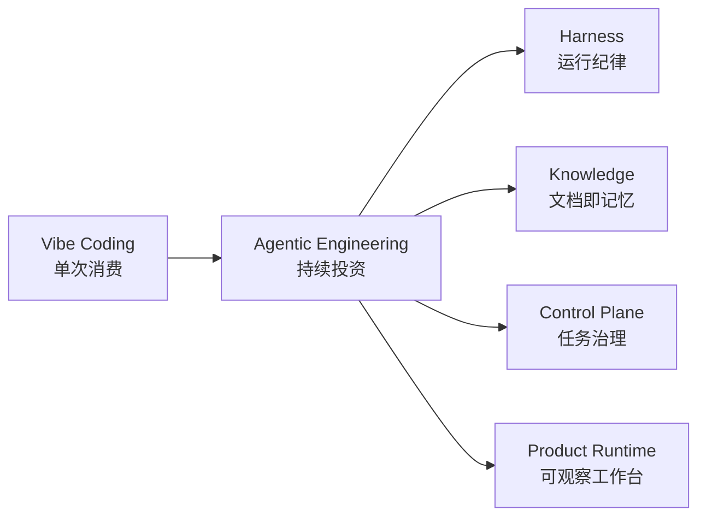
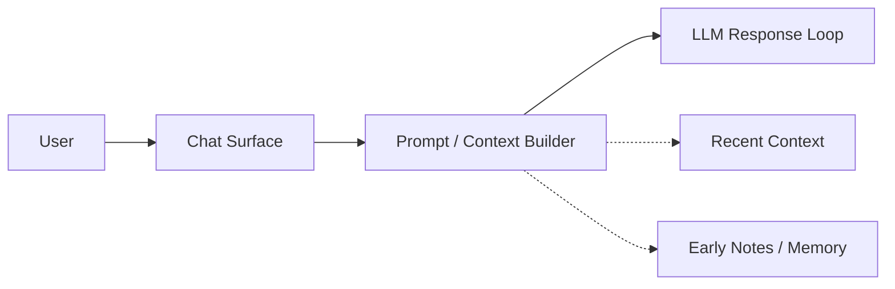
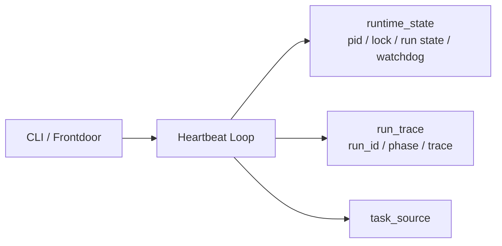
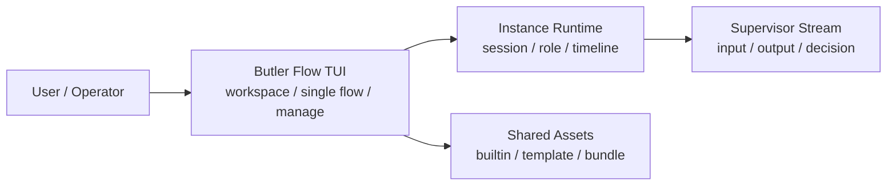
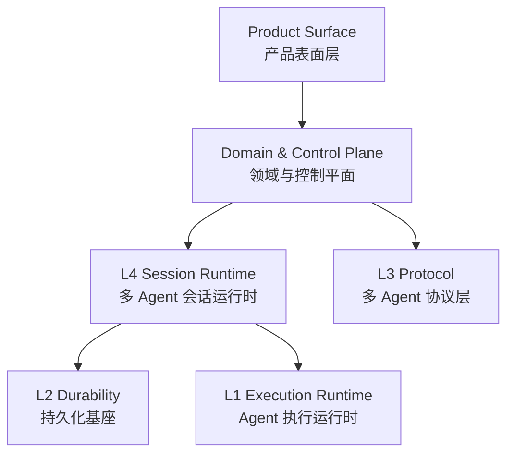

# 从二阶控制论到 Agent Team：`LLM -> Agent -> Agent+ -> Agent Team` 的核心问题长文

日期：2026-04-03  
类型：每日头脑风暴 / 长文总稿 / 可继续扩写  
用途：把这轮关于 Agentic Engineering、Harness、二阶控制论、`subagent / MCP / skill / agent team` 的讨论压成一篇完整长文  
相关材料：
- [01_Agentic工程体系_小红书笔记整理与头脑风暴.md](./01_Agentic工程体系_小红书笔记整理与头脑风暴.md)
- [02_一手资料与学习地图_Agentic与Harness_头脑风暴集.md](./02_一手资料与学习地图_Agentic与Harness_头脑风暴集.md)
- [阶段性总结+组会分享.md](./阶段性总结+组会分享.md)

---

## 先给结论

如果把今天这条线压成一句话，那就是：

> `LLM -> Agent -> Agent+ -> Agent Team` 不是一条“能力叠罗汉”的升级线，  
> 而是一条**观察、控制、建模、协同不断外扩**的演化线。

很多人讨论这条线时，容易把问题理解成：

- 模型会不会更强
- 工具会不会更多
- 能不能并行开更多 agent

但如果从**二阶控制论**的视角往回看，真正的问题根本不是“功能增多”，而是下面这组更硬的问题在不断升级：

1. **系统如何感知世界，而不是只输出语言**
2. **系统如何校正自己，而不是相信自己的自述**
3. **系统如何把记忆、目标、进展和验收外部化**
4. **系统如何在多个执行位之间维持一致性，而不是制造协作幻觉**
5. **系统如何治理自己的观察结构、权限边界和反馈回路**

所以：

- `LLM` 的问题是：**会说，不等于会做**
- `Agent` 的问题是：**会做一轮，不等于能稳定闭环**
- `Agent+` 的问题是：**会接工具，不等于拥有良好的上下文架构**
- `Agent Team` 的问题是：**会分工，不等于形成真正可治理的协作系统**

这也是为什么我越来越觉得，未来最有壁垒的，不是“谁家模型多一点技巧”，而是：

> 谁更会设计一套让观察、行动、验证、恢复、协同都可持续的 **harness / control plane**。

---

## 一、为什么二阶控制论是看懂 Agent 演化最合适的视角

先把这里的“二阶控制论”说白一点。

一阶控制论里，我们常常默认：

- 有一个目标
- 有一个执行器
- 执行以后看结果
- 偏了就纠偏

这套想法在简单系统里很好用，但一旦进入 Agent 系统，它会立刻不够。

因为在 Agent 场景中，真正麻烦的不是“怎么执行动作”，而是：

- 谁定义目标
- 谁解释结果
- 谁来判断“已经完成”
- 观察者自己是否已经卷入系统
- 系统会不会奖励“看起来完成”而不是真完成

这就是二阶控制论关心的问题：

> **观察者不在系统外部，观察结构本身会影响系统行为。**

一旦这个前提成立，很多 Agent 设计上的问题就会一下变得清晰：

### 1.1 为什么不能相信单一线程里的自我叙事

一个模型在同一个上下文里：

- 理解任务
- 设计方案
- 执行代码
- 解释结果
- 证明自己做对了

这套链路在短任务里偶尔可行，在长任务里几乎必然失真。  
因为“做事的人”和“解释自己做得对不对的人”是同一个观察位。

所以真正可靠的系统，一定会把这些东西外部化：

- 目标合同外部化
- 进度外部化
- 验收标准外部化
- 验证视角外部化
- 恢复状态外部化

### 1.2 为什么上下文管理不是 token 优化，而是认知治理

小红书那篇材料里最有价值的一句，我认为不是“22 个 Agent、27 个 Skill”，而是：

> **上下文空间是 Agent 的认知带宽。**

这句话如果只从工程效率看，会被理解成“省 token”。  
但更深一层，它其实是在说：

> 上下文不是普通输入缓存，而是系统此刻“如何观察世界”的结构。

你多塞一条规则、多加一个管理机制、多注入一层路由逻辑，都不是中性的。  
它们会改变系统的注意力分配、解释路径和判断方式。

所以二阶控制论和 context engineering 其实是同一条线：

- 前者关心观察结构如何影响系统
- 后者关心上下文结构如何影响模型

说到底，都是在处理**观察被观察对象反过来污染**的问题。

### 1.3 为什么真正难的是“反馈回路的设计”而不是“多开几个 agent”

多 Agent 最容易让人兴奋，因为看起来像组织升级。  
但多数系统不是死在 agent 不够多，而是死在反馈回路失真：

- 研究结果没有进入后续执行的真源
- 执行完成没有过独立验收
- reviewer 只是重复 executor 的自我叙述
- subagent 回传的是漂亮摘要，不是可验证事实
- manager 以为自己在治理系统，其实只是在消费系统的自述

所以真正重要的问题从来不是“有没有 team”，而是：

> 这个 team 的观察、写回、验证、恢复、升级回路有没有被设计成结构，而不是继续靠聊天时的临场聪明。

---

## 二、`LLM`：为什么“会说”还远远不是 Agent

很多关于 Agent 的讨论起点太高，仿佛只要加几个 tool call 就已经进入“系统时代”。  
但如果退回去看，`LLM` 本身解决的是一件非常有限的事：

> 它提供了一个强大的语义生成与模式匹配引擎。

它很强，但天然有四个边界。

### 2.1 `LLM` 的强项

- 语言理解
- 语义压缩与重组
- 代码与文本生成
- 基于局部上下文做高密度推断
- 用自然语言当通用接口来吸收任务描述

### 2.2 `LLM` 的天然缺口

但 `LLM` 直接面对真实任务时，几乎立刻暴露缺口：

1. **没有稳定的外部状态**
   这一轮说过的话，默认不是真源，更不一定能跨轮可靠继承。

2. **没有天然行动闭环**
   它可以建议“去做”，但不等于真的能执行、观测、回写。

3. **没有天然验收机制**
   它擅长给解释，但不擅长对自己的解释保持怀疑。

4. **没有天然恢复能力**
   中断、重试、换线程、失败继续，默认都不是它的能力。

### 2.3 所以 `LLM` 的核心问题是什么

`LLM` 这一层的核心问题不是“智力不够”，而是：

> **它缺乏外部化的状态、动作、反馈与恢复结构。**

这也是为什么：

- 单独的 `LLM` 更像“可交互推理核”
- 但还不是“可持续完成任务的系统”

从二阶控制论看，这一层最大的问题在于：

> 它只有“观察到什么就说什么”的能力，还没有“如何验证自己的观察结构是否可靠”的能力。

所以 `LLM` 不是终点，它只是起点。

---

## 三、`Agent`：第一次让模型从“会说”变成“会做”

进入 `Agent` 之后，系统开始有了一个更完整的闭环：

- 能接收目标
- 能调用工具
- 能执行动作
- 能读结果
- 能根据结果继续行动

这是一个很大的飞跃，因为这一步第一次把模型从“语言生成器”拉向“行动系统”。

### 3.1 `Agent` 带来了什么

最典型的 `Agent` 结构，会开始包含这些元素：

- loop
- tool use
- memory 或临时状态
- plan / act / observe
- 任务中间结果
- 简单失败恢复

这意味着系统不再只是回答，而是开始“在世界中留下可回读痕迹”。

### 3.2 但 `Agent` 立刻遇到什么问题

问题也很快变成新的层级。

#### 问题 1：单线程闭环会越来越脏

一个 agent 同时承担：

- 目标理解
- 研究
- 规划
- 执行
- 验证
- 汇报

在短回合里像是统一闭环，在长任务里就会变成噪声中心。  
上下文越长，角色越混，系统越倾向于“提前结束”和“叙事补洞”。

#### 问题 2：记忆不再只是“记住什么”，而是“什么算真源”

当 agent 能跨回合继续时，问题不再是有没有 memory，而是：

- 什么信息写进长期记忆
- 什么只是会话噪声
- 什么是人机共读真源
- 什么是可恢复状态

也就是说，记忆问题会迅速变成**真源治理问题**。

#### 问题 3：执行和验证不能永远共用一个观察位

单 agent 最危险的一点是：

> 做的人往往也在解释为什么自己做对了。

于是很多“通过”其实是语言层面的通过，而不是世界层面的通过。

### 3.3 所以 `Agent` 这一层的核心问题是什么

`Agent` 的核心问题可以压成一句话：

> **如何让一轮行动闭环变成可持续、可校验、可恢复的闭环。**

这也是为什么一旦项目认真起来，系统就会继续往上长：

- 需要外部进度文件
- 需要 feature/spec/checklist
- 需要独立 review
- 需要 task receipt / execution receipt
- 需要 run state / recovery state

也就是说，`Agent` 并不是最终解，它只是第一次承认：

> 模型需要一个外部行动壳。

---

## 四、`Agent+`：为什么有了 `subagent / MCP / skill / workflow` 仍然不够

我把 `Agent+` 理解成这样一层：

> 它已经不是“单 agent + 几个工具”了，而是开始出现上下文架构、技能封装、独立执行位、外部能力接入和阶段化工作流。

这里常见的组件包括：

- `skill`
- `subagent`
- `MCP`
- `workflow`
- `external memory`
- `review loop`
- `planner / executor / verifier` 分工

这是今天大家最容易兴奋的层，因为它看起来最像“系统终于长大了”。

但其实，这一层也最容易走偏。

### 4.1 `Agent+` 真正新增的，不是功能，而是“上下文架构”

很多人会把 `skill / subagent / MCP` 当作功能插件。  
但更本质的变化其实是：

> 系统开始显式地管理“哪些知识该驻留，哪些知识该按需加载，哪些任务该在隔离上下文里做”。

这就是为什么那篇材料里三级分层特别重要：

- `Command`：极小入口，不承载厚知识
- `Skill`：知识包，按需展开
- `Subagent`：上下文隔离，而不是简单多开

这个分层之所以重要，不是因为名字高级，而是因为它对应了三种完全不同的认知治理方式。

### 4.2 `MCP` 的本质不是“更多工具”，而是“能力表面的标准化”

很多人提 `MCP` 时会把重点放在“能接更多服务”。  
但如果往深一点看，`MCP` 真正改变的是：

- 工具如何被发现
- 能力如何被描述
- 外部资源如何被纳入可调用面
- 模型如何在统一协定下使用不同资源

也就是说，`MCP` 不是单个工具，它更像是：

> 把外部世界的一部分，变成可被 Agent 访问的标准化能力表面。

但这也带来新问题：

- 能力很多，不等于系统更聪明
- 工具面越大，选择负担越高
- 未经治理的能力暴露，会让 agent 更容易“乱试一通”

所以 `MCP` 的真正问题从来不是“能不能接”，而是：

> 接进来以后，能力如何被路由、裁剪、审计和恢复。

### 4.3 `subagent` 的本质不是“多开一个脑子”，而是“切分观察位”

这点很关键。

`subagent` 如果只是把主任务拆出去做，很快会沦为：

- 一个并发执行器
- 一个摘要返回器
- 一个漂亮的进度通知器

但如果从二阶控制论去看，`subagent` 真正重要的地方在于：

> 它允许系统为某类问题建立一个相对隔离的观察位。

比如：

- 让研究与实现分开
- 让验证与执行分开
- 让高噪声任务不要污染主线程
- 让局部试探先在小空间内完成

所以优秀的 `subagent` 不是“另开个 shell”，而是：

- 有边界
- 有明确输入
- 有受控输出
- 有可回读产物
- 不默认继承全部主线程噪声

### 4.4 `Agent+` 为什么还是会失败

很多 `Agent+` 系统失败，不是因为不够高级，而是因为太早地把复杂度花掉了。

常见失败方式有：

1. **功能越堆越多，真源越来越少**
   到处都是 skill、规则、prompt、路由，但没有统一的任务合同和状态真源。

2. **分工做出来了，协作协议没做出来**
   planner、executor、reviewer 都有了，但只是不同 prompt 的串联，没有真正的事实写回与验收闭环。

3. **subagent 很多，但没有独立价值**
   只是把主线程的混乱复制成多个线程的混乱。

4. **工具暴露很丰富，但没有认知节流**
   agent 面对一大堆能力，反而更不稳定。

### 4.5 所以 `Agent+` 这一层的核心问题是什么

`Agent+` 的核心问题不是“怎么多接几个组件”，而是：

> **如何把上下文、能力、执行位、验证位组织成一套低噪声、可恢复、可审计的结构。**

它处理的核心，已经不是“单轮做事”，而是**认知架构设计**。

---

## 五、`Agent Team`：为什么真正难的不是分工，而是协作治理

到了 `Agent Team` 这一层，系统看起来终于像一个组织了：

- 有 coordinator / supervisor
- 有 specialists / workers
- 有 handoff / mailbox / artifact
- 有并行
- 有阶段总结
- 有局部自治

这一步当然重要，但也是最容易被浪漫化的一步。

因为多数所谓的 `agent team`，其实只是：

- 一个总控 prompt
- 几个子任务 prompt
- 一点并发能力
- 一堆看起来像组织结构的 metadata

而真正的 team，难点不在“角色数量”，而在协作是否真的成为运行时真源。

### 5.1 真正的 `Agent Team` 要解决什么

如果要严一点说，一个真正的 `Agent Team` 至少要解决六类问题：

1. **目标分解问题**
   谁来把总目标分成可交接的局部目标？

2. **状态共享问题**
   哪些信息共享？哪些只局部可见？什么叫“当前共识”？

3. **协议问题**
   handoff、join、acceptance、ownership 到底怎么定义？

4. **验证问题**
   worker 的完成谁来验？cell 的完成谁来验？全局完成谁拍板？

5. **恢复问题**
   一个 worker 挂了、一个 cell 卡了、一个验证失败了，系统怎么继续？

6. **治理问题**
   谁可以扩权？谁可以改目标？谁可以改合同？谁可以宣布 done？

只要这六个问题里有两三个没解决，所谓 team 很快就会退化成“总控多开几个线程”。

### 5.2 为什么 `Agent Team` 特别容易官僚化

用户长期偏好里有一句判断我很认同：

> 多 Agent 的主要风险不是不够聪明，而是协作成本会迅速膨胀为官僚系统。

这句话非常准。

因为一旦进入 team，系统会自然长出很多中间对象：

- 状态同步
- 角色权限
- 消息路由
- 审批门
- 汇报摘要
- 产物挂载
- 失败重试

这些东西本来都是为了解决复杂度，但如果没有被压缩进良好的协议和真源对象里，它们会反过来吞掉系统本身。

于是你会得到一个很熟悉的现象：

- 看起来很像组织
- 过程特别丰富
- 产物特别多
- 但推进效率并没有提高

这就是典型的**协作幻觉**。

### 5.3 从二阶控制论看，`Agent Team` 的真正升级点是什么

如果把这一层说得再抽象一点，它真正新增的是：

> 系统开始不只控制“世界”，还要控制“自己内部的观察与协作结构”。

也就是：

- supervisor 不只是分派任务
- 它还在治理系统内部谁看什么、谁写什么、谁能判什么

这就是非常典型的二阶问题：

- 不只是控制对象
- 而是控制控制系统本身

所以 `Agent Team` 的核心，不是多几个 agent，而是：

> 有没有一套能约束协作复杂度持续膨胀的**控制面**。

---

## 六、把四层放在一起看：每往上一层，系统到底新增了什么问题

如果把 `LLM -> Agent -> Agent+ -> Agent Team` 压成一张表，可以更清楚：

| 层级 | 新增能力 | 真正新增的问题 | 若失败，最常见的错法 |
|------|----------|----------------|----------------------|
| `LLM` | 语义生成与推断 | 如何把语言能力接到真实状态和动作上 | 以为“会说”就是“会做” |
| `Agent` | 单体行动闭环 | 如何让闭环可持续、可校验、可恢复 | 把单线程自洽当成完成 |
| `Agent+` | 上下文架构、技能、工具、子执行位 | 如何治理上下文、能力暴露和验证结构 | 组件很多，真源很少 |
| `Agent Team` | 协同、分工、并行、局部自治 | 如何治理协作复杂度与内部控制面 | 组织形态很丰富，推进仍然失真 |

从这个角度你会发现：

> 每往上一层，系统难点都越来越不像“AI 问题”，而越来越像“系统设计问题”。

所以未来真正的分水岭，大概率不是“谁家模型更像人”，而是：

- 谁能把任务合同外部化
- 谁能把上下文治理结构化
- 谁能把验证和恢复写成系统对象
- 谁能把协作复杂度压回可控协议

---

## 七、这条线对 Harness 的真正启发：不要迷信 Agent，先设计观察与控制结构

如果把前面的讨论收束到工程实践，我现在会更倾向于这样理解 harness：

> Harness 不是“Agent 的外壳”，而是让系统拥有稳定观察、受控执行、独立验证、持续恢复与协同治理能力的结构层。

所以一个成熟的 harness，至少要回答这几件事：

### 7.1 目标如何被钉成真源

不是“这轮聊过了就算有目标”，而是要有：

- `mission.md`
- `spec.md`
- `feature_list`
- `acceptance_checklist`

之类的外部对象。

### 7.2 状态如何从聊天里抽出来

不是“大家都知道做到哪了”，而是要有：

- progress
- receipts
- run state
- recovery state
- artifact linkage

### 7.3 验证如何独立于执行

不是让 executor 说“我觉得好了”，而是要能让 verifier / critic / test / contract 独立说话。

### 7.4 升级如何形成复利

不是靠这轮对话里灵光一闪，而是要把错误与修正写回：

- docs
- tests
- change packets
- playbooks
- skill packs

也就是把“犯过的错”转成下次的结构优势。

### 7.5 协作如何不失控

不是为了 team 而 team，而是：

- 该隔离的隔离
- 该共享的共享
- 该写合同的写合同
- 该降级成单 agent 的就降级

换句话说：

> 好的 harness 不是让系统永远更复杂，  
> 而是让系统在需要复杂时有结构，在不需要复杂时敢于简单。

---

## 八、如果要真正落地，我会如何定义一套最小正确结构

如果今天不是做概念讨论，而是要真的开始做，我不会一上来造一个盛大的 `agent team` 社会。  
我会先坚持一套很克制的最小结构。

### 8.1 第一层：任务合同

先把这些对象稳定下来：

- `mission.md`
- `spec.md`
- `acceptance_checklist.md`

没有这一层，后面所有“智能”都只是浮在空中。

### 8.2 第二层：执行与写回

每轮执行都沉淀：

- 做了什么
- 没做什么
- 改了什么
- 剩下什么
- 下一轮从哪接

也就是：

- `progress.md`
- `execution_receipt.json`
- `artifacts/`

### 8.3 第三层：独立验证

必须让执行位之外有一层独立观察：

- review checklist
- test results
- risk notes
- unresolveds

### 8.4 第四层：恢复与接力

系统必须能回答：

- 如果断了，怎么接
- 如果失败了，怎么重试
- 如果线程变了，真源还在不在

### 8.5 第五层：有限协同

只有前四层稳定后，才开始上：

- `subagent`
- parallel workers
- team cells
- mailbox / handoff / join contract

这样做的原因很简单：

> 没有稳定真源和恢复面之前，多 Agent 只会放大混乱。  
> 有了这些结构之后，多 Agent 才可能形成复利。

---

## 九、回到最开始：为什么这条线最后会指向 Agent Team，但不应该从 Agent Team 开始

很多人会天然被 `Agent Team` 吸引，因为它看起来最像未来。  
但如果你真的顺着这条线想下去，会发现一个更反直觉的结论：

> 真正的 `Agent Team` 不是起点，而是系统在目标真源、上下文治理、独立验证、恢复能力都站稳之后的结果。

否则，团队化只会让问题更快暴露：

- 目标不清，大家一起乱
- 状态不稳，大家一起猜
- 验收不硬，大家一起自证
- 恢复没有，大家一起断片

所以正确顺序通常不是：

`先 team，后治理`

而是：

`先真源 -> 再闭环 -> 再上下文架构 -> 再协作协议 -> 最后 team 化`

这也是为什么我现在越来越相信：

> 最好的 Agent 系统，不是先学会“像组织一样热闹”，  
> 而是先学会“像系统一样可靠”。

---

## 十、最终判断

如果要把这篇文章最后再压成一段话，我会这样说：

`LLM -> Agent -> Agent+ -> Agent Team` 的演化，不是从“不会做”到“会做更多”，而是从“单点语义生成”一路走向“带观察结构的可治理协作系统”。

这条线里每升一级，真正新增的都不是炫目的能力，而是更难的问题：

- 如何避免把自我叙事当成事实
- 如何把状态和验收外部化
- 如何治理上下文与能力暴露
- 如何让多个执行位共享世界而不是共享幻觉
- 如何让控制面压住协作复杂度，而不是被协作复杂度反噬

所以如果今天让我给这条线一个最核心的关键词，我不会选 autonomy，也不会选 multi-agent。  
我会选：

> **governed feedback**

因为最后决定系统能不能从 `LLM` 走到真正 `Agent Team` 的，始终不是“它多像一个聪明人”，而是：

> 它有没有被放进一套真实可持续的观察、控制、验证、恢复与协同回路里。

这也是二阶控制论给 Agent 时代最有价值的提醒：

> 真正需要被设计的，不只是行动能力，  
> 而是系统如何观察自己、纠正自己，并在复杂协作中不失真。

---

## 附：如果把这篇长文再压成 5 个最值得继续追的问题

1. `LLM` 升级为 `Agent` 时，哪类状态最先必须外部化：目标、进度、验收，还是恢复？
2. `Agent+` 里 `skill / MCP / subagent` 的边界，最合理的划分依据到底是功能、成本，还是上下文污染度？
3. `Agent Team` 的最小协作协议应该先从 `handoff`、`ownership` 还是 `acceptance` 开始钉？
4. 在多 Agent 系统里，什么样的观察与验证结构能避免“大家共享同一个幻觉”？
5. 如果把 Butler 或任何 agentic 系统继续往前推，下一阶段最值得投资的是更强模型，还是更硬的 harness / control plane？

---

## 参考与延伸

- 小红书导读整理：见 [01_Agentic工程体系_小红书笔记整理与头脑风暴.md](./01_Agentic工程体系_小红书笔记整理与头脑风暴.md)
- 一手资料与学习地图：见 [02_一手资料与学习地图_Agentic与Harness_头脑风暴集.md](./02_一手资料与学习地图_Agentic与Harness_头脑风暴集.md)
- Butler 开发者复盘：见 [阶段性总结+组会分享.md](./阶段性总结+组会分享.md)
- 过程脑暴草稿：`工作区/20260329_harness_design_brainstorm.md`
- 远景草稿：`docs/远景草稿/Butler-flow_1.0到2.0_从经理式Flow到AgentTeam的阶段演进与远景框架_20260402.md`

# Butler 开发者视角复盘稿 V2.1：从 Chat 到 Flow，我到底在学什么

日期：2026-04-03  
用途：个人复盘 / 组会分享 / 后续继续开发时对照  
口径：在 V2 基础上，补入 Agentic Engineering / Harness 学习材料、演变图、方法论对照与下一步实验议题

---

## 先说结论：这不是一个“功能不断变多”的故事，而是一条控制面不断外移的线

如果只看表面，Butler 像是在一路加模块：

`chat → heartbeat → orchestrator → campaign → flow`

但站在开发者角度看，这条线真正重要的不是模块名，而是：**我在被项目逼着，一层层把 agent 系统里原本混在一起的东西拆开。**

拆到最后，我慢慢看清楚了四件事：

1. 系统是不是还活着  
2. 它到底怎么推进任务  
3. 长任务怎么被治理、恢复、审计  
4. 这些能力怎么变成一个人真的能用的工作台  

所以今天回头看，我不会再把这条线讲成“从简单 chat 做到复杂 multi-agent”，而会讲成：

> 我一开始以为自己在做一个更聪明的 chat。  
> 后来才发现，我其实是在一步步学习怎么做一个长期可运行、可恢复、可治理、可观察的 agent 系统。

这个变化，本质上就是我对 **Harness Engineer** 的理解在往下扎。

---

## 一页总览：这条线其实对应三层 Harness 能力

这一页图想表达的其实就一句话：

- `Chat` 阶段解决的是**入口与可用性**  
- `Heartbeat` 阶段解决的是**运行存在性与最低限度的 runtime discipline**  
- `Orchestrator / Campaign` 阶段解决的是**任务推进与宏观治理**  
- `Flow` 阶段解决的是**把控制面做成一个可使用、可观察、可恢复的产品化运行时**  

如果要用一句话概括整条线：

> 这不是“功能更多了”，而是我对 Harness Engineer 的理解，从 prompt/对话层一路往 runtime / control plane / product runtime 往下扎。

---

## 再补一个外部视角：Butler 这条线其实正好落在 Agentic Engineering 那条光谱上

最近补读的 Agentic Engineering 材料，给了我一个特别好的外部坐标系。

那套材料里最打动我的有三个点：

1. **Vibe Coding 和 Agentic Engineering 不是一回事**  
   前者更像单次消费，后者更像复利投资。你不是这次让模型写对就结束了，而是每次使用都要让体系更可复用。

2. **上下文窗口就是认知带宽**  
   你每多加一条规则、一个中间层、一个路由器，都在占用带宽。机制不是免费的。

3. **Command / Skill / Subagent 的分层，不是按复杂度，而是按对上下文的影响来切**  
   这个视角特别好，因为它直接把“架构设计”拉回到“模型到底能不能在当前这轮想明白”。

这三个点一对照 Butler，我突然觉得很多以前只是“做着做着长出来”的东西，开始有了更清楚的方法论解释。

### 一个很有用的对照图

放回 Butler 这条线里，其实就是：

- Chat 更接近“先把入口用起来”
- Heartbeat 开始进入 Harness
- Campaign 开始进入治理面
- Flow 开始进入 product runtime

也就是说，Butler 后面越来越不像一个“会聊天的助手”，而越来越像一个 **agentic system**。

---

## 一、Chat 阶段：先把入口做出来，但很快就撞上边界

最开始的 Butler，本质上还是一个“更贴近我自己使用”的 chat。

这一阶段其实没什么玄学，目标很直接：

- 我想有一个长期能对话的助手
- 我想把个人上下文和习惯慢慢接进去
- 我不满足于一次性网页问答，我想要一个更像“长期存在的个人助手”的东西

这个阶段的价值，不在技术有多复杂，而在于它立住了一个最重要的现实约束：

> 后面的所有 agent 能力，最后都得回到一个我自己愿不愿意天天用的入口。

这一点我现在反而更确定。很多 agent 系统特别容易一上来就奔着架构、自治、多角色、长任务去，最后做出一套工程很复杂、但实际不想碰的东西。Butler 早期从 chat 起步，至少保证了一件事：**它一开始就是从真实使用出发的。**

但这个阶段的问题也暴露得很快。

chat 适合：

- 单轮问答
- 轻上下文延续
- 局部辅助

chat 不适合：

- 长任务推进
- 后台持续运行
- 多轮状态治理
- 多步骤执行与验收
- 前后台恢复与观察

说白了，chat 很快就让我撞到一个事实：

> “能聊”不等于“能长期做事”。

也就是从这里开始，我的开发重点不再只是“模型怎么回”，而变成了“这个系统怎么跑”。

### 站在今天回看：Chat 阶段最大的问题不是“弱”，而是“太容易承担一切”

从开发者视角看，这一层真正的问题不是模型答得差，而是所有语义都压在同一个对话壳里：

- 会话语义和任务语义没分开
- 运行状态和聊天状态没分开
- 记忆像是在“补丁式增强 chat”，不是一个真正的任务系统
- 一旦时间拉长，对话历史就会同时承担产品入口、任务记录、状态容器三种职责

这一步其实已经埋下了后面所有层的起点：  
**我需要的不是“更厚的 chat”，而是“把 chat 从系统总壳里解放出来”。**

---

## 二、Heartbeat 阶段：第一次真正把 agent 当成“运行体”而不是“对话体”

这是我觉得特别关键的一步。很多时候，外面讲 agent，还是在讲 prompt、角色、工具、会话。但 heartbeat 这一层把问题一下子拉回了工程现实：

- 进程还在不在
- 当前 run 到底有没有卡住
- stale 怎么判
- watchdog 什么时候接管
- run_id、phase、trace 有没有留
- 前台断开后，后台到底发生了什么

这一步看起来不“聪明”，但它其实是整个项目里第一次真的出现 **runtime discipline（运行纪律）** 的地方。

如果用更直白的话说：

> heartbeat 解决的不是“它会不会做事”，而是“它是不是还活着、还能不能被管”。

这是一个很大的视角变化。因为在 chat 阶段，我更关心的是“回答质量”。到了 heartbeat 阶段，我开始被迫关心：

- liveness
- lifecycle
- watchdog
- stale detection
- run state
- trace

也就是从这时起，我才真正明白：

> agent 不是一个“会说话的大模型人格”，它首先是一个要被监管、被恢复、被判断是否存活的运行体。

### Heartbeat 阶段暴露出的工程问题

这一层暴露出来的，几乎都不是“模型不够强”，而是很典型的工程问题：

1. **运行噪声和业务状态混在一起**  
   哪些只是瞬时推理痕迹，哪些是运行状态，哪些值得升格成长期材料，一开始很容易混。

2. **前后台感知不一致**  
   前台可能觉得系统挂了，后台其实还在跑；后台已经死了，前台却没有可靠信号。

3. **一个模块开始承担太多职责**  
   比如某些阶段，heartbeat、memory、治理语义会纠缠在同一处，这类设计短期能跑，长期一定越来越脆。

### 这一层在 Harness Engineer 上让我明白了什么

如果只从产品视角看，heartbeat 很像“后台设施”。但从 Harness Engineer 角度看，它其实是在回答一个更底层的问题：

> 你给模型搭的，不只是一个提示词环境，而是一个能持续运行、能判断是否异常、能恢复状态的执行环境吗？

所以 heartbeat 不是附属物。它是我从“做一个聊天产品”转向“做一个 agent runtime”的起点。

### 放到 Agentic Engineering 的坐标系里，这一步到底对应什么

如果借用外部材料的语言，我会说 heartbeat 对应的是：

- 还不是高层 agentic planning
- 也不是 skill system
- 它更像是 **meta engineering 的起点**

也就是你开始认真处理：

- 会话续传
- 运行恢复
- 工具/动作是否真的执行
- 系统是不是“看起来在跑”还是“实际上可监管”

这一步也很像外部材料里那句让我印象很深的话：

> 让 AI 长期稳定地写对，偶尔写对没有意义。

heartbeat 就是在做“长期稳定”这件事的最低层工程化。

---

## 三、Orchestrator 阶段：我开始真正处理“任务怎么推进”，而不是“系统活不活着”

heartbeat 解决的是“活着”。但一个系统活着，不代表它会做事。

真正把我推向 orchestrator 的，不是“我想把系统做复杂”，而是下面这些问题终于绕不过去了：

- 一件事不再是一轮对话能做完
- 一个任务需要拆成多步
- 有的步骤负责探索，有的负责执行，有的负责验收
- 长任务不可能靠单个 chat loop 稳定推进
- 状态不能只挂在对话历史上

所以 orchestrator 长出来，核心不是“加一个调度器”，而是：

> 我已经不能再用“用户说一句，模型回一句”的范式来理解系统了。  
> 我必须开始处理“目标如何被组织成一串动作”。

这一步是一个非常明显的思维升级：  
从 **conversation mindset** 转向 **execution mindset**。

### Orchestrator 阶段我真正开始处理的，是下面这些问题

- 谁来决定 next action
- 谁执行
- 谁 review
- 一轮 turn 和一个完整任务的关系是什么
- 恢复时是从对话继续，还是从任务状态继续
- 出错是局部 retry，还是整体退回
- 多个动作之间如何留下稳定外显，而不是只散落在自然语言里

换句话说，这一步真正重要的不是模块名，而是：

> 我开始承认：系统需要一个“执行编排层”。

### 这一层最典型的 bug / 现状问题

orchestrator 一旦长出来，很容易马上进入一个常见陷阱：

> 什么都想往调度层塞。

因为它看起来最像“全局大脑”，于是特别容易同时承担：

- 计划
- 调度
- 状态桥接
- 验收
- query
- feedback
- operator patch
- 恢复

短期看很爽，长期就会变成一个超级控制器。也就是说，orchestrator 阶段的最大风险，不是“太弱”，而是“太会长”。

这一点现在回头看很重要，因为它直接解释了为什么后面会长出 campaign。

### 如果放到外部方法论里，这一层对应什么

如果用 Agentic Engineering 那条光谱来讲，orchestrator 对应的是从：

- 纯 router / 纯 state machine

往：

- 有明确执行语义的 autonomous loop

过渡的阶段。

但 Butler 这条线的独特点在于：我不是先看了光谱再设计，而是先被真实任务逼到不得不做执行编排，然后才发现它和外部讲的那套是同一类问题。

---

## 四、Campaign 阶段：我第一次认真做“治理面”，也第一次被“厚控制面”反噬

如果说 orchestrator 在解决“任务如何推进”，那 campaign 开始解决的就是：

> 长任务怎么作为一个整体被治理、被记录、被恢复、被审计。

这一步很关键，因为它标志着系统不再只是“能跑一串动作”，而开始有了更宏观的控制面意识。

### 一个特别关键的技术锚点

到了 `0331`，项目已经明确在把后台 campaign 主线收成这样一条链：

`campaign 宏账本 -> workflow_session 内环状态 -> agent turn receipt -> harness 持久化/恢复/设施`

这句话其实非常能说明问题。

因为它意味着 campaign 的目标已经不是“再写一个调度器”，而是：

- `campaign` 负责宏账本和宏观身份
- `workflow_session` 负责细粒度运行态
- `turn receipt` 负责每一轮 agent 的结构化产物
- `harness` 负责持久化、恢复、artifact 与设施层

从 Harness Engineer 角度看，这一步非常值钱，因为它第一次比较系统地把下面几层拆开了：

1. **宏观任务身份**
2. **细粒度会话内环**
3. **单轮执行证据**
4. **基础设施层**

### 先说它做对了什么

这一步做对的东西，其实非常多：

#### 1. 它逼我去处理“宏状态”
不是每次只看单轮执行，而是开始区分：

- `running`
- `waiting`
- `paused`
- `completed`
- `failed`

也就是说，系统开始有了“长任务身份”。

#### 2. 它逼我去处理“turn receipt”
agent 每一轮推进，不应该只留下自然语言结论，而应该有结构化回执。  
这是从“模型答了一段话”走向“系统留下了一笔操作记录”。

#### 3. 它逼我去处理“控制面 vs 内环状态”
这一步特别关键。因为一旦任务跨轮、跨阶段、跨恢复点，你就不能把所有状态都塞在一个 metadata 里。

### 但 Campaign 也暴露了非常典型的开发者问题：控制面开始变厚

这个阶段最适合拿来讲“升级改造的 bug / 现状的不足”。

在 `0329`，后台任务已经因为“一个状态同时表示正在推进和是否最终完成”而开始做双状态收口：  
把任务拆成 `execution_state` 和 `closure_state`，避免“还在推进”“已有阶段产物”“最终还没闭环”这几件事被压缩成一个模糊状态。

这其实已经说明一个问题了：

> 控制面开始过载了。  
> 一个状态已经不够表达系统真实情况。

但到了 campaign 阶段，更深的问题又出现了。

`0331` 的文档里把复杂性来源点得很明白：

- 派生状态回写进真源
- 同一任务存在多层状态
- 控制面承担运行同步桥职责
- operator 写口过强

这几个点，几乎就是开发者复盘里最值得讲的内容。

#### 1）派生状态写回真源：这是控制面开始发胖的典型信号

比如：

- `execution_state`
- `closure_state`
- `progress_reason`
- `operator_next_action`

这些东西里，有不少其实更适合在 query / feedback / console 读时计算，而不是长久写进 metadata 当真源。

一旦这么干，会出现几个问题：

- source of truth 和 projection 开始打架
- console 读一套，query 读一套，feedback 再拼一套
- 你越来越分不清哪些是事实，哪些只是解释
- 改 bug 的时候，修一个地方不够，得找所有镜像

这给我一个很强的经验：

> 控制面最怕把“解释”误存成“事实”。

#### 2）状态层级过多：系统开始失去“到底哪一层说了算”的直觉

在这段时期，同一条后台任务一度同时涉及：

- `campaign.status`
- `mission.status`
- `node.status`
- `branch.status`
- `workflow_session.status`
- `execution_state / closure_state`
- `approval_state`

这件事本质上不是“状态设计得很精细”，而是：

> 系统对“哪一层才是真源”开始不再有清晰直觉。

这类问题对开发者特别致命，因为它不会像语法错误那样直接炸。它更像是一种慢性退化：

- 功能还能跑
- 文档还能写
- operator 还能 patch
- 但架构已经开始变糊

这就是为什么我后来越来越在意“边界回流”这类问题。很多升级改造不是代码没写通，而是原本好不容易拆开的层，又开始偷偷往一起长。

#### 3）Operator patch 太强，本质上说明平时结构约束还不够

如果系统经常需要：

- 强行改 phase
- 强行改 status
- 手工 patch metadata
- 跳步骤
- 人工补状态

那通常不说明系统很灵活，而说明：

> 正常路径不够稳，所以才不得不靠大量手工外科手术兜底。

所以后来 campaign 逐步把 operator 主动作收成：

- `pause`
- `resume`
- `abort`
- `annotate_governance`
- `force_recover_from_snapshot`
- `append_feedback`

这个收口背后的思想其实很值得讲：

> 好的 Harness，不是给操作者无限 patch 权限；  
> 而是让大多数情况下，系统不需要被 patch。

---

## 五、Flow 阶段：我不再只是在做后台控制面，而是在做“产品化运行时”

如果说：

- heartbeat 解决的是“它活不活着”
- orchestrator 解决的是“任务怎么推进”
- campaign 解决的是“长任务怎么治理”

那 flow 解决的就是：

> 这些能力怎样从后台机制，变成一个人可以使用、可以观察、可以恢复、可以管理的运行平台。

这一步和前面最大的不同在于：

**它不是单纯的后台升级，而是控制面开始产品化。**

### Flow 阶段到底和 orchestrator/campaign 有什么本质区别

#### orchestrator / campaign 更像什么
- 后台控制面
- 调度与治理层
- 宏账本、session、receipt 的组织方式

#### flow 更像什么
- 前台主产品
- instance runtime workbench
- shared assets 管理中心
- supervisor 可观察界面
- session / role / runtime / timeline 的产品外显

也就是说：

> orchestrator / campaign 更像“系统怎么工作”；flow 更像“系统怎么被使用、被观察、被恢复”。

### Flow 阶段最重要的两个成熟点

#### 1）它把 shared assets 和 instance runtime 硬拆开了

这是一个非常成熟的边界意识。

到了 flow 阶段，系统开始明确区分：

- `/manage`：管理 shared assets
- `workspace + single flow`：管理 instance runtime

这意味着 Butler 不再把：

- 静态定义
- 运行态
- operator 动作
- 历史身份
- prompt 资产

都混在一个控制面里。

从软件工程角度，这比单纯“再加点功能”成熟太多了。因为它说明系统终于开始承认：

> 资产治理和实例运行不是一回事。

这也是我后来一直在强调的一个经验：  
如果不把静态资产和实例运行分开，系统最后一定会乱。

#### 2）它把 supervisor 从“黑盒调度器”变成“可观察运行体”

`0402` 的那次可观测性升级，我觉得是一个非常强的信号。在这一步里，flow 明确要求 supervisor stream 不再只给 decision，而要显式展示：

- `input`
- `output`
- `decision`

连 heuristic supervisor 也要补齐合成的 input/output 记录，不能只剩一个 decision 结果。

这一点特别值得讲，因为它说明了一个非常关键的转变：

> 我不再满足于“系统内部知道下一步要干嘛”。  
> 我开始要求：这个决定是怎么来的，能不能被人看到、被人审、被人复盘。

这就是很典型的 Harness Engineer 升级。

因为真正成熟的 agent 系统，不能只有“智能行为”，还要有：

- observability
- auditability
- replayability
- inspectability

否则它永远是黑盒。

---

## 六、把新补的 Agentic Engineering 材料真正落到 Butler 上：我现在最认同的四个方法论

这一部分是 V2.1 新增的重点。因为前面更多是在讲“系统自己怎么长出来”，但现在有了外部材料之后，我开始能更清楚地说：

**Butler 这条线，不只是个人经验，它和当前 Agentic / Harness 讨论里一些很硬的原则是互相对照的。**

### 1. 上下文窗口就是认知带宽

这是我觉得最硬的一个锚点。

一旦承认这件事，很多以前觉得“只是多加一层控制挺合理”的设计，马上就会暴露成本：

- 每多一层 router，都是带宽税
- 每多一包规范注入，都是带宽税
- 每一次“为了保险起见把所有背景都塞进去”，都是带宽税

这点和 Butler 特别对得上。因为我后来越来越能感觉到：

- 厚 prompt 会拖慢系统
- 厚控制面会拖慢系统
- 厚文档注入会拖慢系统
- 所有“为了更安全加的层”，都可能变成新的噪声源

所以今天如果让我重新描述很多早期设计问题，我会直接说：

> 很多 bug 不是因为能力不够，而是因为我让系统长期在交过多的“上下文税”。

### 2. 文档即记忆，不只是知识整理，更是团队/agent 的共同真源

外部材料里“Markdown + Git 就是最好的知识管理系统”这件事，我其实非常有共鸣。

因为 Butler 走到现在，我越来越依赖文档，不是因为我喜欢写文档，而是因为没有文档，系统根本没法长期推进。

但现在我对这件事的理解比以前更进一步：

> 文档不是辅助说明，而是长期 agent 系统的共享记忆层。

它至少同时服务三类读者：

1. 人类自己
2. 未来的我
3. 未来接手这个项目的 agent / Codex

所以我现在会更愿意把 `docs/project-map/`、daily-upgrade、变更包这些东西看成 Butler 的一种**冷记忆真源**，而不是项目说明书。

### 3. Command / Skill / Subagent：分层应该按“对上下文的影响”来切

这一点也很有启发。

以前做系统时，很容易按“复杂度”分层：

- 简单一点的是工具
- 复杂一点的是 agent
- 更复杂一点的是 workflow

但外部材料给了一个更适合 agent 系统的分法：

- **Command**：极小入口 / 快捷意图
- **Skill**：可控知识包 / 按需展开
- **Subagent**：隔离上下文的独立执行体

这套分法厉害的地方在于：

> 它不是按“功能大不大”分，而是按“对上下文的占用与污染程度”分。

放回 Butler，我觉得特别值得继续问几个问题：

- 哪些能力其实应该是 command，而不是一个厚路由链
- 哪些知识应该沉成 skill，而不是每轮都注入
- 哪些长任务应该交给隔离 session / 子运行体，而不是继续在主上下文里拖着跑

### 4. 复利比单次正确更重要

“每次 AI 犯错花两分钟记录”这句话，我觉得说得特别好。

因为它把很多人会忽略的一件事点穿了：

> agent 工程的真正壁垒，不是某次模型写得多漂亮，而是系统有没有把错误变成可复用资产。

这和 Butler 现在特别相关。

比如你最近一直在处理的：

- stall
- 恢复失败
- 超时
- 路由误判
- 控制面语义打架

这些问题如果只是“解决了就算了”，那系统不会真正变强。  
只有当它们进入：

- trace / jsonl
- regression test
- change packet
- docs 回写

它们才会开始变成 Butler 的复利。

---

## 七、如果站在 Harness Engineer 的层级上，这条线到底体现了什么

如果让我把 `heartbeat → orchestrator/campaign → flow` 压成最核心的三句，我会这么说。

### 1. Heartbeat 体现的是：运行存在性开始被工程化
关键词：

- liveness
- watchdog
- stale detection
- run state
- lifecycle
- trace

这一步说明：我第一次不再把系统当作“对话体”，而开始把它当作“运行体”。

---

### 2. Orchestrator / Campaign 体现的是：任务推进与长任务治理开始被控制面化
关键词：

- task loop
- next action
- execution semantics
- macro ledger
- workflow session
- turn receipt
- governance

这一步说明：我不再只是在做会话，而是在做 control plane。  
但也正是在这一步，我第一次被“厚控制面”反噬，学会了控制面该薄、内环该强、派生态不要回写真源。

---

### 3. Flow 体现的是：控制面开始被产品化、实例化、可观察化
关键词：

- workbench
- instance runtime
- shared assets
- supervisor observability
- manage center
- runtime product surface

这一步说明：我不再只是做后台 agent 内核，而是在做一个人和 agent 都能共同工作的运行平台。

---

## 八、再补一层系统总视角：Butler 为什么后来越来越像一个真正的 agent 系统

这部分也是 V2.1 新增，因为前面更多是在讲“阶段”，但系统后面真正成熟的标志，不只是多了 flow，而是我开始越来越承认：**这些东西应该分层存在。**

可以用下面这张图理解：

这套分层特别重要，因为它说明：

> 我后面越来越不是在“加功能”，而是在给系统找稳定落点。

一旦这些层混说，系统就会重新变糊：

- 产品面会去碰真源
- 控制面会去吞运行细节
- 运行态会反向污染静态协议
- 可观测面会被当成状态真源

这也是为什么我后来越来越看重：

- `butler-flow` 是主产品
- `chat` 是附属产品
- `campaign` 是历史治理层
- `workspace` 不是程序真源
- `assets` 不是草稿区

换句话说，Butler 后半段真正成熟的地方，不只是功能多了，而是边界开始稳下来。

---

## 九、如果从“文档的问题 / 升级改造的 bug / 现状不足”来讲，我会重点讲这几个

### 1. 文档很容易先于代码一步

长期项目里，文档常常先把理想边界讲清楚，但代码仍处在迁移期。

这不是谁的问题，而是迁移型项目的常态。真正的难点不在于“文档写得全不全”，而在于：

> 文档能不能持续回写，成为迁移控制面的一部分，而不是只讲理想结构。

### 2. 升级改造里最危险的 bug，不是报错，而是“边界回流”

我现在越来越觉得，真正可怕的不是某个测试挂了，而是：

- 本来拆出去的职责又悄悄塞回来
- 本来应该是读时投影的语义又重新写回 metadata
- 本来分开的资产面和运行时面又开始互相写对方的东西

这类 bug 很隐蔽，但对长期维护最伤。

### 3. 现状不足不是“还没做完”，而是系统仍然处在几个张力之间

比如：

#### 张力一：历史控制面 vs 新产品主线
campaign 在历史上很重要，但 flow 正在变成新的主产品中心。如何平稳换中心，是一个持续张力。

#### 张力二：治理面 vs 运行时面
控制面总想知道更多，运行时又不该把所有细状态都升格成真源。这个边界很难一次定死。

#### 张力三：智能自主性 vs 可审计性
supervisor 越强，越需要更强的可观察与恢复。你不能只追求“更自动”。

#### 张力四：工作区自由度 vs 程序主体整洁度
个人长期工作区是真需求，但程序真源不能被它侵入。所以仓库级治理会一直是重点。

---

## 十、如果把这次补读真正转成行动，Butler 接下来最值得做的不是“再加一个模块”，而是做三个实验

这部分是 V2.1 最想落到地上的地方。因为复盘如果最后只停在“我学到了很多”，其实意义不够。

### 实验 A：把一类高频规范从“推送注入”改成“按需拉取”

要验证的问题：

- 现在某些路由/规范注入是不是已经在交“带宽税”
- 改成 skill 化、工具拉取式之后，误判率和上下文长度会不会下降

### 实验 B：强制长结论带锚点

例如规定：

- 要么引用 `docs/` 的明确路径
- 要么给出可执行测试 / 可追溯 artifact

目的不是形式主义，而是减少“看起来合理但没有来源”的输出。

### 实验 C：并行 checker 小规模试跑

不是一下子上全量多 agent review，而是选一类低风险任务试：

- 固定检查项用弱模型
- 综合裁决用强模型
- 记录 token、耗时、收益

这个实验的意义在于：它既能验证“多 checker”有没有价值，也能避免一上来把系统复杂度拉太高。

---

## 十一、最后一句：这条线最值得复盘的，不是模块名，而是我对 Harness 的理解

我原来以为自己在做一个更复杂的 chat。后来发现，我真正做的是三件事：

1. 给 agent 建一个能活着的运行环境  
2. 给长任务建一个能推进、能治理的控制面  
3. 再把这些东西做成一个可观察、可操作、可恢复的产品运行时  

所以 `heartbeat → orchestrator/campaign → flow` 并不是简单的模块升级，而是三个不同层级的 Harness 能力：

- heartbeat 是 **运行存在性**
- orchestrator/campaign 是 **任务控制与治理**
- flow 是 **产品化运行时与可观察控制面**

如果非要用一句话总结这段开发经历，我现在会说：

> 我一开始以为自己在做一个更聪明的 chat，后来才明白，我真正学会的是：如何给一个 agent 建立可持续工作的系统环境。

---

## 技术文档锚点（建议组会时备用）

- `docs/runtime/System_Layering_and_Event_Contracts.md`
- `docs/daily-upgrade/0329/03_后台任务双状态与前门弱化重构.md`
- `docs/daily-upgrade/0331/03_后台主线控制面瘦身与Agent内环提权草稿计划.md`
- `docs/daily-upgrade/0402/02_butler-flow_manage-center资产中心升级与会话式交互落地.md`
- `docs/daily-upgrade/0402/11_butler-flow_长流治理与supervisor可观测性升级.md`

## 外部学习锚点（V2.1 新增）

- OpenAI：Harness engineering / Codex harness / agent loop
- Anthropic：effective agents / writing tools / subagents / skills
- 社区样板：everything-claude-code
- Agentic Engineering 导读材料：Vibe vs Agentic、上下文带宽、文档即记忆、Command/Skill/Subagent、错误 2 分钟记录
