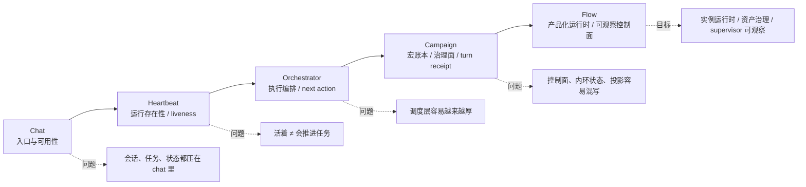
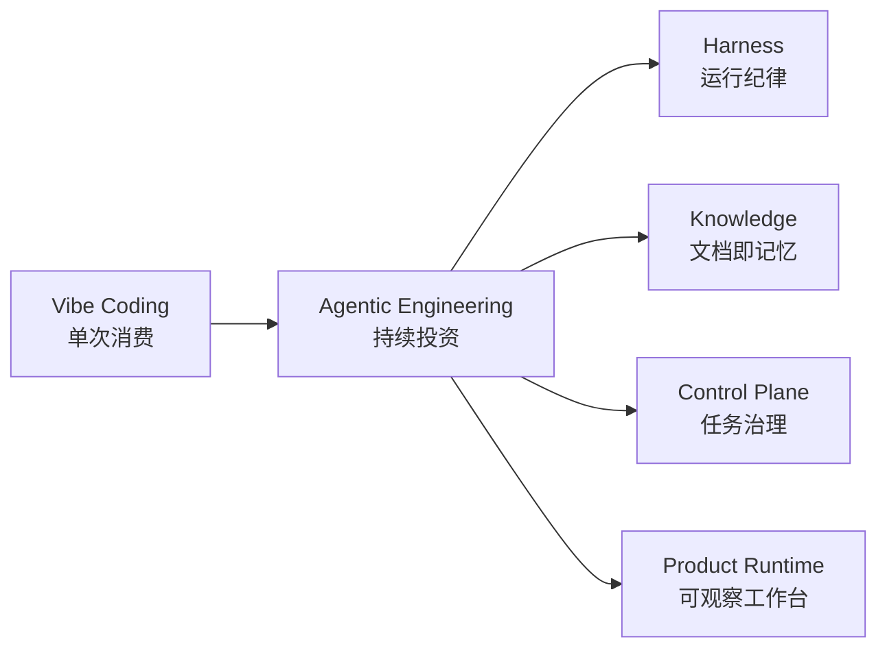
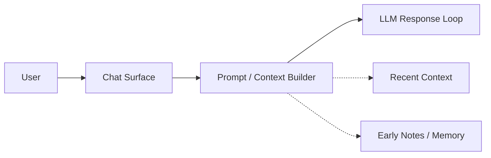
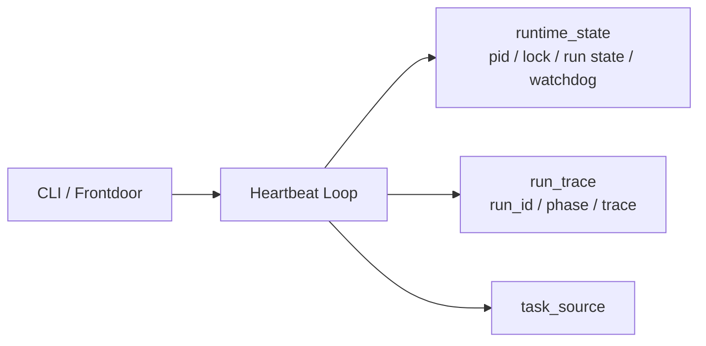
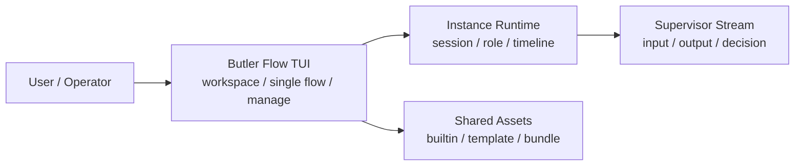
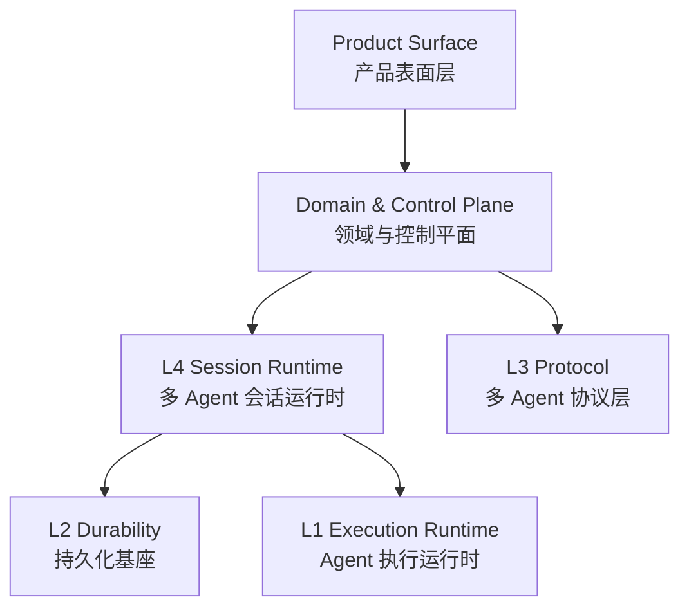

# Butler 开发者视角复盘稿 V2.2：从 Chat 到 Flow，我到底在学什么

日期：2026-04-03  
用途：个人复盘 / 组会分享 / 后续继续开发时对照  
口径：在 V2.1 基础上，再补入 0403 当天真实技术变更锚点，把“系统变迁”“Harness / Agentic 实质”“哲学转向”讲成同一条线

---

## 组会版一页摘要：我现在会怎么压这条线

| 阶段           | 解决的核心问题          | 长出来的技术对象                                                                               | 背后的 Harness 含义                      | 当时最典型的风险                         |
| ------------ | ---------------- | -------------------------------------------------------------------------------------- | ----------------------------------- | -------------------------------- |
| Chat         | 入口能不能用、长期对话能不能成立 | chat surface / context builder / recent memory                                         | 先建立产品入口与最小可用上下文                     | chat 壳承担会话、任务、状态三种职责             |
| Heartbeat    | 系统到底活着没有、还能不能被管  | heartbeat loop / run state / watchdog / trace                                          | 把 agent 从“对话体”变成“运行体”               | 运行噪声、业务状态、记忆语义缠在一起               |
| Orchestrator | 任务不是一轮对话能做完，怎么推进 | next action / planner / executor / review loop                                         | 承认系统需要执行编排层                         | 调度层越长越厚，变成超级控制器                  |
| Campaign     | 长任务怎么被治理、恢复、审计   | macro ledger / workflow session / turn receipt                                         | 控制面开始成形，receipt 开始成为事实对象            | 派生态回写真源、状态层级失控、operator patch 过强 |
| Flow         | 这些能力怎么变成可使用的运行平台 | workspace / single flow / manage / supervisor stream                                   | 控制面开始产品化、实例化、可观察化                   | 资产面和运行态重新混写、黑盒 supervisor 难复盘    |
| 0403 这轮收口    | 如何把隐性经验压成显式合同    | `execution_context` / `execution_workspace_root` / `control_profile` / `draft_payload` | Harness 不再只是外壳，而是运行边界、权限边界、写入边界的合同层 | ambient authority、自由文本写口、控制画像漂移  |

如果要再压成一句话：

> Butler 不是从 chat 长成了 multi-agent，  
> 而是从“模型能不能回”一路长成了“系统怎么被约束、被恢复、被审计、被产品化”。

---

## 先说结论：这不是一个“功能不断变多”的故事，而是一条控制面不断外移的线

如果只看表面，Butler 像是在一路加模块：

`chat → heartbeat → orchestrator → campaign → flow`

但站在开发者角度看，这条线真正重要的不是模块名，而是：**我在被项目逼着，一层层把 agent 系统里原本混在一起的东西拆开。**

拆到最后，我慢慢看清楚了四件事：

1. 系统是不是还活着
2. 它到底怎么推进任务
3. 长任务怎么被治理、恢复、审计
4. 这些能力怎么变成一个人真的能用的工作台

所以今天回头看，我不会再把这条线讲成“从简单 chat 做到复杂 multi-agent”，而会讲成：

> 我一开始以为自己在做一个更聪明的 chat。  
> 后来才发现，我其实是在一步步学习怎么做一个长期可运行、可恢复、可治理、可观察的 agent 系统。

这个变化，本质上就是我对 **Harness Engineer** 的理解在往下扎。

---

## 一页总览：这条线其实对应三层 Harness 能力

这一页图想表达的其实就一句话：

- `Chat` 阶段解决的是**入口与可用性**  
- `Heartbeat` 阶段解决的是**运行存在性与最低限度的 runtime discipline**  
- `Orchestrator / Campaign` 阶段解决的是**任务推进与宏观治理**  
- `Flow` 阶段解决的是**把控制面做成一个可使用、可观察、可恢复的产品化运行时**

如果要用一句话概括整条线：

> 这不是“功能更多了”，而是我对 Harness Engineer 的理解，从 prompt/对话层一路往 runtime / control plane / product runtime 往下扎。

---

## 再补一个外部视角：Butler 这条线其实正好落在 Agentic Engineering 那条光谱上

最近补读的 Agentic Engineering 材料，给了我一个特别好的外部坐标系。

那套材料里最打动我的有三个点：

1. **Vibe Coding 和 Agentic Engineering 不是一回事**
  前者更像单次消费，后者更像复利投资。你不是这次让模型写对就结束了，而是每次使用都要让体系更可复用。
2. **上下文窗口就是认知带宽**
  你每多加一条规则、一个中间层、一个路由器，都在占用带宽。机制不是免费的。
3. **Command / Skill / Subagent 的分层，不是按复杂度，而是按对上下文的影响来切**
  这个视角特别好，因为它直接把“架构设计”拉回到“模型到底能不能在当前这轮想明白”。

这三个点一对照 Butler，我突然觉得很多以前只是“做着做着长出来”的东西，开始有了更清楚的方法论解释。

### 一个很有用的对照图

放回 Butler 这条线里，其实就是：

- Chat 更接近“先把入口用起来”
- Heartbeat 开始进入 Harness
- Campaign 开始进入治理面
- Flow 开始进入 product runtime

也就是说，Butler 后面越来越不像一个“会聊天的助手”，而越来越像一个 **agentic system**。

---

## 一、Chat 阶段：先把入口做出来，但很快就撞上边界

最开始的 Butler，本质上还是一个“更贴近我自己使用”的 chat。

这一阶段其实没什么玄学，目标很直接：

- 我想有一个长期能对话的助手
- 我想把个人上下文和习惯慢慢接进去
- 我不满足于一次性网页问答，我想要一个更像“长期存在的个人助手”的东西

这个阶段的价值，不在技术有多复杂，而在于它立住了一个最重要的现实约束：

> 后面的所有 agent 能力，最后都得回到一个我自己愿不愿意天天用的入口。

这一点我现在反而更确定。很多 agent 系统特别容易一上来就奔着架构、自治、多角色、长任务去，最后做出一套工程很复杂、但实际不想碰的东西。Butler 早期从 chat 起步，至少保证了一件事：**它一开始就是从真实使用出发的。**

但这个阶段的问题也暴露得很快。

chat 适合：

- 单轮问答
- 轻上下文延续
- 局部辅助

chat 不适合：

- 长任务推进
- 后台持续运行
- 多轮状态治理
- 多步骤执行与验收
- 前后台恢复与观察

说白了，chat 很快就让我撞到一个事实：

> “能聊”不等于“能长期做事”。

也就是从这里开始，我的开发重点不再只是“模型怎么回”，而变成了“这个系统怎么跑”。

### 站在今天回看：Chat 阶段最大的问题不是“弱”，而是“太容易承担一切”

从开发者视角看，这一层真正的问题不是模型答得差，而是所有语义都压在同一个对话壳里：

- 会话语义和任务语义没分开
- 运行状态和聊天状态没分开
- 记忆像是在“补丁式增强 chat”，不是一个真正的任务系统
- 一旦时间拉长，对话历史就会同时承担产品入口、任务记录、状态容器三种职责

这一步其实已经埋下了后面所有层的起点：  
**我需要的不是“更厚的 chat”，而是“把 chat 从系统总壳里解放出来”。**

---

## 二、Heartbeat 阶段：第一次真正把 agent 当成“运行体”而不是“对话体”

这是我觉得特别关键的一步。很多时候，外面讲 agent，还是在讲 prompt、角色、工具、会话。但 heartbeat 这一层把问题一下子拉回了工程现实：

- 进程还在不在
- 当前 run 到底有没有卡住
- stale 怎么判
- watchdog 什么时候接管
- run_id、phase、trace 有没有留
- 前台断开后，后台到底发生了什么

这一步看起来不“聪明”，但它其实是整个项目里第一次真的出现 **runtime discipline（运行纪律）** 的地方。

如果用更直白的话说：

> heartbeat 解决的不是“它会不会做事”，而是“它是不是还活着、还能不能被管”。

这是一个很大的视角变化。因为在 chat 阶段，我更关心的是“回答质量”。到了 heartbeat 阶段，我开始被迫关心：

- liveness
- lifecycle
- watchdog
- stale detection
- run state
- trace

也就是从这时起，我才真正明白：

> agent 不是一个“会说话的大模型人格”，它首先是一个要被监管、被恢复、被判断是否存活的运行体。

### Heartbeat 阶段暴露出的工程问题

这一层暴露出来的，几乎都不是“模型不够强”，而是很典型的工程问题：

1. **运行噪声和业务状态混在一起**
  哪些只是瞬时推理痕迹，哪些是运行状态，哪些值得升格成长期材料，一开始很容易混。
2. **前后台感知不一致**
  前台可能觉得系统挂了，后台其实还在跑；后台已经死了，前台却没有可靠信号。
3. **一个模块开始承担太多职责**
  比如某些阶段，heartbeat、memory、治理语义会纠缠在同一处，这类设计短期能跑，长期一定越来越脆。

### 这一层在 Harness Engineer 上让我明白了什么

如果只从产品视角看，heartbeat 很像“后台设施”。但从 Harness Engineer 角度看，它其实是在回答一个更底层的问题：

> 你给模型搭的，不只是一个提示词环境，而是一个能持续运行、能判断是否异常、能恢复状态的执行环境吗？

所以 heartbeat 不是附属物。它是我从“做一个聊天产品”转向“做一个 agent runtime”的起点。

### 放到 Agentic Engineering 的坐标系里，这一步到底对应什么

如果借用外部材料的语言，我会说 heartbeat 对应的是：

- 还不是高层 agentic planning
- 也不是 skill system
- 它更像是 **meta engineering 的起点**

也就是你开始认真处理：

- 会话续传
- 运行恢复
- 工具/动作是否真的执行
- 系统是不是“看起来在跑”还是“实际上可监管”

这一步也很像外部材料里那句让我印象很深的话：

> 让 AI 长期稳定地写对，偶尔写对没有意义。

heartbeat 就是在做“长期稳定”这件事的最低层工程化。

---

## 三、Orchestrator 阶段：我开始真正处理“任务怎么推进”，而不是“系统活不活着”

heartbeat 解决的是“活着”。但一个系统活着，不代表它会做事。

真正把我推向 orchestrator 的，不是“我想把系统做复杂”，而是下面这些问题终于绕不过去了：

- 一件事不再是一轮对话能做完
- 一个任务需要拆成多步
- 有的步骤负责探索，有的负责执行，有的负责验收
- 长任务不可能靠单个 chat loop 稳定推进
- 状态不能只挂在对话历史上

所以 orchestrator 长出来，核心不是“加一个调度器”，而是：

> 我已经不能再用“用户说一句，模型回一句”的范式来理解系统了。  
> 我必须开始处理“目标如何被组织成一串动作”。

这一步是一个非常明显的思维升级：  
从 **conversation mindset** 转向 **execution mindset**。

### Orchestrator 阶段我真正开始处理的，是下面这些问题

- 谁来决定 next action
- 谁执行
- 谁 review
- 一轮 turn 和一个完整任务的关系是什么
- 恢复时是从对话继续，还是从任务状态继续
- 出错是局部 retry，还是整体退回
- 多个动作之间如何留下稳定外显，而不是只散落在自然语言里

换句话说，这一步真正重要的不是模块名，而是：

> 我开始承认：系统需要一个“执行编排层”。

### 这一层最典型的 bug / 现状问题

orchestrator 一旦长出来，很容易马上进入一个常见陷阱：

> 什么都想往调度层塞。

因为它看起来最像“全局大脑”，于是特别容易同时承担：

- 计划
- 调度
- 状态桥接
- 验收
- query
- feedback
- operator patch
- 恢复

短期看很爽，长期就会变成一个超级控制器。也就是说，orchestrator 阶段的最大风险，不是“太弱”，而是“太会长”。

这一点现在回头看很重要，因为它直接解释了为什么后面会长出 campaign。

### 如果放到外部方法论里，这一层对应什么

如果用 Agentic Engineering 那条光谱来讲，orchestrator 对应的是从：

- 纯 router / 纯 state machine

往：

- 有明确执行语义的 autonomous loop

过渡的阶段。

但 Butler 这条线的独特点在于：我不是先看了光谱再设计，而是先被真实任务逼到不得不做执行编排，然后才发现它和外部讲的那套是同一类问题。

---

## 四、Campaign 阶段：我第一次认真做“治理面”，也第一次被“厚控制面”反噬

如果说 orchestrator 在解决“任务如何推进”，那 campaign 开始解决的就是：

> 长任务怎么作为一个整体被治理、被记录、被恢复、被审计。

这一步很关键，因为它标志着系统不再只是“能跑一串动作”，而开始有了更宏观的控制面意识。

### 一个特别关键的技术锚点

到了 `0331`，项目已经明确在把后台 campaign 主线收成这样一条链：

`campaign 宏账本 -> workflow_session 内环状态 -> agent turn receipt -> harness 持久化/恢复/设施`

这句话其实非常能说明问题。

因为它意味着 campaign 的目标已经不是“再写一个调度器”，而是：

- `campaign` 负责宏账本和宏观身份
- `workflow_session` 负责细粒度运行态
- `turn receipt` 负责每一轮 agent 的结构化产物
- `harness` 负责持久化、恢复、artifact 与设施层

从 Harness Engineer 角度看，这一步非常值钱，因为它第一次比较系统地把下面几层拆开了：

1. **宏观任务身份**
2. **细粒度会话内环**
3. **单轮执行证据**
4. **基础设施层**

### 先说它做对了什么

这一步做对的东西，其实非常多：

#### 1. 它逼我去处理“宏状态”

不是每次只看单轮执行，而是开始区分：

- `running`
- `waiting`
- `paused`
- `completed`
- `failed`

也就是说，系统开始有了“长任务身份”。

#### 2. 它逼我去处理“turn receipt”

agent 每一轮推进，不应该只留下自然语言结论，而应该有结构化回执。  
这是从“模型答了一段话”走向“系统留下了一笔操作记录”。

#### 3. 它逼我去处理“控制面 vs 内环状态”

这一步特别关键。因为一旦任务跨轮、跨阶段、跨恢复点，你就不能把所有状态都塞在一个 metadata 里。

### 但 Campaign 也暴露了非常典型的开发者问题：控制面开始变厚

这个阶段最适合拿来讲“升级改造的 bug / 现状的不足”。

在 `0329`，后台任务已经因为“一个状态同时表示正在推进和是否最终完成”而开始做双状态收口：  
把任务拆成 `execution_state` 和 `closure_state`，避免“还在推进”“已有阶段产物”“最终还没闭环”这几件事被压缩成一个模糊状态。

这其实已经说明一个问题了：

> 控制面开始过载了。  
> 一个状态已经不够表达系统真实情况。

但到了 campaign 阶段，更深的问题又出现了。

`0331` 的文档里把复杂性来源点得很明白：

- 派生状态回写进真源
- 同一任务存在多层状态
- 控制面承担运行同步桥职责
- operator 写口过强

这几个点，几乎就是开发者复盘里最值得讲的内容。

#### 1）派生状态写回真源：这是控制面开始发胖的典型信号

比如：

- `execution_state`
- `closure_state`
- `progress_reason`
- `operator_next_action`

这些东西里，有不少其实更适合在 query / feedback / console 读时计算，而不是长久写进 metadata 当真源。

一旦这么干，会出现几个问题：

- source of truth 和 projection 开始打架
- console 读一套，query 读一套，feedback 再拼一套
- 你越来越分不清哪些是事实，哪些只是解释
- 改 bug 的时候，修一个地方不够，得找所有镜像

这给我一个很强的经验：

> 控制面最怕把“解释”误存成“事实”。

#### 2）状态层级过多：系统开始失去“到底哪一层说了算”的直觉

在这段时期，同一条后台任务一度同时涉及：

- `campaign.status`
- `mission.status`
- `node.status`
- `branch.status`
- `workflow_session.status`
- `execution_state / closure_state`
- `approval_state`

这件事本质上不是“状态设计得很精细”，而是：

> 系统对“哪一层才是真源”开始不再有清晰直觉。

这类问题对开发者特别致命，因为它不会像语法错误那样直接炸。它更像是一种慢性退化：

- 功能还能跑
- 文档还能写
- operator 还能 patch
- 但架构已经开始变糊

这就是为什么我后来越来越在意“边界回流”这类问题。很多升级改造不是代码没写通，而是原本好不容易拆开的层，又开始偷偷往一起长。

#### 3）Operator patch 太强，本质上说明平时结构约束还不够

如果系统经常需要：

- 强行改 phase
- 强行改 status
- 手工 patch metadata
- 跳步骤
- 人工补状态

那通常不说明系统很灵活，而说明：

> 正常路径不够稳，所以才不得不靠大量手工外科手术兜底。

所以后来 campaign 逐步把 operator 主动作收成：

- `pause`
- `resume`
- `abort`
- `annotate_governance`
- `force_recover_from_snapshot`
- `append_feedback`

这个收口背后的思想其实很值得讲：

> 好的 Harness，不是给操作者无限 patch 权限；  
> 而是让大多数情况下，系统不需要被 patch。

---

## 五、Flow 阶段：我不再只是在做后台控制面，而是在做“产品化运行时”

如果说：

- heartbeat 解决的是“它活不活着”
- orchestrator 解决的是“任务怎么推进”
- campaign 解决的是“长任务怎么治理”

那 flow 解决的就是：

> 这些能力怎样从后台机制，变成一个人可以使用、可以观察、可以恢复、可以管理的运行平台。

这一步和前面最大的不同在于：

**它不是单纯的后台升级，而是控制面开始产品化。**

### Flow 阶段到底和 orchestrator/campaign 有什么本质区别

#### orchestrator / campaign 更像什么

- 后台控制面
- 调度与治理层
- 宏账本、session、receipt 的组织方式

#### flow 更像什么

- 前台主产品
- instance runtime workbench
- shared assets 管理中心
- supervisor 可观察界面
- session / role / runtime / timeline 的产品外显

也就是说：

> orchestrator / campaign 更像“系统怎么工作”；flow 更像“系统怎么被使用、被观察、被恢复”。

### Flow 阶段最重要的两个成熟点

#### 1）它把 shared assets 和 instance runtime 硬拆开了

这是一个非常成熟的边界意识。

到了 flow 阶段，系统开始明确区分：

- `/manage`：管理 shared assets
- `workspace + single flow`：管理 instance runtime

这意味着 Butler 不再把：

- 静态定义
- 运行态
- operator 动作
- 历史身份
- prompt 资产

都混在一个控制面里。

从软件工程角度，这比单纯“再加点功能”成熟太多了。因为它说明系统终于开始承认：

> 资产治理和实例运行不是一回事。

这也是我后来一直在强调的一个经验：  
如果不把静态资产和实例运行分开，系统最后一定会乱。

#### 2）它把 supervisor 从“黑盒调度器”变成“可观察运行体”

`0402` 的那次可观测性升级，我觉得是一个非常强的信号。在这一步里，flow 明确要求 supervisor stream 不再只给 decision，而要显式展示：

- `input`
- `output`
- `decision`

连 heuristic supervisor 也要补齐合成的 input/output 记录，不能只剩一个 decision 结果。

这一点特别值得讲，因为它说明了一个非常关键的转变：

> 我不再满足于“系统内部知道下一步要干嘛”。  
> 我开始要求：这个决定是怎么来的，能不能被人看到、被人审、被人复盘。

这就是很典型的 Harness Engineer 升级。

因为真正成熟的 agent 系统，不能只有“智能行为”，还要有：

- observability
- auditability
- replayability
- inspectability

否则它永远是黑盒。

---

## 六、把新补的 Agentic Engineering 材料真正落到 Butler 上：我现在最认同的四个方法论

这一部分是 V2.1 新增的重点。因为前面更多是在讲“系统自己怎么长出来”，但现在有了外部材料之后，我开始能更清楚地说：

**Butler 这条线，不只是个人经验，它和当前 Agentic / Harness 讨论里一些很硬的原则是互相对照的。**

### 1. 上下文窗口就是认知带宽

这是我觉得最硬的一个锚点。

一旦承认这件事，很多以前觉得“只是多加一层控制挺合理”的设计，马上就会暴露成本：

- 每多一层 router，都是带宽税
- 每多一包规范注入，都是带宽税
- 每一次“为了保险起见把所有背景都塞进去”，都是带宽税

这点和 Butler 特别对得上。因为我后来越来越能感觉到：

- 厚 prompt 会拖慢系统
- 厚控制面会拖慢系统
- 厚文档注入会拖慢系统
- 所有“为了更安全加的层”，都可能变成新的噪声源

所以今天如果让我重新描述很多早期设计问题，我会直接说：

> 很多 bug 不是因为能力不够，而是因为我让系统长期在交过多的“上下文税”。

### 2. 文档即记忆，不只是知识整理，更是团队/agent 的共同真源

外部材料里“Markdown + Git 就是最好的知识管理系统”这件事，我其实非常有共鸣。

因为 Butler 走到现在，我越来越依赖文档，不是因为我喜欢写文档，而是因为没有文档，系统根本没法长期推进。

但现在我对这件事的理解比以前更进一步：

> 文档不是辅助说明，而是长期 agent 系统的共享记忆层。

它至少同时服务三类读者：

1. 人类自己
2. 未来的我
3. 未来接手这个项目的 agent / Codex

所以我现在会更愿意把 `docs/project-map/`、daily-upgrade、变更包这些东西看成 Butler 的一种**冷记忆真源**，而不是项目说明书。

### 3. Command / Skill / Subagent：分层应该按“对上下文的影响”来切

这一点也很有启发。

以前做系统时，很容易按“复杂度”分层：

- 简单一点的是工具
- 复杂一点的是 agent
- 更复杂一点的是 workflow

但外部材料给了一个更适合 agent 系统的分法：

- **Command**：极小入口 / 快捷意图
- **Skill**：可控知识包 / 按需展开
- **Subagent**：隔离上下文的独立执行体

这套分法厉害的地方在于：

> 它不是按“功能大不大”分，而是按“对上下文的占用与污染程度”分。

放回 Butler，我觉得特别值得继续问几个问题：

- 哪些能力其实应该是 command，而不是一个厚路由链
- 哪些知识应该沉成 skill，而不是每轮都注入
- 哪些长任务应该交给隔离 session / 子运行体，而不是继续在主上下文里拖着跑

### 4. 复利比单次正确更重要

“每次 AI 犯错花两分钟记录”这句话，我觉得说得特别好。

因为它把很多人会忽略的一件事点穿了：

> agent 工程的真正壁垒，不是某次模型写得多漂亮，而是系统有没有把错误变成可复用资产。

这和 Butler 现在特别相关。

比如你最近一直在处理的：

- stall
- 恢复失败
- 超时
- 路由误判
- 控制面语义打架

这些问题如果只是“解决了就算了”，那系统不会真正变强。  
只有当它们进入：

- trace / jsonl
- regression test
- change packet
- docs 回写

它们才会开始变成 Butler 的复利。

---

## 七、如果把 0403 这轮真实变更压成五个技术迁移锚点

前面讲的是长期演进线。  
但如果组会里要把“最近这一轮到底改了什么”讲清楚，我觉得最值得讲的不是功能清单，而是下面五次迁移。

### 1. 从“控制根目录”和“执行根目录”混用，到显式区分 `workspace_root` 和 `execution_workspace_root`

以前一个很隐蔽但很真实的问题是：

- Butler 虽然给 flow 准备了独立 `codex_home`
- 但 Codex 真正执行时，还是在仓库 `workspace_root` 下跑
- 于是非仓库任务也会先读到仓库根 `AGENTS.md`

`0403` 之后，系统把这件事正式拆成：

- `workspace_root`
  - Butler 控制面、资产、sidecar 的根
- `execution_workspace_root`
  - Codex 真正 `cwd/-C` 的执行根
- `execution_context`
  - `repo_bound` 或 `isolated`

这件事在工程上看起来像一个路径修复，但在哲学上其实很大：

> Harness 开始认真区分“我在哪里管理它”和“它实际上在哪里执行”。

这说明 Butler 已经不再把 runtime 当作附着在仓库上的 prompt 壳，而是当成一个有真实执行边界的系统。

### 2. 从“在仓库里执行”默认等于“继承仓库规则”，到 repo contract 显式绑定

这一步我觉得非常值得讲，因为它特别能体现 agent 系统设计成熟度。

现在的裁决是：

- `repo_bound`
  - 只表示执行位置
- `repo_binding_policy`
  - 才表示是否显式绑定 repo contract
- `repo_contract_paths`
  - 才是当前生效的合同集合

也就是：

> 在仓库里执行，不再自动等于“仓库根的一切规则都天然有权约束我”。

这背后其实就是一个非常标准的 agent/harness 哲学转向：

- 从 ambient authority
- 转向 explicit authority

这类变化特别重要，因为长期 agent 系统最怕的，就是环境里有一堆默认生效、没人说清楚、但处处在影响模型行为的隐性权力。

### 3. 从“治理经验散在 prompt / 默认值 / operator patch 里”，到实例级 `control_profile`

`0403` 另一件很关键的事，是把 supervisor 治理从经验性调节收口成轻量合同：

- `packet_size`
- `evidence_level`
- `gate_cadence`
- `repo_binding_policy`

这些东西现在不再只是“某轮 decision 里提了一嘴”，而会真正回写到实例态 `flow_state.control_profile`。

这背后最核心的变化，不是字段多了，而是：

> 控制画像第一次被当成一等运行对象，而不是 prompt 里的风格提示。

这意味着 Butler 开始承认：

- control 不是话术
- control 是 runtime contract

而这也是 Harness 和单纯“提示词工程”最本质的区别之一。

### 4. 从“manager chat 直接驱动 mutation”，到 `draft + pending_action + draft_payload` 的 staged commit

这一步也很关键，因为它把一类很常见的 agent 风险显式化了：

- 模型先说一段自由文本
- 系统再从自由文本里猜你到底要不要写入
- 一旦走偏，就会把“对话建议”误升级成“真实 mutation”

现在的管理口径开始变成：

- 先持久化 `manage_session`
- 再持久化 `draft`
- 只有存在待确认动作且用户纯确认时，才进入 `action_ready`
- 真正写入走 `draft_payload -> manage_flow()`

这背后其实是在做一件很 agentic、也很 harness 的事：

> 把“想法”“建议”“拟提交内容”“真实写入”拆成不同状态层。

这不是保守，而是系统终于承认：  
语言不是事实，草稿不是提交，意图不是落盘。

### 5. 从“后台长流机制”到“可观察的产品化运行时”

这一点前面在 Flow 部分已经讲了，但 `0403` 之后它更清楚了。

现在你能看到的不是一套模糊的“agent 在后台工作”，而是更明确的结构：

- shared assets 和 instance runtime 分开
- supervisor stream 有 `input / output / decision`
- `control_profile` 是实例级
- `execution_context` 是实例级
- manager 只设计默认控制画像，supervisor 在运行时调整并回写

这意味着 Butler 不只是“多了一些运行功能”，而是在逐步形成：

> 一个同时面对人类操作者和 agent 执行体的运行产品面。

也就是从系统内核视角，开始走向真正的 product runtime。

### 这五次迁移合在一起，到底说明了什么

如果把这五次迁移压成最核心的一句话，我会说：

> Butler 正在把“环境默认”“prompt 经验”“人工 patch”  
> 逐步替换成“显式边界”“结构化状态”“实例级合同”。

而这正是我现在理解的 Harness 实质：

- 它不是给模型外面套一层壳
- 它是把原本隐性的运行约束，做成可读、可调、可恢复、可审计的系统对象

---

## 八、如果站在 Harness Engineer 的层级上，这条线到底体现了什么

如果让我把 `heartbeat → orchestrator/campaign → flow` 压成最核心的三句，我会这么说。

### 1. Heartbeat 体现的是：运行存在性开始被工程化

关键词：

- liveness
- watchdog
- stale detection
- run state
- lifecycle
- trace

这一步说明：我第一次不再把系统当作“对话体”，而开始把它当作“运行体”。

---

### 2. Orchestrator / Campaign 体现的是：任务推进与长任务治理开始被控制面化

关键词：

- task loop
- next action
- execution semantics
- macro ledger
- workflow session
- turn receipt
- governance

这一步说明：我不再只是在做会话，而是在做 control plane。  
但也正是在这一步，我第一次被“厚控制面”反噬，学会了控制面该薄、内环该强、派生态不要回写真源。

---

### 3. Flow 体现的是：控制面开始被产品化、实例化、可观察化

关键词：

- workbench
- instance runtime
- shared assets
- supervisor observability
- manage center
- runtime product surface

这一步说明：我不再只是做后台 agent 内核，而是在做一个人和 agent 都能共同工作的运行平台。

---

## 九、再补一层系统总视角：Butler 为什么后来越来越像一个真正的 agent 系统

这部分也是 V2.1 新增，因为前面更多是在讲“阶段”，但系统后面真正成熟的标志，不只是多了 flow，而是我开始越来越承认：**这些东西应该分层存在。**

可以用下面这张图理解：

这套分层特别重要，因为它说明：

> 我后面越来越不是在“加功能”，而是在给系统找稳定落点。

一旦这些层混说，系统就会重新变糊：

- 产品面会去碰真源
- 控制面会去吞运行细节
- 运行态会反向污染静态协议
- 可观测面会被当成状态真源

这也是为什么我后来越来越看重：

- `butler-flow` 是主产品
- `chat` 是附属产品
- `campaign` 是历史治理层
- `workspace` 不是程序真源
- `assets` 不是草稿区

换句话说，Butler 后半段真正成熟的地方，不只是功能多了，而是边界开始稳下来。

---

## 十、如果从“文档的问题 / 升级改造的 bug / 现状不足”来讲，我会重点讲这几个

### 1. 文档很容易先于代码一步

长期项目里，文档常常先把理想边界讲清楚，但代码仍处在迁移期。

这不是谁的问题，而是迁移型项目的常态。真正的难点不在于“文档写得全不全”，而在于：

> 文档能不能持续回写，成为迁移控制面的一部分，而不是只讲理想结构。

### 2. 升级改造里最危险的 bug，不是报错，而是“边界回流”

我现在越来越觉得，真正可怕的不是某个测试挂了，而是：

- 本来拆出去的职责又悄悄塞回来
- 本来应该是读时投影的语义又重新写回 metadata
- 本来分开的资产面和运行时面又开始互相写对方的东西

这类 bug 很隐蔽，但对长期维护最伤。

### 3. 现状不足不是“还没做完”，而是系统仍然处在几个张力之间

比如：

#### 张力一：历史控制面 vs 新产品主线

campaign 在历史上很重要，但 flow 正在变成新的主产品中心。如何平稳换中心，是一个持续张力。

#### 张力二：治理面 vs 运行时面

控制面总想知道更多，运行时又不该把所有细状态都升格成真源。这个边界很难一次定死。

#### 张力三：智能自主性 vs 可审计性

supervisor 越强，越需要更强的可观察与恢复。你不能只追求“更自动”。

#### 张力四：工作区自由度 vs 程序主体整洁度

个人长期工作区是真需求，但程序真源不能被它侵入。所以仓库级治理会一直是重点。

---

## 十一、如果把这次补读真正转成行动，Butler 接下来最值得做的不是“再加一个模块”，而是做三个实验

这部分是 V2.1 最想落到地上的地方。因为复盘如果最后只停在“我学到了很多”，其实意义不够。

### 实验 A：把一类高频规范从“推送注入”改成“按需拉取”

要验证的问题：

- 现在某些路由/规范注入是不是已经在交“带宽税”
- 改成 skill 化、工具拉取式之后，误判率和上下文长度会不会下降

### 实验 B：强制长结论带锚点

例如规定：

- 要么引用 `docs/` 的明确路径
- 要么给出可执行测试 / 可追溯 artifact

目的不是形式主义，而是减少“看起来合理但没有来源”的输出。

### 实验 C：并行 checker 小规模试跑

不是一下子上全量多 agent review，而是选一类低风险任务试：

- 固定检查项用弱模型
- 综合裁决用强模型
- 记录 token、耗时、收益

这个实验的意义在于：它既能验证“多 checker”有没有价值，也能避免一上来把系统复杂度拉太高。

---

## 十二、最后一句：这条线最值得复盘的，不是模块名，而是我对 Harness 的理解

我原来以为自己在做一个更复杂的 chat。后来发现，我真正做的是三件事：

1. 给 agent 建一个能活着的运行环境
2. 给长任务建一个能推进、能治理的控制面
3. 再把这些东西做成一个可观察、可操作、可恢复的产品运行时

所以 `heartbeat → orchestrator/campaign → flow` 并不是简单的模块升级，而是三个不同层级的 Harness 能力：

- heartbeat 是 **运行存在性**
- orchestrator/campaign 是 **任务控制与治理**
- flow 是 **产品化运行时与可观察控制面**

如果非要用一句话总结这段开发经历，我现在会说：

> 我一开始以为自己在做一个更聪明的 chat，后来才明白，我真正学会的是：如何给一个 agent 建立可持续工作的系统环境。

---

## 技术文档锚点（建议组会时备用）

- `docs/project-map/02_feature_map.md`
- `docs/project-map/03_truth_matrix.md`
- `docs/daily-upgrade/0403/00_当日总纲.md`
- `docs/daily-upgrade/0403/01_butler-flow_Codex执行根隔离与repo_bound裁决.md`
- `docs/daily-upgrade/0403/02_butler-flow_supervisor控制画像与agents-flow治理升级.md`
- `docs/runtime/System_Layering_and_Event_Contracts.md`
- `docs/daily-upgrade/0329/03_后台任务双状态与前门弱化重构.md`
- `docs/daily-upgrade/0331/03_后台主线控制面瘦身与Agent内环提权草稿计划.md`
- `docs/daily-upgrade/0402/02_butler-flow_manage-center资产中心升级与会话式交互落地.md`
- `docs/daily-upgrade/0402/11_butler-flow_长流治理与supervisor可观测性升级.md`

## 外部学习与 BrainStorm 互证锚点（V2.2 新增）

- OpenAI：Harness engineering / Codex harness / agent loop
- Anthropic：effective agents / writing tools / subagents / skills
- 社区样板：everything-claude-code
- Agentic Engineering 导读材料：Vibe vs Agentic、上下文带宽、文档即记忆、Command/Skill/Subagent、错误 2 分钟记录
- `BrainStorm/Insights/mainline/Harness_Engineering_主线知识体系.md`
- `BrainStorm/Insights/mainline/20260327_长运行应用Harness与多AgentWorkflow_主线知识体系.md`
- `BrainStorm/Insights/standalone_archive/20260318_OpenAI_Codex_Harness工程范式_Agent_Runtime_insight.md`
- `BrainStorm/Insights/standalone_archive/20260318_agent_harness_全网调研汇总_insight.md`

