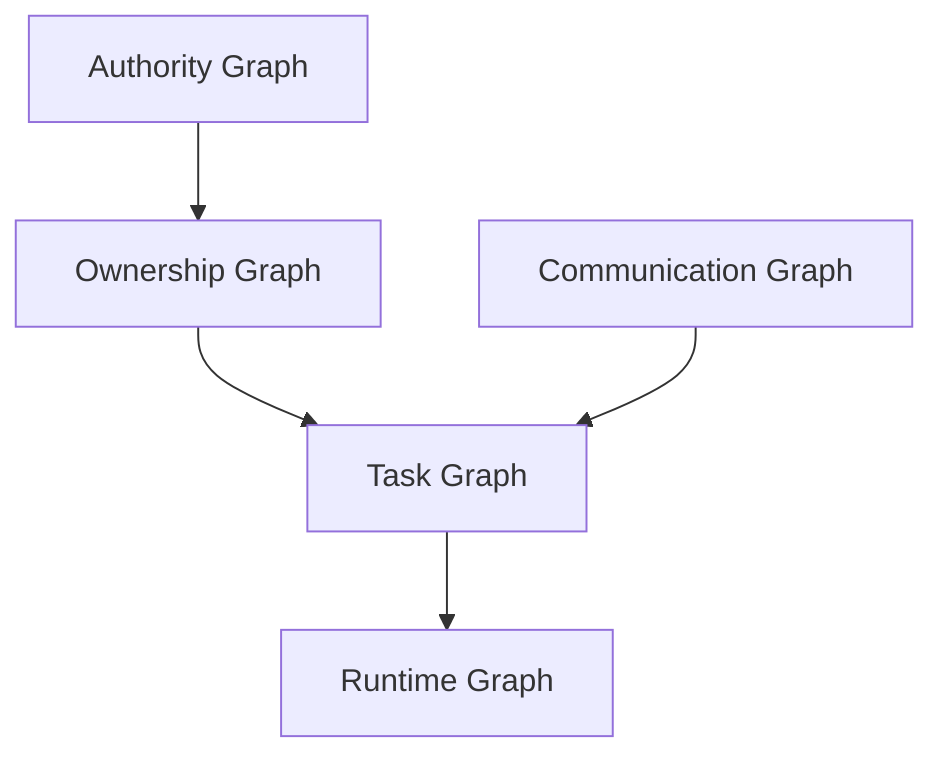
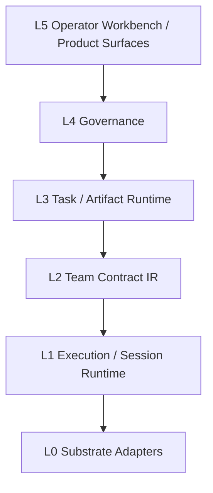

# CLI Agent Substrate -> Canonical Team Runtime -> Team OS

日期：2026-04-07  
类型：每日头脑风暴 / 提案压测后收口稿 / 当前轮次讨论真源  
状态：已完成一轮多 agent 讨论 + 官方资料核对 + `proposal-stress-test` 压测  
用途：把本轮关于「建立在 Codex / Claude Code 这类 CLI agent 产品之上的可递归团队契约运行时」的讨论，收口成一份可继续推演的理论文档  

相关内部文档：

- [当前系统基线](../../project-map/00_current_baseline.md)
- [分层地图](../../project-map/01_layer_map.md)
- [功能地图](../../project-map/02_feature_map.md)
- [系统分层与事件契约](../../runtime/System_Layering_and_Event_Contracts.md)
- [Workflow IR 正式口径](../../runtime/WORKFLOW_IR.md)
- [0330 Agent Harness 全景研究与 Butler 主线开发指南](../../daily-upgrade/0330/02_AgentHarness全景研究与Butler主线开发指南.md)
- [0331 Agent 监管 Codex 实践：`exec`、非交互 `resume` 与重试](../../daily-upgrade/0331/01_Agent监管Codex实践_exec与resume.md)
- [0401 Claude / Codex CLI 单 Session 能力报告](../../daily-upgrade/0401/20260401_claude_codex_cli_session_report.md)
- [0403 Butler Flow Codex 执行根隔离与 `repo_bound` 裁决](../../daily-upgrade/0403/01_butler-flow_Codex执行根隔离与repo_bound裁决.md)
- [0403 Butler Flow supervisor 控制画像与 agents-flow 治理升级](../../daily-upgrade/0403/02_butler-flow_supervisor控制画像与agents-flow治理升级.md)

外部参考：

- [OpenAI Codex CLI](https://developers.openai.com/codex/cli)
- [OpenAI Codex Non-interactive](https://developers.openai.com/codex/noninteractive)
- [OpenAI Codex Subagents](https://developers.openai.com/codex/subagents)
- [OpenAI Codex Sandboxing](https://developers.openai.com/codex/concepts/sandboxing)
- [OpenAI Codex Agent approvals & security](https://developers.openai.com/codex/agent-approvals-security)
- [OpenAI Codex Cloud](https://developers.openai.com/codex/cloud)
- [Claude Code CLI Usage](https://code.claude.com/docs/en/cli-usage)
- [Claude Code Hooks](https://code.claude.com/docs/en/hooks)
- [Claude Code Sub-agents](https://code.claude.com/docs/en/sub-agents)
- [Claude Code Agent Teams](https://code.claude.com/docs/en/agent-teams)
- [A2A Key Concepts](https://a2a-protocol.org/dev/topics/key-concepts/)
- [A2A and MCP](https://a2a-protocol.org/dev/topics/a2a-and-mcp/)
- [LangGraph Durable Execution](https://docs.langchain.com/oss/python/langgraph/durable-execution)
- [The Contract Net Protocol](https://www.eecs.ucf.edu/~lboloni/Teaching/EEL6788_2008/papers/The_Contract_Net_Protocol_Dec-1980.pdf)

---

## 1. 一句话裁决

本轮最新裁决不是“直接做 Team OS”，而是：

> **把 Codex / Claude Code 这类 CLI agent 产品压回 `L1 execution substrate`，在其上先做一个 `operator-governed, recoverable, repo-bound engineering-task runtime`；只有当 `task / artifact / policy / authority / receipt` 真正成为稳定真源，并由一个可验证的 `organizational kernel` 统领时，它才有资格升级为 `Team OS`。**

---

## 2. 本轮真正解决的两个问题

### 2.1 建立在 CLI agent 产品之上，这条路是否成立？

成立，但只能成立为：

- `L1 execution substrate`
- 不是 `organizational kernel`
- 更不是最终 `team OS`

CLI agent 产品今天已经公开提供的能力，足以支撑这一层判断：

- 单 agent tool loop
- thread / session continuity
- 非交互执行
- hooks
- sandbox / approval
- MCP
- 原生 subagent 或 agent teams
- 部分 cloud/background task

所以：

- 把它们当 `execution engine` 是合理的
- 把它们当 `组织真源` 就会出问题

### 2.2 “可递归团队契约运行时”距离“真正的 Team OS”还差什么？

还差一个明确的 `organizational kernel`，至少包括：

- 组织身份
- 授权与撤销
- authority 与 accountability
- 任务与产物账本
- 资源与调度
- 恢复与审计
- operator 控制面

如果这些还没成立，最诚实的叫法应是：

- `canonical team runtime`
- 或 `organizational runtime`

而不是过早叫 `Team OS`

---

## 3. 本轮最重要的概念修正

### 3.1 不再用单一“上级/下级”解释系统

“上级/下级”最多只覆盖 `ownership`，真实系统至少有五张图：

这五张图里：

- `ownership` 回答谁发起、谁对子任务负责
- `authority` 回答谁能批准、撤销、接管、追认
- `communication` 回答谁能直接 message / @ / 协作
- `task` 回答任务如何拆解、依赖、收口
- `runtime` 回答谁在跑、谁在等、谁可 resume

### 3.2 `group chat / @ / 1:1 stream` 只能是 projection

本轮几乎所有批评视角都收敛到同一结论：

- 群聊很适合给人看
- 群聊非常不适合做真源

因为很多系统动作其实是：

- `delegate`
- `handoff`
- `approval`
- `ownership transfer`
- `artifact publish`

如果把它们全退化成“谁在群里说了一句话”，系统就会失去：

- 精确恢复
- 稳定审计
- 明确责任
- 结构化控制

### 3.3 `caller != authority`

协议层可以把 human 和 agent 都近似看作 `caller`。  
治理层不可以。

至少要拆出：

- `caller`
- `owner`
- `authority`
- `approver`
- `operator`
- `observer`

同一个人可以暂时戴多顶帽子，但系统里这些帽子必须是不同对象。

---

## 4. 从 Team Runtime 到 Team OS 的硬边界

### 4.1 Team Runtime 是什么

`Team Runtime` 负责：

- 把一组 agent / role / subteam 跑起来
- 让它们 handoff、join、resume、cancel
- 让 operator 看见运行态

它的一等对象更接近：

- `session`
- `thread`
- `role-run`
- `team-run`
- `handoff`

### 4.2 Team OS 是什么

`Team OS` 负责：

- 组织如何成立
- 谁有权授权、撤销、接管、验收
- 任务如何成为正式承诺对象
- 产物如何成为正式组织记忆
- 恢复、审计、投影如何跨 substrate 持续成立

它的一等对象应转为：

- `task`
- `artifact`
- `policy`
- `authority`
- `receipt`

一句最短判断：

> **Team runtime 负责“团队去执行”，Team OS 负责“组织如何成立、授权、记账、恢复并对外负责”。**

---

## 5. 修正版总架构

### 5.1 推荐路线

本轮多方讨论后，路线排序基本稳定为：

1. `Canonical team runtime over vendor substrate`
2. `Vendor-native team shell`
3. `Full team OS kernel`

推荐坚定选 `2 > 1 > 3` 里的中间路线，也就是：

- 不做薄壳
- 不过早自研全内核
- 先把自己真正的真源立起来

### 5.2 六层结构

#### `L0 Substrate Adapters`

这里是：

- Codex CLI
- Claude Code
- 未来其他 CLI / SDK / remote worker

它们只负责把底层执行能力暴露出来。

#### `L1 Execution / Session Runtime`

这里承接 vendor 已有能力：

- thread
- resume
- compact
- tool loop
- sandbox
- native subagents
- native agent teams

但这里还不是真源层。

#### `L2 Team Contract IR`

这里才开始进入你自己的系统对象：

- `TeamSpec`
- `RoleSpec`
- `TaskSpec`
- `HandoffSpec`
- `AcceptanceContract`
- `EvidenceContract`
- `Permission / Escalation`

#### `L3 Task / Artifact Runtime`

这里是 runtime 的核心资产：

- task graph
- artifact graph
- mailbox
- state machine
- lineage
- receipts

#### `L4 Governance`

这里承接真正的组织级控制：

- authority
- operator actions
- policy
- budget
- quality gates
- recovery
- evaluation

#### `L5 Operator Workbench / Product Surfaces`

这里才是：

- operator console
- manager board
- end-user status/result view
- 群聊 / 1:1 / query / feedback 等投影

---

## 6. 这条路里绝不能外包给 vendor 的东西

下面这些，如果交给 vendor session 或 CLI 产品默认语义，你做出来的就只是 orchestrator：

### 6.1 不能外包的真源对象

- `team identity`
- `authority`
- `task truth`
- `artifact truth`
- `receipts`
- `governance state`
- `recovery cursor`

### 6.2 不能外包的控制语义

- 谁能批准
- 谁能接管
- 谁能绑定 repo / secret / resource
- 谁对失败负责
- 何时需要 escalation
- 哪些动作进入审计链

### 6.3 不能外包的投影语义

- operator 看到什么
- manager 看到什么
- end-user 看到什么
- 哪些事件升格为正式状态

---

## 7. 本轮最硬的理论补丁：`Organizational Kernel`

本轮最大的改进不是又多一层 workflow，而是明确提出：

> 现有 `protocol / runtime / durability / execution` 分层之间，还缺一个正式的 `organizational kernel`。

它至少要回答：

- 谁可以组建 team
- 谁能授予 authority
- 谁能撤销 authority
- 谁承担剩余责任
- 冲突与争议如何裁决
- 组织何时可重构
- 什么才算正式 commit / acceptance / closure

如果没有这层：

- team 只是运行时形状
- role 只是 prompt costume
- governance 只是更长的 system prompt

---

## 8. `v1` 现在必须如何收窄

`proposal-stress-test` 之后，本轮最关键的修复不是再补理论，而是把 `v1` 变成一个硬 proof slice。

### 8.1 `v1` 只证明这一条

> **一个 operator-gated、可恢复、repo-bound 的 engineering-task runtime，能在 CLI substrate 之上稳定地产生 task/artifact/authority/receipt 真源。**

### 8.2 `v1` 只做这些

- 一个 repo
- 一个 primary substrate
- 一个 operator
- 一类 engineering task
- 一套 authority handoff 规则
- 一种 receipt 格式
- interruption / recovery
- artifact ledger

### 8.3 `v1` 明确不做这些

- 任意 team topology
- generalized recursive team composition
- 多 vendor 平权支持
- generalized product projections
- 完整组织内核
- 全面 memory 大一统

这些现在只能算：

- architectural constraint
- later proof obligation

不能算 first-delivery scope。

---

## 9. `Canonical Now` 与 `Provisional Hypotheses`

为避免 `ontology lock-in`，本轮新增这个区分。

### 9.1 现在就该当真源的对象

- `Task`
- `Artifact`
- `RunReceipt`
- `AuthorityTransition`
- `OperatorAction`
- `RecoveryCursor`

### 9.2 现在还只是工作假说的对象

- generalized `organizational kernel`
- broad `vendor-neutral portability`
- full recursive `team-of-teams`
- universal `projection system`
- generalized `mission layer`

这些对象现在可以进入理论，但不能过早写死成系统承诺。

---

## 10. Falsification Conditions

这部分是本轮 proposal stress test 后新增的硬要求。

若出现下面任一情况，应暂停“Team OS”叙事，回退为 runtime product：

1. 第二 substrate 映射高失真
   - 说明所谓 canonical objects 其实仍被 vendor 语义绑架
2. 恢复仍严重依赖 vendor session/thread
   - 说明 task-centric truth 还没成立
3. operator plane 没有显著提升治理/恢复能力
   - 说明新控制面缺乏独特价值
4. artifact ledger 无法稳定支撑 acceptance / lineage / replay
   - 说明“产物真源”只是口号
5. authority transitions 无法进入同一 receipt / audit chain
   - 说明 human/operator/manager 边界还没真正落成系统对象

---

## 11. 升级成 Team OS 的条件

这条线后面什么时候才配从 `team runtime` 升级成 `team OS`？

本轮收口后，我认为至少要同时满足下面几条：

1. 团队与子团队是第一类对象，而不是 prompt 幻觉
2. 稳定真源已经从 `session` 转为 `task / artifact / policy / receipt`
3. authority 与 operator actions 已进入统一治理账本
4. substrate 更换后，组织身份、任务承诺、验收结果仍能连续
5. artifact、receipt、recovery、projection 都不依赖原始 transcript 才能成立
6. scheduler、budget、admission control、failure containment 至少有可用最小版
7. `organizational kernel` 已不再只是理论命名，而有正式对象和边界

---

## 12. 当前仍保留的分歧

### 12.1 经验不确定性

市场上是否真的存在足够强的“协调税 / 恢复税 / 治理税”，足以让这层 runtime 成为独立产品，而不是高级控制台。

### 12.2 范围不确定性

何时它还只是：

- `team runtime`

何时才配叫：

- `team OS`

### 12.3 价值取舍

是更早证明：

- `single-primary-substrate shipping speed`

还是更早证明：

- `cross-substrate semantic survival`

这两者短期天然冲突。

---

## 13. 本轮最诚实的下一步

这轮最诚实的下一步已经不再是继续开放式脑暴，而是补三张硬表：

1. `proof slice spec`
   - 把 `v1` 只允许证明什么、只允许忽略什么写死
2. `canonical-now vs provisional`
   - 哪些对象现在就能当系统真源，哪些还只是工作假说
3. `team runtime -> team OS upgrade conditions`
   - 升级条件、降级条件、falsification 条件

如果这三张表都写不硬，就不该继续膨胀“Team OS”叙事。

---

## 14. 最终结论

本轮结束时，我对这条路的判断是：

> **方向正确，但命名要降级，边界要升高，`v1` 要极度收窄。**

更具体地说：

- 你现在最适合建设的是  
  `canonical team runtime over vendor CLI agent substrate`
- 不是  
  `vendor-native team shell`
- 也不是  
  `full self-built team OS kernel`

它的近期价值应被表述为：

> **一个 operator-governed、recoverable、repo-bound 的 engineering-task runtime，具备 portable task/artifact/authority semantics。**

等到 `organizational kernel` 被真正证明，再升级叙事到 `Team OS`，会更诚实，也更稳。

