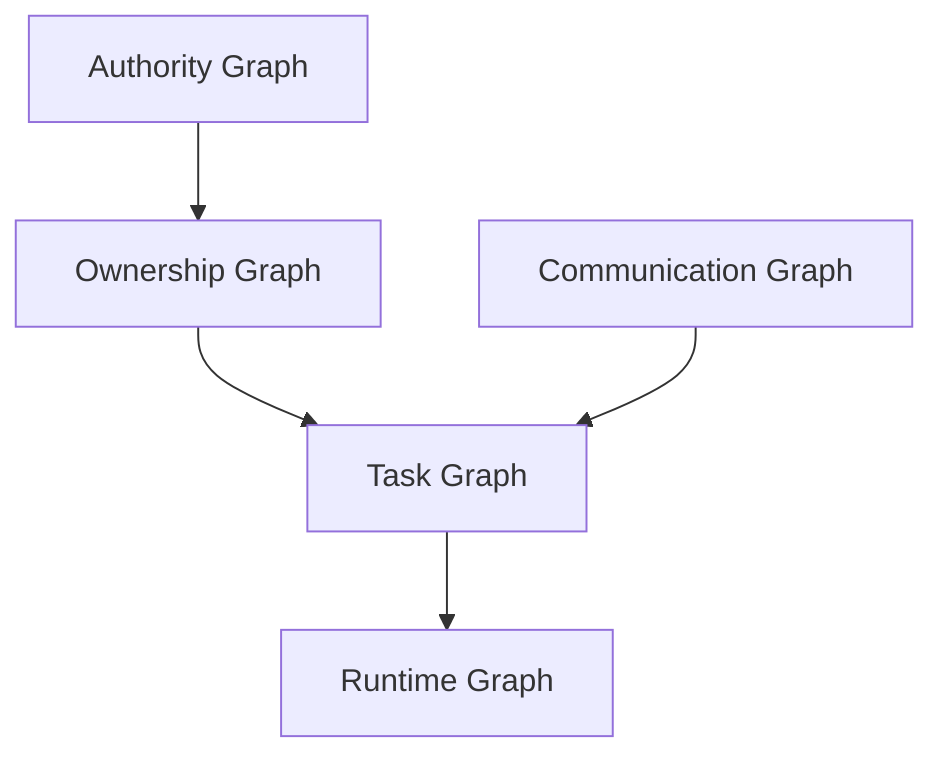
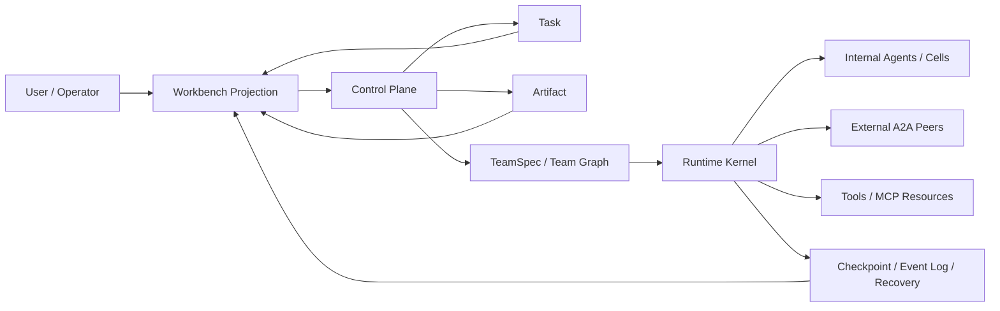

# 以 `Task + Artifact` 为真源的 Full-Stack Team OS 草稿

日期：2026-04-07  
类型：每日头脑风暴 / full-stack 远景草稿 / 当前轮次讨论补充稿
状态：已完成一轮 full-stack 头脑风暴收口；当前现役裁决仍以 [0407 Canonical Team Runtime 最终收口：任务产物真源、治理真源与升级门槛](../../daily-upgrade/0407/01_canonical_team_runtime最终收口_任务产物真源与升级门槛.md) 为准
用途：承载本轮关于「Agency Swarm 式通信图 + A2A 式 task/artifact 模型 + durable workflow/runtime + Proma/Codex 式工作台投影」的远景想象，作为未来 `Team OS` 方向的补充草稿

相关内部文档：

- [0407 当日总纲](../../daily-upgrade/0407/00_当日总纲.md)
- [0407 Canonical Team Runtime 最终收口：任务产物真源、治理真源与升级门槛](../../daily-upgrade/0407/01_canonical_team_runtime最终收口_任务产物真源与升级门槛.md)
- [CLI Agent Substrate -> Canonical Team Runtime -> Team OS](./01_CLI_Agent_Substrate到Canonical_Team_Runtime再到Team_OS_脑暴收口.md)
- [当前系统基线](../../project-map/00_current_baseline.md)
- [分层地图](../../project-map/01_layer_map.md)
- [功能地图](../../project-map/02_feature_map.md)
- [系统分层与事件契约](../../runtime/System_Layering_and_Event_Contracts.md)
- [Workflow IR 正式口径](../../runtime/WORKFLOW_IR.md)
- [0330 Agent Harness 全景研究与 Butler 主线开发指南](../../daily-upgrade/0330/02_AgentHarness全景研究与Butler主线开发指南.md)
- [0401 Claude / Codex CLI 单 Session 能力报告](../../daily-upgrade/0401/20260401_claude_codex_cli_session_report.md)

外部参考：

- [Agency Swarm communication flows](https://agency-swarm.ai/core-framework/agencies/communication-flows)
- [A2A Key Concepts](https://a2a-protocol.org/latest/topics/key-concepts/)
- [OpenAI Agents SDK multi-agent](https://openai.github.io/openai-agents-python/multi_agent/)
- [LangGraph durable execution](https://docs.langchain.com/oss/python/langgraph/durable-execution)
- [LangChain multi-agent supervisor/subagents](https://docs.langchain.com/oss/python/langchain/multi-agent)
- [AutoGen Teams](https://microsoft.github.io/autogen/dev/user-guide/agentchat-user-guide/tutorial/teams.html)
- [Semantic Kernel agent orchestration](https://learn.microsoft.com/en-us/semantic-kernel/frameworks/agent/agent-orchestration/)
- [Proma](https://github.com/ErlichLiu/Proma)

---

## 0. 这份草稿解决什么问题

[01_CLI_Agent_Substrate到Canonical_Team_Runtime再到Team_OS_脑暴收口.md](./01_CLI_Agent_Substrate到Canonical_Team_Runtime再到Team_OS_脑暴收口.md) 已经解决了一件更硬的事：

- `Codex / Claude Code` 这类产品最多是 `L1 execution substrate`
- 当前最诚实的现役命名仍是 `canonical team runtime over vendor substrate`
- 不能因为有 subagent、agent teams、group chat，就提前把整条线命名成成熟 `Team OS`

这份文档继续往前推一步，但不推翻上面的裁决。  
它回答的问题是：

> **如果未来真的要长成一个 full-stack 的 team-native 系统，它应该长成什么样，什么才是它的真源，工作台又该如何只是投影而不反客为主？**

所以这是一份：

- 远景草稿
- full-stack 描绘
- 对未来 `Team OS` 的结构化想象

它**不是**当前 Butler 主线的命名切换令，也**不是**已经进入实施的系统级升级单。

---

## 1. 一句话裁决

本轮 full-stack 讨论后，最稳的路线不是：

- `group chat-first`
- `workflow-first but team-second`
- `org chart-first`

而是：

> **以 `Task + Artifact` 为第一真源，围绕它建立 `Team Graph + Runtime Kernel + Governance + Workbench Projection` 的 full-stack Team OS。**

也就是：

- `Task + Artifact` 负责回答“事情是什么、产物是什么、完成标准是什么”
- `Team Graph` 负责回答“谁能和谁以什么协议协作”
- `Runtime Kernel` 负责回答“现在谁在跑、如何 checkpoint、如何恢复”
- `Workbench Projection` 负责回答“人看见什么、如何 @、如何在群聊或 1:1 里消费系统状态”

一句最短判断：

> **任务与产物是真源，团队是执行组织，会话是运行容器，聊天与工作台只是投影。**

---

## 2. 这条路线为什么比“上级/下级团队”更稳

最初的“上级 -> 下级”直觉是对的，因为它抓住了：

- caller / manager / leader 的委派关系
- 子任务向下派发
- 局部团队可以递归长出

但如果只用这一条轴解释系统，会把很多关键关系吞掉。

真实系统至少有下面五张图：

这五张图里：

- `authority` 回答谁能批准、撤销、接管、追认
- `ownership` 回答谁发起、谁对子任务负责
- `communication` 回答谁能 message、@、broadcast、review
- `task` 回答任务如何拆解、依赖、收口
- `runtime` 回答谁在跑、谁暂停、谁可恢复、谁已失联

所以“上级/下级”应被保留，但只能作为：

- `ownership` 的一等关系
- `authority` 的部分来源
- `spawn-cell` 的特殊边

它不应再成为唯一组织模型。

---

## 3. Full-Stack Team OS 的总结构

### 3.1 推荐结构

这个结构里，系统分为四层，但只允许一个真源中心。

### 3.2 四层定义

#### A. Control Plane

控制面持有：

- `Mission`
- `Task`
- `Artifact`
- `Acceptance`
- `Ownership`
- `Budget`
- `Risk Gate`

它负责：

- 任务进入正式系统
- 子任务成为正式承诺对象
- 产物被纳入账本
- 验收、回滚、升级、审计成立

#### B. Protocol Layer

协议层持有：

- `TeamSpec`
- `Participant`
- `Edge`
- `Context Policy`
- `Artifact Contract`
- `Spawn Policy`
- `Autonomy Profile`

它负责：

- 团队如何成立
- 谁能和谁协作
- 谁能看到哪些输入、历史、artifact
- 哪些情况下允许递归生成子团队

#### C. Runtime Kernel

运行时持有：

- `Run`
- `Session`
- `Mailbox`
- `Scheduler`
- `Checkpoint`
- `Event Log`
- `Recovery`
- `Adapter Handle`

它负责：

- 任务真正跑起来
- 队伍中的节点互相 handoff
- 中断后恢复
- 外部 peer 掉线或内部 worker 失败时继续推进

#### D. Workbench Projection

产品层持有：

- `Mission Board`
- `Chat / Group Chat / 1:1 Stream`
- `Team Graph View`
- `Artifact Registry View`
- `Inspector`
- `Operator Controls`

它负责：

- 让人看懂系统
- 让人介入系统
- 让复杂运行态可投影、可浏览、可接管

但它**不持有真源**。

---

## 4. 第一真源为什么必须是 `Task + Artifact`

本轮明确选定：

- `Task + Artifact` 是第一真源
- `TeamSpec` 是执行协议，不是真源中心
- `Session/Thread` 是运行容器，不是真源中心

原因很简单。

### 4.1 如果把 `TeamSpec` 当第一真源

系统会很容易滑向：

- 先定义组织，再找任务
- team 结构压过真实目标
- runtime 为组织表演服务，而不是为交付服务

最后容易长成：

- 一个“很会排班的 team 演示系统”
- 但不一定稳定产出正式结果

### 4.2 如果把 `Session/Thread` 当第一真源

系统会很容易滑向：

- 一切都从聊天中解释
- 任务状态靠对话抽取
- 产物和责任边界被群聊摘要稀释

最后会失去：

- 精确恢复
- 稳定审计
- 责任归属
- artifact lineage

### 4.3 把 `Task + Artifact` 立为真源的收益

它天然适合承接：

- A2A 式 `task / artifact`
- workflow runtime 的 durable execution
- 接受多种 team 拓扑
- workbench 多种 projection

也天然更适合 Butler 当前的长期方向：

- `Projection` 不是真源
- `Observability` 与 `Projection` 分离
- `L3/L4/L2` 能围绕正式对象协作

---

## 5. Team Graph：团队不再等于群聊

### 5.1 Team 的一等对象

Team 不应再只是“若干 agent 放在一起说话”。  
它的一等对象至少包括：

- `Participant`
- `Cell`
- `External Peer`
- `Edge`
- `Policy`
- `Visibility`

### 5.2 显式通信图是默认组织方式

默认采用 `explicit graph`，而不是：

- 纯 hierarchy
- 完全 emergent routing

因为显式图更容易同时兼容：

- 上级 -> 下级委派
- 平级协作
- reviewer 链
- blackboard publish
- human/operator intervene
- external peer federation

至少应支持下面这些边类型：

- `delegate`
- `handoff`
- `review`
- `broadcast`
- `publish-to-blackboard`
- `approve`
- `escalate`
- `spawn-cell`

### 5.3 递归 team 的现役口径

递归要保留，但默认采用 `bounded spawn`：

- 允许上级或 cell 自动生成子团队
- 但必须带 `spawn reason`
- 必须带 `task scope`
- 必须带 `artifact contract`
- 必须带 `exit condition`
- 必须带 `budget / timebox`

也就是说：

> **可以自动长出下级团队，但不能无限制长出组织。**

---

## 6. Runtime：不是单纯 group chat，也不是纯 workflow machine

### 6.1 推荐运行姿态

推荐选择：

- `Hybrid Persistent + Ephemeral`

也就是：

- 有长期存在的 team/cell/agent 身份、记忆和策略
- 但每个 task run 可以临时拉起一次性 worker 或子团队
- 完成后只把需要长期保留的状态写回真源

### 6.2 为什么不能只做 group chat runtime

group chat 适合展示：

- 谁在说话
- 谁被 @ 到
- 当前讨论到了哪里

但不适合稳定承接：

- ownership transfer
- artifact publish
- acceptance failure
- replay / rewind / recovery

### 6.3 为什么也不能退回纯 workflow machine

纯 workflow machine 的问题是：

- team 感被抹平
- 局部自治弱
- 每个节点都像被中心化状态机压着走

所以推荐的 runtime 应是：

> **task/artifact-driven + team-graph-aware + checkpoint-native**

而不是：

- 只会跑 DAG 的 workflow engine
- 只会转发 message 的群聊引擎

---

## 7. 外部接入：A2A 与 MCP 不能混

### 7.1 外部 agent peer

外部 agent app 应该按 `A2A-like peer` 看待。  
它是一种：

- 团队成员
- black-box worker
- 可接收 task、返回 artifact 的协作节点

它属于 team graph。

### 7.2 工具与资源

`MCP / tools / resources / prompts` 应看成能力面。  
它们属于：

- capability substrate
- resource plane

它们不直接等于 team member。

### 7.3 这条分界为什么重要

如果把 external peer 和 tool/mcp 混在一起，系统会失去：

- 权限模型的清晰边界
- 责任归属
- artifact lineage
- 审计一致性

一句话收口：

> **外部 peer 是协作者，MCP/tool 是能力提供者。**

---

## 8. Workbench：默认入口应是 `Mission Board + Chat`

### 8.1 不是 graph-first，也不是 chat-first

产品层默认入口不应是：

- 纯 graph studio
- 纯群聊消息流

而应是：

> **Mission Board + Chat**

因为用户首先需要看见：

- 任务是什么
- 当前 owner 是谁
- 产物状态如何
- 哪个 team/cell 在推进
- 是否卡在 gate / approval / failure

然后才进入：

- 群聊流
- @ 协作
- 1:1 流式命令
- inspector

### 8.2 产品投影应如何退化

在产品上可以这样投影：

- 多上级 + 多下级：群聊 / channel 式 @ 展示
- 单一 caller + 单 worker：自然退化成 1:1 流式命令界面
- 复杂长任务：mission board + detail panes + runtime inspector

但不管展示怎样退化，真源对象都不应改变。

### 8.3 工作台的一等面板

默认至少有：

- `Mission Board`
- `Team Graph`
- `Conversation Stream`
- `Artifact Registry`
- `Inspector`
- `Operator Controls`

这几个面板之间不共享真源，只共享投影输入。

---

## 9. 治理姿态：默认自治，但必须带门

### 9.1 默认姿态

本轮选择的是：

- `Autonomous by Default`

也就是：

- 系统默认可以自行拆解、协作、推进
- 人不是每一步都在 loop 里点确认

### 9.2 但自治不等于放任

必须显式内建：

- `risk gate`
- `publish / writeback gate`
- `cross-team escalation gate`
- `budget gate`
- `human override`
- `stop / rewind / replay`

这意味着：

> **自治来自协议、恢复能力和门控，不来自“让 prompt 自己飞”。**

### 9.3 帽子不能再混

至少要显式拆出：

- `caller`
- `owner`
- `authority`
- `approver`
- `operator`
- `observer`

同一个人可以戴多顶帽子，但系统对象里不能混成一个 `user`。

---

## 10. V1 最该证明什么

### 10.1 不是先证明最漂亮的工作台

也不是先证明：

- 全协议 federation
- 最炫的 group chat
- 完整 graph studio

### 10.2 最该证明的是 `Configurable Team Runtime`

也就是：

1. 用户给出目标
2. 系统生成初版 `TeamSpec`
3. 用户可以审阅、修改、冻结、复用
4. runtime 能编译并执行这份 spec
5. 团队能按显式图协作
6. 必要时能递归长出子团队
7. 能稳定产出并消费 artifact
8. 崩溃、暂停、掉线后能恢复
9. 最终统一投影到同一个工作台

### 10.3 V1 的非目标

V1 暂不追求：

- 完全通用的组织内核
- 完整企业级身份/授权体系
- 跨所有 vendor 的深度互联
- 高保真图形编排器

V1 的重点是先证明：

> **团队协议配置真的可以成为运行时真源之一，而不是只停留在 prompt recipe。**

---

## 11. 最小对象模型

如果要把这条线正式工程化，最小一组对象建议收口为：

- `Mission`
- `Task`
- `Artifact`
- `TeamSpec`
- `Participant`
- `Edge`
- `Run`
- `Session`
- `EventEnvelope`
- `Projection DTOs`

### 11.1 `Mission`

顶层目标容器，绑定：

- 全局约束
- 默认治理姿态
- 总预算
- 顶层 TeamSpec

### 11.2 `Task`

最小推进单元，至少带：

- `goal`
- `owner`
- `status`
- `inputs`
- `artifact_contract`
- `acceptance`
- `budget_slice`
- `parent/child relation`

### 11.3 `Artifact`

正式产物对象，至少带：

- `kind`
- `uri/body`
- `version`
- `producer`
- `consumers`
- `validation state`
- `lineage`

### 11.4 `TeamSpec`

团队协议配置，至少带：

- `participants`
- `edges`
- `spawn_policy`
- `context_policy`
- `artifact_visibility`
- `approval_rules`
- `autonomy_profile`

### 11.5 `Run / Session`

运行实例与会话容器，至少带：

- 当前上下文切片
- mailbox
- event stream
- checkpoint pointer
- adapter handle

### 11.6 `Projection DTOs`

至少应有：

- `MissionBoardDTO`
- `TeamGraphDTO`
- `TaskDetailDTO`
- `ArtifactRegistryDTO`
- `ConversationStreamDTO`
- `InspectorDTO`

---

## 12. 对 Butler 的最重要提醒

如果未来 Butler 真往这条路上走，最重要的提醒不是“再多接几家 agent SDK”，而是下面几条。

### 12.1 不要让 product projection 反过来劫持真源

聊天、时间线、群组 @、side panel 都只是投影。

### 12.2 不要让 vendor-native team 概念直接上位

无论是：

- Codex subagents
- Claude Code agent teams
- OpenAI handoffs
- AutoGen group chat

它们都应该先压回 Butler 自己的母概念。

### 12.3 不要把 team config 写成静态 org chart

TeamSpec 应是：

- 可生成
- 可编辑
- 可版本化
- 可冻结
- 可派生

而不是一次性死配置。

### 12.4 不要只做 engineering special-case

本轮已经选定第一批目标是 `general knowledge work`。  
这意味着所有对象和协议都应能服务：

- 软件/infra
- research
- analysis
- writing / synthesis

只是工程场景会作为最严格的验收标尺。

---

## 13. 最终收口

把这次 full-stack 讨论压成一句最短的话，就是：

> **未来若 Butler 要长成真正的 Team OS，不应从“再加几个 agent”开始，而应从“把 `Task + Artifact` 立成第一真源，把 `Team Graph` 立成执行组织，把 `Runtime Kernel` 立成恢复内核，把 `Workbench` 压回 projection”开始。**

以及：

> **当前现役最诚实的口径仍然是：先做 `canonical team runtime over vendor substrate`；这份文档描述的是它如果继续往前长，full-stack 终局更可能长成什么。**
